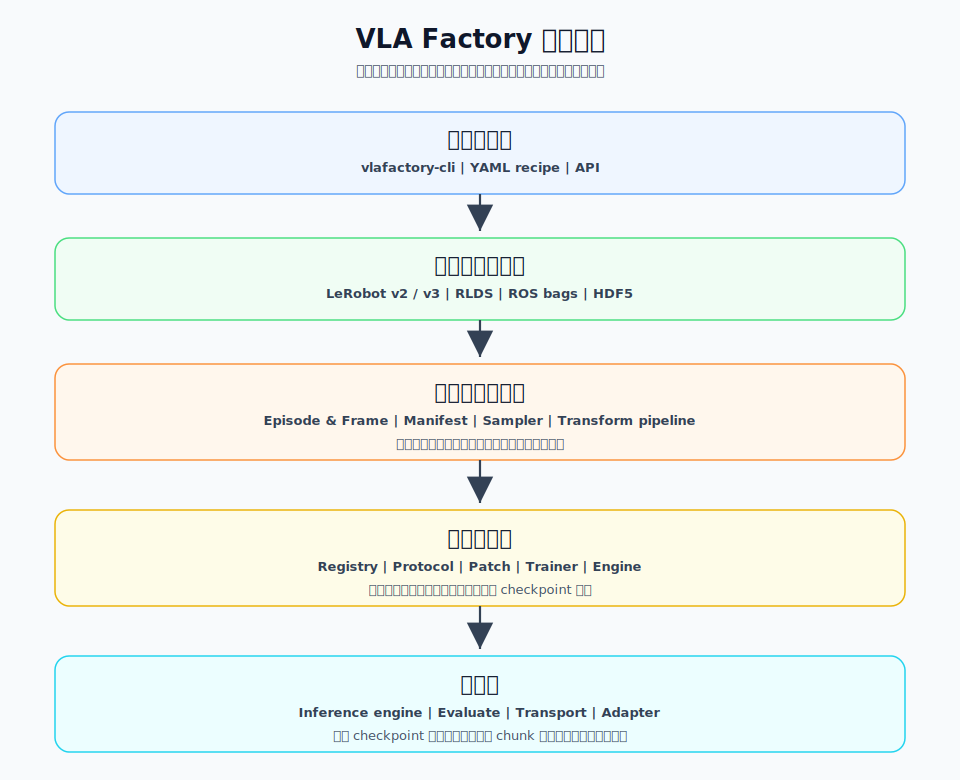

# VLA Factory

> English: [README.md](./README.md)

VLA Factory 是一个 **recipe 驱动** 的机器人视觉-语言-动作（VLA）模型微调框架：用一份 YAML 描述模型、数据、微调策略与训练参数，框架自动完成「数据管线 → 模型构建 → 训练 → 部署」的完整闭环。

---

## 架构和主要特性



架构概述：VLA Factory 的核心目标是把 VLA 微调链路中的数据、模型、训练产物和部署入口统一到一套稳定契约下。用户用 recipe 描述实验意图，框架负责把外部数据格式转换成统一样本语义，通过模型适配层调用上游模型生态，并产出可复用、可验证的训练结果。

- **统一实验入口**：用一份 recipe 描述模型、数据、动作空间、微调策略、训练参数和输出位置，减少散落脚本和临时配置约定。
- **统一数据语义**：把不同来源的数据集转换成一致的 observation/action 表达，保留 schema、统计量和 key 顺序，便于训练、评估和后续复用。
- **模型生态适配**：通过轻量 adapter 接入外部模型实现，框架关注模型协议和训练契约，不重新维护上游模型架构代码。
- **可复用训练产物**：训练输出包含 recipe、数据 schema、归一化统计量和模型权重等必要信息，方便复现、评估和后续推理验证。

---

## 安装

```bash
# 在仓库根目录
pip install -e ".[act]"      # ACT 训练（带 lerobot>=0.5）

# PI0 / PI0.5 训练（openpi 栈；openpi 有严格依赖 pin，需走 uv 安装脚本）
bash scripts/install.sh

# 或，在不需要 openpi patch 安装路径时安装全部 extras
pip install -e ".[all]"      # 全部模型生态依赖
pip install -e ".[dev]"      # 开发依赖：pytest / pytest-cov / tensorboard
```

在 AutoDL 等弱网络环境中，仍然使用同一个安装脚本，按需增加环境变量：

```bash
export VLA_PYPI_INDEX=https://mirrors.aliyun.com/pypi/simple
export VLA_UV_ATTEMPTS=8
export VLA_LOCAL_LEROBOT=1   # 避免 GitHub git 长连接 fetch，改用 tarball 源
bash scripts/install.sh
```

安装后会注册 `vlafactory-cli` 命令（如 `vlafactory-cli train --config recipe.yaml`）；未安装或从源码运行时，等价的 `vlafactory-cli ...` 同样可用。

---

## 快速开始

### 0. 准备数据

VLA Factory 使用 **LeRobot v3** 格式的数据集。将数据集放置在 recipe YAML 中 `data.source.path` 所指定的路径。期望的目录结构为：

```text
<dataset_path>/meta/info.json   # 数据集元数据
<dataset_path>/data/            # Parquet episode 文件
<dataset_path>/videos/          # MP4 视频文件
```

在 recipe YAML 中修改 `data.source.path` 即可指向自己的数据。

### 1. 列出已注册模型

```bash
vlafactory-cli list
#   act                  backend=pytorch  head=...
```

### 1. 预处理视频（可选，但推荐）

把数据集的视频帧解码到 `.npy` 磁盘缓存，避免训练时反复解码：

```bash
vlafactory-cli preprocess --config examples/act_lekiwi_banana.yaml
```

### 2. 训练

```bash
vlafactory-cli train --config examples/act_lekiwi_banana.yaml
```

常用覆盖参数（不改 YAML 也能临时调整）：

```bash
vlafactory-cli train --config <recipe.yaml> \
    --steps 5 --batch-size 2 --output-dir outputs/smoke_test
```

### 3. 推理 / 评估

```bash
# 在数据集某条样本上做一次 smoke-test 推理
vlafactory-cli infer --checkpoint outputs/act_so101_banana \
    --dataset-index 0 --split val

# 在整个数据集上评估每条 episode 的 L1 误差
vlafactory-cli evaluate --checkpoint outputs/act_so101_banana \
    --dataset /path/to/dataset
```

### 4. 启动推理服务

```bash
# 仿真器平台
vlafactory-cli serve --checkpoint outputs/act_so101_banana \
    --platform simulator --strategy receding_horizon

# lerobot 真机平台
vlafactory-cli serve --checkpoint outputs/act_so101_banana \
    --platform lerobot --remote-ip <robot-ip> --strategy receding_horizon
```

---

## Recipe 配置

最完整的带注释模板是 [`examples/reference.yaml`](./examples/reference.yaml)，每个字段都标注了含义、可选值与典型用法。开箱即用的示例：

| 示例 | 说明 |
|------|------|
| `examples/act_lekiwi.yaml` | lekiwi 从零训练 |
| `examples/pi0.yaml` | openpi pi0 系列 smoke —— 默认 pi0 LoRA;注释里给出切 pi05 与全量微调的开关 |
| `examples/reference.yaml` | 全字段注释模板 |

---

**模型默认配置**：每个模型在 `vla_factory/config/model/<name>.yaml` 下附带一份 baseline profile（如 [`vla_factory/config/model/act.yaml`](./vla_factory/config/model/act.yaml)）。工厂以它为默认，再与 recipe 里逐 run 的 `model.config` 做深度合并——recipe 的值优先，profile 只是实验起点而非冻结契约。未知 key 会被上游配置对象报错（不会因拼写错误静默失效）。

---

## 支持路标

| 数据 | 模型 | 算法 | 部署 |
|------|------|-------|------|
| ✅ **LeRobot v2 / v3** | ✅ **ACT** | ✅ **Full-parameter SFT** | ✅ **LeRobot** |
| ⬜ **RLDS** | ✅ **π₀ / π₀.₅** | ✅ **LoRA SFT** | |
| ⬜ **ROS bags** | ⬜ **π-FAST** | ⬜ **Selective SFT** | |
| ⬜ **HDF5** | ⬜ **GR00T / OpenVLA** | | |

---
