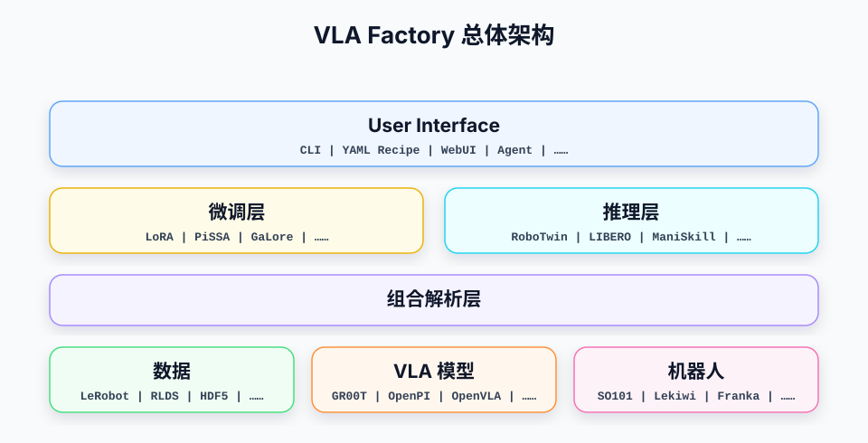

# VLA Factory 架构设计

> **文档定位**：本文档是顶层设计，描述 VLA Factory 的目标架构，**可能包含尚未实现的想法**；各模块的详细设计文档（见各节链接）则始终对齐**当前已实现**的行为，供读者参照学习。架构文档负责讲清「要做什么、为什么」，模块文档负责讲清「现在是什么样」。

## 0. 总览

### 0.1 具身智能面临的工程问题

机器人策略模型从数据准备到验证不是单点任务，而是一条完整工作流：数据采集与转换、训练配置、模型适配、checkpoint 管理、离线评估、仿真验证、真机验证。当前这条链路高度碎片化——数据格式（LeRobot/HDF5/RLDS/ROS bags）在图像、状态、动作、episode 边界和统计量上各不相同，每个模型生态自带配置系统和训练入口，训练产物的 metadata 和 norm stats 又依赖各自约定。换一个模型或数据集就要重写一整套胶水代码，实验之间的经验很难沉淀。

其中最突出的痛点集中在**后训练微调**环节。预训练 VLA 模型（如 OpenPI、OpenVLA、GR00T）参数量通常在数十亿量级，全参数微调算力成本高昂，实际场景普遍依赖 LoRA、QLoRA 等参数高效微调，但各上游模型自带的训练脚本对这些策略支持参差不齐，换一种微调方式往往要直接改训练循环。更棘手的是，微调要在「保持预训练能力」和「适配新场景、新机器人」之间取得平衡：新数据可能来自不同的机器人本体、不同的关节顺序和相机布局，而预训练模型对输入语义有固定假设，归一化、相机映射或关节顺序稍不一致就会破坏已学到的能力、甚至引发灾难性遗忘。这套语义又必须原封不动地带到部署侧，否则微调出的 checkpoint 无法上线——而当前这部分一致性几乎全靠使用者手工维护，极易出错。再加上后训练数据量通常有限（几十到几百条演示），训练稳定性与泛化诊断也缺乏统一手段。

### 0.2 为什么现有框架不能解决

开源社区已经有不少优秀的训练框架，但它们大多不能直接解决 VLA 的工程问题。

**各模型生态自带的训练脚本不能直接复用。** ACT、OpenPI、OpenVLA、GR00T、SmolVLA 等模型各自携带一套训练入口、配置文件和数据加载逻辑，假设的数据格式和机器人各不相同，彼此之间几乎没有可复用的接口。

**为什么不能直接用 Llama Factory 这类 LLM 微调框架。** Llama Factory 是成熟的 LLM 微调框架，但它面向的是「文本输入 → 文本输出」的范式，与 VLA 的工作方式存在本质差异：

| 维度 | Llama Factory 假设 | VLA Factory 需要面对的现实 |
|---|---|---|
| 输入输出 | 纯文本 token 序列 | 多模态时序：图像、机器人状态、动作序列、语言指令 |
| 输出形态 | 一次性生成的文本 | 连续动作序列（action chunk），要逐帧下发到真实关节 |
| 数据载体 | 文本语料 | 多媒体时序数据，带 episode 边界、视频编码和归一化统计量 |
| 本体约束 | 无 | 自由度、关节顺序、控制模式、安全范围、夹爪约定 |
| 部署形态 | 一次推理返回结果 | 端侧实时闭环控制，要求稳定频率和低延迟 |
| 训练-部署一致性 | 仅权重即可迁移 | 必须共用归一化、相机映射、关节顺序，否则模型无法部署 |
| 安全边界 | 输出不当至多答非所问 | 输出不当可能损坏硬件或伤人，需要动作合法性检查与 fallback |

换句话说，VLA 比 LLM/VLM 多了 action 这一模态，并且常常运行在端侧闭环里。动作输出的实时性、稳定性、合法性和安全边界，是 LLM 训练框架完全没有覆盖的问题。直接拿 Llama Factory 来用，要么需要在外面再包一层厚重的适配，要么会丢失训练-部署的一致性，最终仍然是在重新造一个框架。

### 0.3 框架定位与目标

VLA Factory 是一个 recipe 驱动的机器人视觉-语言-动作（Vision-Language-Action）模型训练与部署框架。它用一份 YAML recipe 描述模型、数据、机器人、微调策略、训练参数和输出目录，由框架完成从数据读取、组合解析、样本构造、模型适配、训练、checkpoint 产物写入到在线推理服务的闭环。

本框架的核心定位不是重新实现各类 VLA 或模仿学习模型，而是提供一层稳定的工程胶水层：

- 对用户：用统一 recipe 启动训练、评估、推理和部署。
- 对数据：把不同数据格式转成统一的数据中间表示和训练样本。
- 对模型：通过薄适配器包装外部生态中的模型实现。
- 对训练：复用 PyTorch、HuggingFace Trainer、上游模型库的成熟能力。
- 对部署：通过统一推理引擎和平台 adapter 对接仿真器与真机。

**VLA Factory 框架目标**：在数据、模型、训练、产物和验证之间建立稳定的工程标准，让来自不同生态的能力可以通过清晰的边界接入同一条工作流。这里的「统一」不是把所有模型、数据格式和运行平台改造成同一种实现，而是在数据集、机器人、VLA 模型三者之间建立稳定的描述方式和组合规则。一份新数据接入后可以和已有模型组合，一个新模型接入后可以和已有数据与机器人组合，而不需要为每个三元组合专门写适配代码。量化地说，N 份数据 × M 个模型 × K 种机器人有 `N × M × K` 个候选组合；只要数据来自 F 种格式，框架长期维护的代码资产接近 `F + M + K`，而非 `N × M × K` 份专用适配。`N × M × K` 是候选空间，并非所有组合都必然兼容——组合解析层会对每个实际组合给出确定结果或结构化错误。在生态层面，框架对接主流的数据格式、模型生态和部署平台，并能在后训练阶段与 RLinf 等强化学习与评估框架协同，而不是在内部重新实现一套 RL 训练系统。

### 目录

- [0. 总览](#0-总览)
- [1. 设计原则](#1-设计原则)
- [2. 全局架构](#2-全局架构)
- [3. 用户接口层](#3-用户接口层)
- [4. 核心模块设计](#4-核心模块设计)
- [5. 依赖管理策略](#5-依赖管理策略)
- [6. 测试策略](#6-测试策略)
- [7. 扩展与演进](#7-扩展与演进)

---

## 1. 设计原则

### 1.1 Recipe 驱动

一次训练应由 recipe 完整描述。模型选择、数据路径、机器人选择、采样窗口、动作空间、微调策略、训练步数、输出目录等都来自配置，而不是散落在脚本里。

recipe 是用户最高优先级的配置入口。recipe 的顶层字段表达实验意图（模型/数据/机器人选择、微调策略、训练参数、输出）；模型自身的能力与默认值由模型声明（ModelMetadata）承载，不在 recipe 里；需要调整数据/模型/机器人三者之间的关系时，写在 `overrides` 区。这样实验配置是可审计的，用户能在一份文件里看到本次实验主动覆盖了什么，而不是到脚本和隐式默认值里追踪行为来源。

模型相关的**事实**（默认预处理语义、图像值域、相机槽位布局、维度策略等）随模型声明 `ModelMetadata` 发布，用户不可在 recipe 中修改；模型的**可调超参**（层数、推理步数、compile 模式等）同样随声明发布默认值，但可以在 recipe 的 `model.config` 中逐 run 覆盖。recipe 只承载用户的组合选择、组合调整、模型超参覆盖与训练参数。

CLI 可以提供少量临时 override，例如 `--steps`、`--batch-size`、`--output-dir`，用于 smoke test 或调试，但 recipe 仍是主标准。

### 1.2 适配优于复现

VLA Factory 不持有上游模型架构代码。模型能力通过 registry entry 暴露，每个 entry 只负责：

- 声明 `ModelMetadata`。
- 解析 recipe 与 dataset schema。
- 构造上游模型对象。
- 在 VLA Factory 的 `Observation` / action tensor 与上游模型输入输出之间做格式转换。

这样可以减少自写模型引入的细微行为偏差，也能让上游生态更新时保持较低维护成本。

### 1.3 协议不假设模型结构

统一模型协议只要求两个核心能力：

- `compute_loss(observation, actions, ...)`
- `predict_actions(observation, ...)`

参数访问、设备迁移、训练模式等能力按 backend 扩展，例如 PyTorch 模型实现 `parameters()`、`named_parameters()`、`train()`、`to()`。框架不要求所有模型都暴露相同的内部模块。

### 1.4 数据标准与模型解耦

数据模块输出统一的 observation/action 样本，模型模块只消费抽象后的 `Observation` 和 action tensor。数据格式中的字段路径、视频编码、episode 索引、统计量、向量 key 顺序都不应泄漏到模型实现内部。

### 1.5 依赖按需安装

核心包保持轻量。ACT、OpenPI、GR00T 等上游生态依赖应通过 optional extras 引入。模型未被使用时，缺少该模型依赖不应影响其他模型的注册、训练和部署。

### 1.6 组合解析优于隐式约定

数据集、机器人、VLA 模型三者之间的对应关系（哪个相机进模型的哪个视觉槽位、动作维度怎样 padding、关节顺序怎样对齐、夹爪方向如何翻转）必须由框架根据三者各自的描述显式推导出来，而不是按「模型名 + 数据集名 + 机器人名」触发隐藏分支。

允许的输入是数据描述、模型描述、机器人描述和受控 override；禁止针对某个具体组合编写隐藏条件分支。

### 1.7 确定性与保守失败

组合解析必须满足：

- 相同输入产生相同输出。
- 不依赖注册顺序产生不同结果。
- 不用「数组长度相同」代替「语义匹配」。
- 唯一对应才能自动生成。
- 有歧义时要求受控 override。
- 缺少高风险转换条件时明确失败，而不是猜测后静默执行。

---

## 2. 全局架构

### 2.1 总体架构图



四个层次，自上而下。图中每层只展示该层接入的生态，不体现内部实现：

- **用户接口层**：当前承载 YAML Recipe 与 CLI，未来可增加 WebUI、Agent 等用户表达入口；各入口组织并调用框架能力，不复制训练、推理或组合解析逻辑。
- **微调层 / 推理层**：两个对等的执行引擎。微调层挂接 LoRA / PiSSA / GaLore 等微调策略；推理层对接 RoboTwin / LIBERO / ManiSkill 等仿真与评估环境。
- **组合解析层**：在三种统一描述之上，把数据、VLA 模型、机器人三者进一步组合为**具身组合**（成功产出 `ResolvedAssembly`，失败抛出 `ResolutionError`），供微调层与推理层共用。本层不接入外部生态。
- **数据 / VLA 模型 / 机器人**：三大维度，各自建立统一描述——统一的数据描述（`DataSchema`）、统一的模型描述（`ModelMetadata`）、统一的机器人描述（`RobotProfile`），即框架的「三个统一」。各维度接入具体生态：数据侧 LeRobot / RLDS / HDF5、模型侧 GR00T / OpenPI / OpenVLA、机器人侧 SO101 / Lekiwi / Franka。

依赖关系：recipe 驱动两个执行引擎；三大维度的描述汇入组合解析层；具身组合再交给微调层与推理层。微调层和推理层只消费具身组合，不再独立推导三者之间的对应关系。

### 2.2 代码目录结构

当前核心代码位于 `vla_factory/`。该结构只描述相对稳定的目录边界和模块职责；具体文件名会随着实现演进新增或调整，架构文档不维护文件级清单。

```text
vla_factory/
├── examples/        # recipe 示例和最小运行样例
├── docs/            # 架构、使用说明和设计记录
├── user_interface/        # 用户表达入口：共享 Recipe 协议与 CLI
│   ├── recipe.py    # TrainRecipe、严格解析与模型 tunable 合并
│   └── cli.py       # 当前命令行入口；未来可并列增加 WebUI / Agent
├── data/            # 数据 reader 与中间表示
│   ├── data_schema.py # 数据层统一表示及 describe_dataset 入口
│   ├── reader/      # FormatReader、ReaderRegistry 与外部格式实现
│   └── codec/       # VideoCodec、CodecRegistry 与解码实现
├── assembly/        # 数据集 × 机器人 × VLA 模型的组合解析
│   ├── resolve_assembly.py # 公开编排入口、ResolvedAssembly 与持久化
│   ├── resolve/     # 纯 resolve_from_facts 及解析规则
│   ├── transform/   # TransformStep / TransformPipeline / TransformRegistry 及各 step 实现
│   └── ...
├── model/           # 模型抽象与上游 adapter
│   ├── model_interface.py # ModelMetadata、Observation 与 VLAModel 统一接口
│   ├── registry.py  # ModelRegistry、@register_vla 与外部插件发现
│   ├── adapters/    # ACT / PI0 / PI05 等上游模型薄适配
│   └── checkpoint_validation.py # checkpoint 冗余事实的可选一致性检查
├── robot/           # 机器人本体描述（RobotProfile）注册与校验
├── training/        # 训练编排：Observation 样本构建、dataloader、Trainer 与微调策略
│   ├── strategies/
│   └── ...
├── inference/       # 推理引擎、平台 adapter、transport 和动作执行策略
│   ├── inference_engine.py # checkpoint → ActionChunk 的推理核心
│   ├── execution.py # action chunk 执行策略与 PolicyExecutor
│   ├── checkpoint.py # 推理 metadata 与模型权重加载
│   ├── evaluate_dataset.py # 单样本推理与数据集评估
│   ├── deploy.py    # 部署编排公开入口
│   ├── connectors/  # 远程机器人环境导入的轻量 connector 及其启动配置
│   ├── platforms/   # 平台原生 observation/action 与统一推理接口的适配
│   ├── transports/  # ZMQ、length-prefixed JSON RPC 等线协议与序列化
│   └── ...
├── utils/           # 跨模块共享的常量、工具函数和轻量辅助能力
│   └── ...
└── test/            # 单元测试、标准测试和集成 smoke test
```

**依赖方向（自上而下，禁止反向）：**`data/`、`model/`、`robot/` 是叶子层——`data/` 只产 `DataSchema` / `Episode` / `Frame` / `NormStats` 等 IR，`model/` 持有 VLAModel 接口、`Observation` 和 `ModelMetadata`，三者都不反向依赖上层。`assembly/` 读取三者的描述产出具身组合；`training/`、`inference/` 消费具身组合，并各自把 IR / 平台观测经 TransformPipeline 组装成 `Observation` 样本（`data/` 不构建样本）。`Observation` 归 `model/model_interface.py`，被 `assembly/`、`training/`、`inference/` 共同依赖，而模型接口不反向依赖它们——整体无环。

---

## 3. 用户接口层

用户接口层是框架的用户表达层。当前入口是 YAML Recipe 与 CLI，未来可以并列增加 WebUI、Agent 等入口。Recipe 是这些入口可共享的结构化输入协议，而不是整个层的名字；每种入口只负责把用户意图转换成对 assembly、training、inference 等公开能力的调用。

用户写的 recipe 就是配置的事实来源。模型自带默认值由模型声明（ModelMetadata）随模型发布，不在 recipe 里修改；CLI 提供少量临时覆盖。

### 3.1 Recipe 的三个区

当前 recipe 被清晰地分成三个职责不同的区：

**① 组合选择区**——只指定「用哪份数据、调哪个模型、控制哪台机器人」，每个维度一两个字段即可，不涉及三者之间的关系：

```yaml
model:
  name: pi05                    # 注册表中的模型名
  path: lerobot/pi05_base       # 预训练权重路径（从零训练的模型可省略）
data:
  path: /datasets/aloha_transfer_cube
  format: auto                  # auto 自动识别 LeRobot / HDF5 / RLDS / Zarr
robot:
  name: aloha_vx300s_bimanual   # 机器人本体声明
```

模型也可简写为 `model: act`。当标量含 `/` 时，完整字符串作为 checkpoint 路径，
最后一段作为默认模型名：`model: lerobot/pi0` 等价于
`model: {name: pi0, path: lerobot/pi0}`；特殊情况使用显式 mapping。

**② 组合调整区（可选）**——默认情况下，三者之间的对应关系由组合解析层（4.2 节）从三者描述自动推导；只有解析器无法唯一确定、或用户想用非默认策略时，才在这里显式写出（4.2 节称之为「受控 override」）：

```yaml
overrides:                   # 可选，默认留空
  camera_mapping:               # 模型视觉槽位 -> 数据/机器人相机（歧义时指定）
    base_0_rgb: front
    left_wrist_0_rgb: wrist
  default_task: "pick up the block"  # 语言兜底（数据/部署无 task 时用）
```

本区只放**解析器真正消费**的 override。一个没有消费者的调整项等于「能写、但什么都不做」，因此频率（`accept_fps_mismatch`）与夹爪（`gripper_flip`）两项随它们对应的兼容性检查一起推迟，不预留字段。

**③ 训练参数区**——描述「怎么训练」，与数据/模型/机器人三者之间的关系完全无关：

```yaml
finetuning:
  strategy: lora                # full | lora | freeze | selective
  config:                       # 由选中的策略严格解析
    r: 16
    # 只写 r 即可：components 默认 "all"（对所有组件打 LoRA）、
    # freeze_components 默认 []、target_modules 默认 "all-linear"。
    # 下面显式把 components 限定为只对 VLM 子树打 LoRA。
    components: [llm]    # 引用 ModelMetadata.components 的 key
training:
  lr: 2.5e-5
  batch_size: 8
  total_steps: 20000
  num_workers: 4
output:
  output_dir: outputs/pi05_aloha
  report_to: tensorboard
```

三者之间的关系——哪个相机进模型的哪个视觉槽位、动作维度怎样 padding、关节顺序怎样对齐、夹爪方向如何翻转、归一化怎样对齐——**默认不出现在 recipe 中**，由 4.2 节的组合解析层从数据、模型、机器人三者的描述自动推导；只有歧义或需要策略选择时，才在组合调整区显式写出。

### 3.2 字段概览

下表按区汇总 recipe 的主要字段（完整字段、默认值与可选值见 `examples/reference.yaml` 与 `vla_factory/user_interface/recipe.py`）：

| 区 | 块 | 主要字段 | 说明 |
|---|---|---|---|
| 组合选择 | `model` | `name`、`path` | 模型选择；`path` 微调时必填，从零训练可省 |
| 组合选择 | `data` | `path`、`format`、`video_codec` | 数据集路径与格式，`format: auto` 自动识别 |
| 组合选择 | `robot` | `name` | 机器人本体声明 |
| 组合调整（可选） | `overrides` | `camera_mapping`、`default_task` | 解析器无法唯一确定时显式指定三者关系；不能改写客观事实（shape、checkpoint 槽位、关节拓扑、固定维度上限）。只保留有消费者的 override，其余随对应检查一起推迟 |
| 训练参数 | `finetuning` | `strategy`、`config` | 注册的微调策略及其严格校验的专属配置 |
| 训练参数 | `training` | `lr`、`lr_backbone`、`batch_size`、`total_steps`、`gradient_checkpointing`、`num_workers` | 优化器、调度、显存与数据加载 |
| 训练参数 | `output` | `output_dir`、`report_to`、`logging_steps`、`save_steps`、`save_total_limit`、`overwrite_output_dir` | checkpoint、日志与最终权重 |

`vla_factory/user_interface/recipe.py` 中的 `TrainRecipe` 及子 dataclass 是公共 YAML 结构；`finetuning.config` 保持为字典，由选中的 `FinetuningStrategy` 解析成该策略自己的严格 config dataclass。新增策略不需要继续扩张 `TrainRecipe`。

### 3.3 配置来源与优先级

配置合并遵循「越接近本次运行，优先级越高」的原则：

| 优先级 | 来源 | 作用范围 | 说明 |
|---|---|---|---|
| 1 | CLI 显式指定 | 本次运行的临时覆盖 | 最高优先级，用于 smoke test、调参和临时改输出目录。 |
| 2 | YAML recipe | 本次实验配置 | 用户主要配置入口，描述组合选择、组合调整与训练参数。 |
| 3 | 框架默认值 | 兜底 | `TrainRecipe` 及子 dataclass 的默认值，加上模型自带默认（由 ModelMetadata 声明，不可改）。 |

训练入口 `train()` 当前支持 CLI 覆盖 `override_steps`、`override_batch_size`、`override_output_dir`。

---

### 3.4 解析工作流与校验

recipe 写好后，由组合解析层（4.2）据此推导数据/模型/机器人三者之间的关系。不同维度的事实由各自来源决定，不能套用统一的「后写覆盖前写」：

| 字段类型 | 来源策略 |
|---|---|
| 数据属性与语义 | FormatReader 检查实际数据并生成 DataSchema |
| 模型静态能力 | ModelMetadata |
| checkpoint 实例 | recipe `model.path` 选择；可选与 ModelMetadata 做一致性检查，不提供接口事实 |
| 机器人事实 | RobotProfile / URDF |
| 三者关系 | 解析器生成；歧义时由 recipe 的 `overrides` 区显式指定 |

具身组合（4.2）必须记录每个最终字段的来源。普通用户不需要先阅读 DataSchema 或 RobotProfile 字段参考——首次使用流程是：

```text
填写三者选择
    -> resolve
       ├─ 成功：展示摘要，可直接交给下游模块
       └─ 失败：只展示相关字段、候选项和最小 override 示例
```

只有在调试时，`inspect`（3.5 节）才展示框架推导出的内部事实；错误提示遵循局部暴露原则：例如相机映射歧义时，只展示目标模型槽位、候选相机和对应的 override 片段，不输出完整声明。CLI 提供 `resolve` 解析并预览三者组合，`inspect` 检查实际数据、模型声明和机器人声明。这些命令应能在未安装可选模型重依赖、未初始化 GPU、未连接机器人平台的环境中运行。

### 3.5 维度检查：inspect

`inspect` 是上节所述检查能力的具体形态：把数据集、模型、机器人三个维度的
描述以结构化形式输出，让用户在组合解析之前就能直观看到「框架眼中的三样
东西长什么样」。CLI 形式：

```bash
vlafactory-cli inspect data  --path <dataset> [--stats]
vlafactory-cli inspect model --name <model> [--path <checkpoint>]
vlafactory-cli inspect robot --name <robot>
vlafactory-cli inspect --config <recipe.yaml>   # 按 recipe 一次输出三份
```

三个维度的输出共用一个信封：`{dimension, source, facts}`，
默认人读 YAML，`--json` 供工具消费；key 顺序确定、可 diff。`facts` 内每项
事实标注来源（`measured` / `inferred` / `undeclared`），例如
`inspect model --path` 始终以 ModelMetadata 输出接口事实，并把 checkpoint
检查结果单列为 `compatible` / `incompatible` / `unavailable`，不生成合并视图。
`inspect --config` 把三份信封合并为**单个顶层文档**（JSON 数组 / YAML 列表），
`--json` 输出可被 `json.load` / `jq` 整体消费；读取失败的维度在 stderr 提示后跳过。

inspect 遵守三条纪律：

- **不猜语义**——探测不到、也无法在受控词表下唯一推断的事实原样输出
  null（`semantic: null (undeclared)`），宁可暴露空缺，也不做相似度
  猜测；空缺正是解析器保守失败、要求受控 override 的依据。
- **不触发重依赖**——`inspect model` 只读 registry 的 ModelMetadata 与
  checkpoint 的 `config.json` 做可选一致性检查，永不调用模型 factory；
  全部子命令无 GPU、无可选 extras、无机器人连接可运行。
- **不解析跨维度引用**——数据侧探测到的 `robot_ref`（如 lerobot
  `robot_type`）原样输出字符串；它是否对应一个已注册的 RobotProfile
  由组合解析层校验。

`--stats` 是显式开销开关：统计量默认只出摘要。数据维度输出严格遵循
`DataSchema` 字段和 `data/semantics.py` 中的确定性推断规则。

---

## 4. 核心模块设计

本章把一次实验拆成四个层次：先描述数据、VLA 模型、机器人这三个维度（4.1），再由组合解析层把三者组合为具身组合（4.2），最后交给微调层（4.3）和推理层（4.4）。其中组合解析层（4.2）尤其偏目标方向，不代表所有能力均已实现。

### 4.1 数据 × 模型 × 机器人

具身智能的任何一次实验，本质上都在组合三样东西：

```text
数据集 ──┐
         │
VLA 模型 ─┼──> 组合解析器 ──> 具身组合
         │
机器人 ──┘
```

- **数据集**：训练数据的实际内容——有哪些相机、有哪些状态/动作字段、维度多少、顺序如何、fps 是多少、动作的统计量是什么。它随实际数据内容变化。
- **VLA 模型**：模型需要什么样的输入——有几个视觉槽位、要求多大的图像、状态/动作维度是固定的还是可 padding 的、动作 horizon 多长、需要什么样的归一化。模型族的能力由 registry 描述，具体某个 checkpoint 的实例事实由它自身的 metadata 补充。
- **机器人**：机器人物理上是什么——自由度多少、关节叫什么名字、按什么顺序排列、支持哪些控制模式、夹爪的开关用什么数值表示、关节限位在哪、推荐控制频率多少。它随机器人型号和本体变体演进。

三个维度各自有一份「描述」，组合解析器只消费这些描述，不直接读原始数据、不创建模型、不连接机器人平台。

#### 4.1.1 数据集：DataSchema 与 NormStats

`DataSchema` 是数据 reader 检查一份实际数据后生成的事实快照，描述数据中真实存在的字段、维度、相机、时间信息和动作语义。同一种格式下的不同数据集可以生成不同 DataSchema。组合解析关注以下信息类别：

- 相机名称、分辨率、layout、颜色空间和帧语义；
- 状态 key、顺序、维度、单位和坐标系；
- 动作 key、顺序、维度、单位、控制模式和旋转表示；
- 夹爪约定；
- 时间戳、fps 和 episode 边界；
- 语言字段和默认任务描述；
- 数据对应的机器人 identity；
- schema 来源。

`NormStats` 是与具体数据内容绑定的归一化统计量（mean/std、min/max 或 quantile）。它与 DataSchema 一起由 reader 读取或由框架计算，但保持独立结构。

数据模块负责把外部数据集解析为 VLA Factory 的 Canonical IR（`DataSchema` / `Episode` / `Frame` / `NormStats`），视频解码作为读取过程中的可替换能力使用。训练层把解析出的 schema、norm stats、IO spec 和 pipeline plan 随 `ResolvedAssembly` 写入 `inference_metadata/assembly.json`，部署侧只读取这份训练时快照。**样本构建**（把 IR 经 transform pipeline 组装成 `Observation`）与批处理不在数据层，而在微调层（4.3）完成。

数据维度的描述**全部来自对数据集的实际读取**：Reader 探测客观事实（维度、分辨率、fps、episode 边界、逐维名称、`robot_type`），并在受控词表下对语义做确定性推断（如相机 key 唯一命中 `wrist_left`），每项事实标注来源（measured / inferred / undeclared）。探测不到的语义不进数据描述、不引入数据集侧声明文件——缺口由 recipe 的受控 override（3.1 区②）在组合解析时按需补齐，或归入框架级统一约定。

#### 4.1.2 VLA 模型：ModelMetadata

模型维度的描述集中在**一份随模型发布的声明** `ModelMetadata` 里（一个模型族一个 adapter 声明文件），它分成两半，**容器即属性**：

- **具名字段 = 事实**——接口能力、相机槽位布局、输入尺寸与图像值域、维度策略、归一化方法等组合解析器要读的内容。它们不进 recipe，用户不可逐 run 修改；改了会让具身组合与实际运行的模型不一致。
- **`params` = 可调超参**——只包含该模型自己的上游超参（层数、宽度、dropout、推理步数、compile 模式等），每项带默认值，可被 recipe 的 `model.config` 覆盖。Transform 操作由具名事实推导，不进入 recipe。

模型作者因此没有分类负担：框架级事实有具名字段和类型，其余一律丢进 `params`。`params` 的键集合同时充当两道校验的依据——recipe 写了未声明的键即报错（并提示最接近的候选），声明了却无人消费的键在构造模型时报错（避免「改了不生效」的静默失效）。

若某次实验需要调整数据/模型/机器人之间的关系（如相机映射、语言兜底），用 recipe 的 `overrides` 区表达（见第 3 章），而不是改模型声明。

##### ModelMetadata

`ModelMetadata` 是模型的静态能力描述，复用并扩展现有的模型元数据，描述一个模型族相对稳定的接口能力和约束。它同时承载两类信息：组合解析所需的接口事实，以及 backend、可训练组件、微调能力等模型自身能力（解析器只读取前者参与组合解析，后者随模型描述保留在具身组合中供训练模块访问）。具体字段包括：模型名称、backend 类型、action dim / horizon、action head 类型、architecture 类型、training paradigm、可训练组件映射、是否需要 prompt、图像尺寸/值域/layout/resize 策略、tokenizer 要求、支持的微调方式与安装提示。组合解析依赖的关键信息类别：

- 视觉槽位、名称和输入形状；
- state/action 维度策略：fixed、flexible、padded；
- 动作 horizon；
- 动作表示和控制模式；
- 旋转、夹爪和单位约定；
- normalization 方法及所需统计量；
- prompt 是否必需；
- 支持的输入分辨率和 dtype。

模型槽位数量不等于必须存在同等数量的真实相机。固定模型槽位只表示模型调用边界上需要保留对应的 key / tensor。当前设计不为相机缺失引入额外类型：没有真实相机映射的模型槽位统一 padding，由模型输入适配器生成该模型需要的占位图和无效 mask。例如机器人或数据只有 2 个真实相机、模型具有 3 个固定槽位时，解析器仍生成 3 个模型输入槽位，并规划对第三个槽位进行 padding，不能仅根据两侧数量不同就判定不兼容。

##### checkpoint 可选一致性检查

checkpoint 的 `config.json` 可能重复记录输入槽位、维度和图像规格。框架可在
加载权重前将这些值与 ModelMetadata 比较：读取不到配置时允许跳过，发现矛盾
则明确失败。该检查是诊断闸门，不是第二份 contract；它不能覆盖 ModelMetadata，
也不能改变 resolver、ModelIOSpec、Mapping 或 PipelinePlan 的结果。因而同一
模型族可直接使用本地目录、权重文件或不同外部仓库中的 checkpoint。

##### VLAModel Protocol

统一协议只定义训练和推理所需的最小方法：

```python
compute_loss(observation, actions, ...)
predict_actions(observation, **kwargs)
```

PyTorch 模型额外实现 `parameters()`、`named_parameters()`、`train()`、`to()`，用于优化器、冻结策略、设备迁移和 Trainer。

##### Registry

模型通过装饰器注册：

```python
@register_vla(ModelMetadata(name="act", ...))
def load_act(recipe, assembly):
    ...
```

`get_entry(name)` 在首次访问时 lazy import `model/adapters/*`，触发内置 adapter 的注册；外部包通过 `vla_factory.models` Python entry point 发布模型。registry loader 会把 adapter 或插件导入失败视为真实错误抛出，避免把语法错误或硬依赖缺失伪装成「模型未注册」。可选依赖的缺失应在 factory 调用时给出清晰错误。例如 ACT 可以被注册和列出，但真正创建 ACT 模型时，如果未安装 lerobot，应提示用户安装 `[act]` extra。

##### Thin Adapter

每个模型 adapter 应保持轻薄。以 ACT 为例：

- 上游 `lerobot` 持有 ACTPolicy 和网络结构。
- VLA Factory 的 wrapper 只负责把 `Observation` 转成 lerobot batch dict。
- loss 和 action chunk 预测调用上游 policy。
- checkpoint 加载处理 wrapper 与上游模型 key prefix 差异。

这个边界要求 VLA Factory 不把上游模型代码复制进仓库，也不在 adapter 中重写模型细节。

#### 4.1.3 机器人：RobotProfile

`RobotProfile` 描述机器人本体，**不描述它连接到哪个进程或使用何种 transport**。它负责：

- 机器人 identity 和本体变体；
- 传感器和相机的稳定语义名称；
- 关节名称、顺序、单位、类型和限位；
- 原生动作表示和支持的控制模式；
- 夹爪约定；
- 坐标系和 URDF 引用；
- 组合解析所需的静态安全边界；
- 推荐控制频率。

三个维度共享严格的 schema 和来源记录，但生命周期不同：数据集随内容变化，模型随模型族和实例变化，机器人随本体型号演进。框架只统一它们的解析接口，不强迫它们使用相同的注册和分发方式。

#### 4.1.4 三个维度的扩展方式

外部开发者不需要学习完整组合协议，只需要完成一个维度的最小扩展入口。框架应为数据格式、模型和机器人三个入口分别提供脚手架与注册时校验。脚手架只生成该维度的 adapter、最小声明和 contract test，并把字段分成：必须填写（无法从上游对象读取、解析器又确实需要的事实）、自动读取（从实际数据、checkpoint metadata、URDF 或 adapter 获取）、可选补充（只有特定能力存在时才填写）。

**新增数据格式**：实现 `FormatReader`；从实际数据生成统一 DataSchema、NormStats 和 episode/frame；通过 DataSchema 严格校验；增加 reader contract 和代表性组合测试。新增同一格式下的数据集通常只需提供路径，不需要注册数据实例。不得为了适配某个模型而在 reader 内部重命名成模型专用字段、做模型专用 padding、按模型要求重排动作或注入模型专用 normalization。

**新增模型**：新增或扩展 ModelMetadata registry entry；声明模型 observation、action、language、normalization 和 temporal interface；使用薄 ModelAdapter 包装上游实现；按需补充 checkpoint 配置的可选一致性校验；增加 metadata contract 和代表性组合测试。ModelAdapter 不得根据数据集名选择相机、根据机器人名调整输出语义、使用排序猜测字段对应，也不得重新执行解析器的兼容判断。

**新增机器人**：添加 RobotProfile；按需引用 URDF 或其他标准本体描述；声明传感器、关节、控制模式、夹爪、坐标系和静态安全范围；增加 profile contract 和代表性组合测试。RobotProfile 应支持从 URDF、厂商描述或现有 adapter 导入可确定的字段，开发者只补充标准描述中没有的 VLA 语义。机器人运行平台、connector 和 transport 不在本节扩展范围内。

---

### 4.2 组合解析层

组合解析层把三者解析为统一的具身组合，是微调层和推理层共同的上游；它是确定性的纯逻辑层，也是目标架构的演进方向。

#### 4.2.1 具身组合（ResolvedAssembly）

**「具身组合」是本框架定义的核心概念。** 它是组合解析器把「数据集 × 机器人 × VLA 模型」三者解析成功后的**唯一产物**，代码中对应 `ResolvedAssembly`。

之所以要专门定义一个概念，是因为训练模块和推理模块都需要知道「这次到底用的是哪三样东西、它们之间是什么关系」，而这恰恰是最容易出错、最容易被各自私自假设的地方。具身组合把这部分知识从训练代码和推理代码里抽出来，固化成一个不可绕过的交接对象。

##### 具身组合包含什么

具身组合包含四类信息，共同回答「使用了哪些描述、最终接口是什么、字段如何对应、需要执行哪些转换」：

```text
具身组合 ResolvedAssembly
├─ 三者描述的规范化引用
│   ├─ 数据集描述（DataSchema + NormStats）
│   ├─ VLA 模型描述（ModelMetadata）
│   └─ 机器人描述（RobotProfile）
├─ 模型输入输出规格（ModelIOSpec）
│   （本次组合最终使用的 observation / action / language / temporal 语义）
├─ 字段映射
│   ├─ CameraMapping  ：相机 → 模型视觉槽位
│   ├─ StateMapping   ：状态字段 → 模型状态向量
│   ├─ ActionMapping  ：数据动作 → 模型动作向量
│   └─ LanguageMapping：任务文本字段 → 模型 prompt
└─ 三条 Transform Pipeline 的声明式描述（TransformPipelinePlan）
    ├─ data_to_model   ：数据样本 → 模型训练接口
    ├─ robot_to_model  ：机器人实时观测 → 模型输入
    └─ model_to_robot  ：模型动作输出 → DataSchema action
```

- **三者描述的规范化引用**：让下游不必再去查询各自的 registry，所有事实都在一个对象里。从下游视角看，它们是具身组合的组成部分，而不是需要再次独立查询的外部输入。
- **模型输入输出规格（`ModelIOSpec`）**：三者协商之后，模型实际接收和输出的形状与语义——输入侧是相机 key、逐相机尺寸、状态宽度、是否需要 prompt，输出侧是动作宽度与 horizon。它是组合之后的「事实标准」，下游按它构造模型、按它读写 observation / action。
  注意 `cameras` 是**框架 observation 使用的规范相机 key（数据侧命名）**，不是模型自己的视觉槽位：pi0 的数据侧是 `front`/`wrist`，模型侧是三个 openpi 角色，连接两者的是 `CameraMapping`。`ModelIOSpec` 在 pipeline 之前从模型事实与数据的 flexible/native 事实直接解析：pi0 的 `camera_shapes` 来自 `VisionSlot.resolution`，ACT 可用显式 `model.config.input_image_size` 选择输入尺寸，未设置则采用 `DataSchema` 原生尺寸。transform plan 消费这份目标接口来生成 resize/pad call，不能再通过 step 参数或 shape hook 反向定义接口。
  `action_dim` 描述的是**模型自身的输出宽度**（pi0 = 32）；推理引擎分别暴露 `model_output_dim` 与 `execution_action_dim`。后者是 `model_to_robot` 还原后的 DataSchema action 宽度（pi0 = 8）。
- **字段映射**：只描述真实字段和语义的对应关系，本身不执行任何张量计算。尤其
  `StateMapping` / `ActionMapping` 不为 padding 生成无来源的占位 entry；模型目标宽度在
  `ModelIOSpec`，padding 数量是目标宽度减去真实 mapping 数量，执行动作在 PipelinePlan。
- **Transform Pipeline 声明**：声明式描述，告诉下游「这条路径上要按顺序执行哪些转换」，但不包含已经实例化的可执行对象。

##### 具身组合不包含什么

为了保持职责清晰，具身组合**不包含**以下内容：

- 学习率、batch size、训练步数；
- LoRA、优化器或 Trainer 配置；
- checkpoint 保存布局；
- 部署平台、IP、端口和 transport；
- client/server 运行拓扑；
- 任何已实例化的运行对象（Trainer、DataLoader、PlatformAdapter、模型权重等）。

这些属于下游执行配置或运行时依赖，由训练模块和推理模块各自管理。

##### 具身组合是下游的唯一入口

训练模块和推理模块**只能**通过具身组合访问本次组合的描述和三者关系：

```text
具身组合 + 下游自身配置与运行时依赖
    ├─> 训练模块
    └─> 推理模块
```

它们不得绕过具身组合独立查询数据、模型或机器人 registry，也不得根据模型名、数据集名或机器人名重新推导三者关系。两个下游模块可以各自把具身组合进一步解析成「训练计划」或「推理计划」，但事实来源只能有一个。

#### 4.2.2 组合解析器（Resolver）

组合解析器是三者的组合解析入口，公共入口为 `resolve_assembly()`。它是一个**确定性的纯逻辑组件**：

- 不创建模型；
- 不构造 DataLoader；
- 不启动训练；
- 不加载部署平台；
- 不修改数据集；
- 不依赖 GPU；
- 不创建下游输出目录；
- 结果可序列化、可 diff、可单元测试。

##### 输入

- 数据 reader 针对实际数据生成的 DataSchema；
- NormStats；
- 模型 registry 中已有的 ModelMetadata；
- RobotProfile；
- 受控 override（用户在歧义时给出的显式指定）；
- 解析规则和现有 TransformRegistry。

训练超参数和部署 session config **不进入**解析器。

##### 解析阶段

一次组合解析按以下阶段执行：

```text
1. Load            加载 DataSchema、NormStats、ModelMetadata、RobotProfile
2. Validate        分别校验各描述的内部结构和来源
3. Check Pairs     检查有显式共享词表的兼容关系
4. Resolve Mappings 生成 Camera、State、Action、Language Mapping；只记录 DataSchema → model 真实对应关系
5. Build IO Spec   从 ModelMetadata、model tunables、DataSchema 与 CameraMapping 直接解析模型接口
6. Plan Pipeline   以 ModelIOSpec 为目标生成声明式 TransformPipelinePlan
7. Emit            成功输出具身组合，失败抛出结构化 ResolutionError
```

解析器在完成所有校验前不得创建模型、DataLoader、训练输出目录或部署连接。

##### 兼容性检查

兼容性检查覆盖：

| 检查项 | 比较对象 | 不一致时的处理 |
|---|---|---|
| 状态维度 | 数据 vs 模型 | flexible/padded 可转换；fixed 报错 |
| 动作维度 | 数据 vs 模型 | 可 padding 则规划 transform，否则报错 |
| 相机槽位 | DataSchema 相机 vs 模型槽位 | 唯一匹配则 Mapping；未映射槽位按模型策略处理；歧义报错 |
| 控制模式 | 数据/模型/机器人显式受控词表 | 明确冲突时报错 |
| 归一化统计 | 数据 stats vs 模型方法 | 统计量满足则通过，否则报错 |

相机兼容性按模型槽位逐项检查，不比较相机总数。存在唯一真实视角时建立 Mapping；没有真实视角时保留空映射并规划 padding；存在多个候选且无法唯一决定时才失败。

这里不比较 RobotProfile 相机/关节名与 DataSchema 名称，也不用 robot joint 数推断 action 宽度。无显式 binding 时，名称对不上只表示没有证据，不是不兼容。

##### 转换等级

转换按可靠性分为三级：

**T1：确定性语法或数学转换**——条件完整时自动规划：

- 字段重命名和唯一顺序重排；
- 图像 layout、dtype 和确定性 resize；
- 维度 padding / unpadding；
- normalization / denormalization；
- 明确的夹爪 convention flip；
- 同一坐标系定义下的旋转表示转换；
- 对没有真实相机映射的模型槽位进行 padding。

**T2：依赖机器人模型或运行条件**——条件完整才能生成，默认要求用户审计：

- joint position 与 EEF pose/delta 之间的 FK/IK；
- 不同频率之间的重采样；
- 依赖外参的坐标系转换；
- 单臂与双臂结构化动作的选择或投影。

条件不足时只输出「不支持或需要额外条件」的结构化诊断，不自动生成 T2。

**T3：不可靠自动转换**——直接失败：

- tokenized action 与未知连续动作空间互转；
- 缺少标定信息的相机或坐标系转换；
- 无法唯一确定的关节语义；
- 没有明确投影规则的跨机器人拓扑动作转换；
- 需要任务语义推理才能决定的映射。

#### 4.2.3 字段映射（Mapping）

Mapping 只表达 DataSchema 到模型的稳定语义对应，不执行张量操作。以相机为例：

```text
模型视觉槽位 ← DataSchema 相机，或显式空映射
```

运行时 Adapter 先把平台原生相机名转成同一 DataSchema key，因此不需要第二份 robot camera mapping。显式空映射的模型槽位仍由模型适配器产生 placeholder/mask。

Mapping 必须满足：

- 每个模型槽位都有明确的来源关系或空映射；
- 非空来源必须能在 DataSchema 中找到；
- 空映射必须在对应路径规划相机槽位 padding；
- 自动映射只能使用确定性规则；
- 受控 override 直接产生最终 Mapping；
- 不依赖字典顺序或字符串排序猜测语义。

#### 4.2.4 Transform Pipeline

框架复用现有 Transform 体系，不新增另一套转换抽象：

| 对象 | 职责 |
|---|---|
| `TransformStepCall` | 可序列化的单次调用：注册名 + 构造参数（`type` / `args`） |
| `TransformPipelinePlan` | 解析器产生的有序 TransformStepCall 列表（`calls`） |
| `TransformRegistry` | 将 step type 解析为实现，并维护能力 metadata |
| `TransformStep` | 已实例化、可执行的单步转换 |
| `TransformPipeline` | 下游实际运行的有序 TransformStep |

具身组合只保存 `TransformPipelinePlan`（声明式）。下游使用 `TransformRegistry` 实例化为可执行的 `TransformPipeline`。具身组合不能把包含 Python 对象和 runtime context 的 `TransformPipeline` 直接写进解析结果。

##### 三条语义 Pipeline

具身组合暴露三个语义入口，但只有两份实际计划：

**data_to_model**：把数据样本转换为模型训练接口，包括数据相机和 state 字段到模型输入槽位、图像 dtype/layout/resize/normalization、state/action normalization、action padding、task/language 字段映射。

**robot_to_model**：Platform Adapter 先把机器人原生 payload 转成 checkpoint DataSchema 接口，再执行这个语义入口。它的 calls 和 `resolved` 与 `data_to_model` 值相等，不包含相机改名或关节重排。

**model_to_robot**：把模型 action 输出 unpad/denormalize 回 DataSchema action。Platform Adapter 负责把这个有序向量转成平台命令并发送；Assembly 当前不做跨接口单位、关节或控制空间转换。

##### 正向与逆向不能靠列表反转

每个 transform 实现必须显式说明它是否精确可逆、近似可逆或不可逆；存在逆向操作时还必须明确对应实现，不能由下游根据名称猜测。例如：

- pad 的逆向是 unpad；
- normalize 的逆向是 denormalize；
- resize 通常没有精确逆向；
- safety clamp 不可逆；
- temporal resampling 可能有损。

解析器规划 `data_to_model` 与 `model_to_robot`，然后令 `robot_to_model = data_to_model`。`model_to_robot` 仍必须由每个 step 声明的 inverse 生成，不能只倒序 calls。

##### 规则来源

解析规则和 TransformPipelinePlan 只能依赖三个维度中的显式事实。禁止使用模型名硬编码、数据集名硬编码、机器人名硬编码、当前部署平台或某个 Trainer 的实现细节来触发分支。特定对象确实具有独有约束时，应把约束提升为该维度的声明字段，再由通用规则消费。

#### 4.2.5 解析失败处理

解析失败必须在进入下游前成为结构化结果，而不是由训练或部署深层代码抛出模糊异常。错误契约只保留三个稳定概念：

- `code`：稳定的机器错误码，供测试、CLI 和外部工具判断问题类型；
- `path`：错误对应的解析目标，不要求它一定是用户 recipe 中的原始字段；
- `params`：渲染消息所需的、可 JSON 序列化的事实。

`params` 不是任意调试上下文。每个 `code` 必须定义允许的参数集合，并通过专用构造入口创建。检查规则不得随手拼接错误字符串或放入完整 DataSchema、模型对象、tensor 等不可控内容。

用户可读消息不作为稳定错误协议保存。CLI 根据 `code` 从统一错误目录选择模板，再使用 `params` 渲染。例如相机映射歧义只需展示目标槽位、经过稳定排序的候选项和局部 override 提示。这样可以独立修改文案、提供多语言输出，并避免测试依赖完整错误字符串。

解析器可以收集彼此独立的问题后统一抛出 `ResolutionError`；如果某个声明本身无效，则停止依赖它的后续检查。

#### 4.2.6 与训练、推理模块的边界

**训练模块**可以读取：具身组合中保留的 DataSchema 和 NormStats、ModelMetadata 及其 backend/训练组件/微调能力、模型输入输出规格、数据 × 模型 Mapping 和 `data_to_model` TransformPipelinePlan。训练模块自己负责训练模式、目标函数、微调策略、backend、Trainer、sampler、DataLoader、batch 构建、优化器、调度器、分布式执行以及 checkpoint 与训练产物。训练模块不得根据模型名重新推导相机映射、不得根据数组 shape 猜测动作语义、不得绕过具身组合独立查询 registry、不得覆盖解析器已确定的关节顺序、不得静默忽略组合错误。

**推理模块**读取 ModelIOSpec、四类 data → model Mapping、`robot_to_model` 和 `model_to_robot` TransformPipelinePlan。它负责平台 adapter/connector、transport、action chunk 执行与运行时安全。Platform Adapter 必须把原生 observation/action 明确转成/从 checkpoint DataSchema 转出；推理模块不得根据 RobotProfile 名称重新猜测 mapping。

### 4.3 微调层

微调层由 `training/` 模块实现，入口是 `vla_factory/training/train.py` 的 `train()`。训练流程：

```text
parse recipe
    -> resolve recipe + assembly
    -> resolve strategy + strict config
    -> prepare output_dir + save training contract
    -> create model from registry
    -> strategy.prepare_model
    -> create one all-episode training dataloader
    -> VLATrainer.train()
    -> strategy.finalize_model / state_dict
    -> save final/model.pt
```

训练入口先调用 `resolve_assembly()` 得到具身组合；输出目录、模型和 DataLoader 都在解析成功之后创建。训练层从具身组合读取描述、Mapping、IO spec 与 PipelinePlan，不自行重推关系。

微调层负责把数据层产出的 Canonical IR（`Episode` / `Frame`）按具身组合中解析得到的 `data_to_model` TransformPipeline 组装成 `Observation` 样本，再做窗口采样与批处理，交给 `VLATrainer`。

#### 4.3.1 Fine-tuning Strategy

微调策略负责决定哪些参数可训练。它应基于 `ModelMetadata.components` 和 `named_parameters()` 操作参数，而不是依赖硬编码模型类型。当前核心策略包括：

- `full`：全参数训练。
- `freeze`：冻结指定组件。
- `selective`：只训练指定组件。
- `lora`：面向支持 LoRA 的模型扩展。

ACT 从零训练通常使用 `full`；预训练 VLA 模型可使用 full、freeze、selective 或 LoRA。

**LoRA 默认行为契约。** 一份只写了 `finetuning: {strategy: lora, config: {r, lora_alpha}}` 的 recipe——不写 `components`、不写 `freeze_components`、不写 `target_modules`——得到的是「对每个已声明组件打 LoRA」。该契约划定的边界：**LoRA 只落在已声明组件的子树内；子树外的线性层（pi0 的 state/action/time 投影层）从不被 peft 触碰，保持全参训练**——默认 `"all"` 也不例外，它只是对每个已声明组件各走一遍同一的单子树路径。三个字段都有默认值，使这成为最简且合理的行为：

- `components` 默认 `"all"`（字符串）：apply 时展开为 `ModelMetadata.components` 的全部 key，即对每个已声明子树都打 LoRA（pi0 即 VLM 与 action_expert 都打），每个子树由各自独立的 `get_peft_model` 调用原地包装。列表（如 `["llm"]`）则只对所列子树打 LoRA。
- `freeze_components` 默认 `[]`：`components` 之外的子树保持 `requires_grad=True`、全参微调。在此列出某个子树则改为冻结它，补上了「子树 LoRA 原本覆盖不到」的一处空缺（"action_expert 冻结 + llm LoRA"）。同一组件不得同时出现在 `components` 与 `freeze_components` 中（列表在 config 解析时校验，`"all"` 展开后在 apply 时再校验一次；冻结本身先于任何 peft 包装执行，组件前缀匹配的是未被改名的参数名）。
- `target_modules` 默认 `"all-linear"`：peft 特殊串，匹配被包装范围内所有 `Linear`/`Conv1D`。它原样透传给 peft，因此正则串或显式列表（如 `["q_proj","v_proj"]`）也可用。它是单次训练的决策，不是 `ModelMetadata` 的事实。

该默认值与 openpi 低显存配置（`gemma_2b_lora` + `gemma_300m_lora`——VLM 与 action_expert 都打 LoRA）参数等价，并与 llamafactory 的 `lora_target="all"` 对齐。已知局限：单一 `peft_config` 被所有子树的包装共享，故 `r`/`lora_alpha`/`target_modules` 在所有被包装子树间统一——暂无法表达「各组件不同的 LoRA 配置」，除非有 recipe 真有此需求。

策略通过 `@register_strategy(name)` 注册，并严格解析自己的 `finetuning.config`。
`prepare_model()` 负责冻结/包装，`finalize_model()` 与 `state_dict()` 负责保存前收口；
训练入口和 checkpoint 层不按 `lora` 等策略名分支。改变 loss、采样或训练循环的方法不属于
这个接口，未来应进入独立的 Training Method 层。

#### 4.3.2 VLATrainer

`VLATrainer` 是 HuggingFace `Trainer` 的薄子类。它的职责是把 data pipeline 产出的 batch：

```python
{
    "observation": Observation,
    "actions": Tensor,
    "action_is_pad": Tensor | None,
}
```

桥接到：

```python
model.compute_loss(observation, actions, action_is_pad=...)
```

Trainer 生态提供混合精度、梯度累积、checkpoint、日志、优化器调度等能力。VLA Factory 只补充 VLA batch 适配、辅助 loss logging 和 `lr_backbone` 参数组。

#### 4.3.3 Checkpoint 与 Final Model

训练开始前，`training/checkpoint.py` 会把部署需要的元数据写入输出目录的 `inference_metadata/`。训练中间 checkpoint 由 HF Trainer 写入。训练结束后，框架额外写入：

```text
<output_dir>/final/model.pt
```

推理加载时会按优先级查找 final 权重、根目录权重、safetensors 或最近的 `checkpoint-*`。

### 4.4 推理层

推理模块负责把训练产物转成平台可调用的实时策略服务：从 checkpoint 重建与训练一致的推理链路（模型 + preprocessor / postprocessor），把各仿真器 / 真机平台的原生 observation 翻译成统一 `ObsDict`，按 `robot_to_model` TransformPipeline 组装成 `Observation` 运行模型前向，再按执行策略把归一化 action chunk 经 `model_to_robot` 还原成平台可执行的动作命令。它以 checkpoint 中的 `inference_metadata/{assembly.json,recipe.yaml}` 为唯一事实来源；schema、norm stats、IO spec 和 pipeline plans 均取自 assembly 快照，不重新扫描训练数据集，也不重新推导数据/模型/机器人三者之间的关系。

推理层内部按以下职责组织：

- 推理核心层、平台适配层、传输与远程服务层的职责边界。
- `InferenceEngine`、`ObsDict`、平台 adapter、`PolicyRunner`、`RemotePolicyModel`、`ZmqPolicyClient`、`LengthPrefixedJsonRpcServer` 等核心对象。
- ObsDict → Observation 前处理、后处理反变换，以及 synchronous / temporal_ensembling / receding_horizon 三种 action chunk 执行策略。
- 进程内 / 远程两种服务形态（ZMQ 与 length-prefixed JSON RPC）以及零依赖 connector。
- 新增平台 adapter、transport 和外置 connector 的扩展方式。

---

## 5. 依赖管理策略

依赖管理遵循「核心轻量、生态按需」的原则，工具链采用 **uv + venv**：每个模型环境是一个由 uv 管理的独立虚拟环境，互不污染。

### 5.1 为什么用 uv + venv

核心依赖只覆盖配置解析、数据管线、PyTorch 训练基础、CLI 和通用部署能力（见 `pyproject.toml` 的 `dependencies`），模型生态依赖按需引入。框架用 [uv](https://github.com/astral-sh/uv) 管理版本、虚拟环境和包安装，而不是系统 Python 或 conda：

- uv 的 PubGrub 解析器能解开源生态（尤其 openpi）严格的 `==` 版本钉；这些钉加上 openpi 的 in-place transformers patch，会让普通 `pip install -e ".[pi0]"` 直接解析失败。
- uv 原生支持把 torch / torchvision 路由到 PyTorch 的 CUDA wheel index（`--torch-backend`），无需手写 `--find-links` 或 `PIP_EXTRA_INDEX_URL`。
- uv 创建和管理 venv 极快，每个模型环境相互隔离，避免 lerobot / openpi 的依赖冲突污染全局。

### 5.2 环境搭建

模型环境由 `scripts/install.sh` 封装，推荐入口：

```bash
bash scripts/install.sh [venv_dir] [model]
# 默认：venv_dir=.venv，model=pi0
```

脚本依次完成：

- 用 `uv venv --python 3.12` 创建虚拟环境（默认 `.venv`）并激活。
- 按 GPU 的 **compute capability**（而非驱动 CUDA 版本）自动选 torch CUDA wheel 后端：Blackwell（sm_100 及以上，如 RTX 5090 sm_120）→ `cu128`；其它（Hopper sm_90 及更早）→ `cu126`。可用 `VLA_TORCH_BACKEND=cu126|cu128` 覆盖。之所以看 compute cap 而非驱动版本，是因为 Blackwell 卡驱动报 CUDA 12.4，但需要 cu128 的 torch 2.8+ 才带 sm_100/sm_120 kernel。
- 自动探测 PyPI 镜像（国内网络走清华，否则 PyPI），可用 `VLA_PYPI_INDEX` 覆盖。
- 把 openpi（以及 `VLA_LOCAL_LEROBOT=1` 时的 lerobot）以 tarball 下到 `.local-deps/` 再从本地路径安装，规避 GitHub git transport 在弱网下的不稳定；openpi 固定到已知可用 commit。
- 装完 openpi 后，把它的 `transformers_replace` 补丁覆盖到 site-packages（SigLIP / PaliGemma / Gemma 的 dtype 修复，PI0Pytorch 需要）。
- 以 editable 模式装上 vla-factory 自身（`uv pip install -e .`）。

装完后即可：

```bash
source .venv/bin/activate
vlafactory-cli list
vlafactory-cli train --config examples/pi0_lora.yaml
```

### 5.3 Optional Extras

模型生态依赖声明在 `pyproject.toml` 的 `[project.optional-dependencies]`：

| extra | 内容 | 安装方式 |
|---|---|---|
| `act` | lerobot（ACT 策略） | 可直接 `uv pip install -e ".[act]"` |
| `pi0` / `pi05` | openpi（固定 commit） | **必须走 `scripts/install.sh`** |
| `robotwin` | h5py（RoboTwin 原生 hdf5 数据） | 可直接 `uv pip install -e ".[robotwin]"` |
| `all` | 以上全部 | pi0/pi05 部分仍需 install.sh |
| `dev` | pytest、pytest-cov、tensorboard | `uv pip install -e ".[dev]"` |

需要强调：**pi0 / pi05 不能用普通 pip 安装**——openpi 的严格钉和 transformers patch 必须由 `install.sh` 配合 uv 处理。

`ModelMetadata.install_hint` 在缺少依赖时给出明确提示，CLI 的 `list` 命令列出已注册模型及其安装提示。

### 5.4 Adapter 依赖边界

模型 adapter 模块可以被导入，不代表上游模型依赖必须已经安装。推荐做法是：

- entry 顶层只导入 VLA Factory 内部稳定模块。
- 上游模型库在 factory 内延迟导入。
- 缺失 optional dependency 时抛出清晰 ImportError。
- 真正的 entry 导入错误由 registry loader 显式报错。

### 5.5 不复制上游模型代码

VLA Factory 不维护 `vendor/` 模型实现。上游模型应来自 pip extra、用户环境中的可安装包，或 `install.sh` 拉取的本地源码依赖（openpi / lerobot）。adapter 中如果需要处理上游版本差异，应保持局部、可删除、可测试。

---

## 6. 测试策略

> TODO：本章描述的是后续需要补齐的测试策略，目前作为测试覆盖目标和回归检查清单保留。

测试应覆盖从配置解析到组合解析、训练、推理和部署 adapter 的关键标准。

### 6.1 配置测试

配置测试关注：

- YAML 能解析成 `TrainRecipe`。
- 默认值符合预期。
- 嵌套配置结构稳定。
- CLI override 能正确影响训练参数。
- 顶层字段与嵌套字段的兼容策略明确。

### 6.2 组合解析测试

组合解析测试是新增的重点，详见 4.2 节：

- 三个维度各自的输入契约测试（必填字段、未知字段、枚举词表、维度与 key 数量、checkpoint 与 ModelMetadata 可选一致性检查、RobotProfile 与 URDF 一致性）。
- 解析规则测试覆盖兼容性矩阵每一行：直接兼容、自动生成 Mapping、自动生成 TransformPipelinePlan、warning、error、受控 override 后成功、相同输入结果稳定。
- 失败测试断言 `ResolutionError` 的 `code`、`path` 和 `params`，不匹配完整用户文案。
- Golden Composition 测试选择少量代表性组合保存具身组合 golden file（例如 LeRobot ACT 数据 × ACT × LeKiwi；RoboTwin 数据 × ACT × 仿真机器人；LeRobot ALOHA 数据 × PI0/PI0.5 × ALOHA）。
- Mapping 与 Transform Pipeline 测试覆盖唯一字段匹配、相机槽位歧义、未映射相机槽位的 padding、state/action key 重排、normalize/denormalize 配对、pad/unpad 配对、gripper flip、rotation conversion、风险和可逆性声明、禁止名称硬编码。
- 具身组合序列化 round trip 稳定，解析过程不加载模型重依赖、GPU 或部署 runtime。

### 6.3 数据管线测试

数据测试关注：

- reader 能读取 schema、norm stats 和 episode 信息。
- 全部 episode 的 `SampleWindow` 数量、顺序和时间范围正确。
- transform pipeline 的 normalize、resize、padding 行为正确。
- `VLADataset` 输出的 observation/action shape 符合模型预期。
- `collate_fn` 能处理 batch 聚合。

### 6.4 模型注册与 Adapter 测试

模型测试关注：

- registry 能发现内置 adapter 和外部模型插件。
- 重复注册会失败。
- 缺少 optional dependency 时错误信息清楚。
- wrapper 能实现 `compute_loss` 和 `predict_actions`。
- state dict 保存和加载能 round trip。

### 6.5 训练 Smoke Test

训练测试不要求跑完整实验，但应覆盖最小步数训练：

- 小数据集、小 batch、少量 steps。
- 能写出 `inference_metadata`。
- 能写出 final 权重。
- loss logging 不保留 autograd graph。

### 6.6 推理与部署测试

推理测试关注：

- `InferenceEngine` 能从 checkpoint 加载 metadata 和权重。
- dataset sample inference 能输出正确 action shape。
- postprocessor 能还原原始动作尺度。
- `synchronous`、`temporal_ensembling`、`receding_horizon` 策略行为可预测。
- simulator 和 lerobot adapter 的输入输出 key 映射正确。

### 6.7 回归测试原则

凡是修复过的标准问题，都应固化为测试，尤其是：state/action key 顺序；action dim padding 与反向裁剪；checkpoint 路径解析；optional dependency 延迟导入；训练与部署 transform 一致性；解析器对三者关系推导的稳定性。

---

## 7. 扩展与演进

VLA 是当前具身智能的主流路线之一。它未必是具身智能的最终模型形态，但在当前阶段具有很强代表性：学术界和工业界仍在围绕 VLA 的数据、模型、后训练和部署持续产生新方法。因此，VLA Factory 的演进目标不仅是做一个可用的微调工具，也是在 VLA 这条技术路线下探索基础软件应该如何设计。

VLA Factory 是一个工程框架，也是一个研究载体。它借助统一的 recipe、数据标准、模型 adapter、训练引擎和部署引擎，持续研究以下问题：

- 数据如何被采集、清洗、标定、转换和复用。
- VLA 与模仿学习模型如何低成本微调、续训和后训练。
- 模型特有的技巧如何抽象成框架能力，让其他模型共享。
- 具身模型如何在端侧稳定、实时、安全地部署。
- 国产化软硬件环境下，训练和推理基础设施如何适配和优化。

### 7.1 横向演进：扩大生态覆盖

横向演进指的是扩大 VLA Factory 的生态适配范围。由于框架本身定位是胶水层，横向扩展的重点是接入更多数据格式、模型生态、训练策略和部署平台，让同一套 recipe 和部署接口覆盖更多真实场景。

横向扩展包括：

- 数据格式：从 LeRobot 扩展到 HDF5、RLDS、ROS bags、Zarr 和混合多源采样。
- 模型生态：从 ACT 扩展到 OpenPI、OpenVLA、GR00T、SmolVLA 等。
- 微调方式：从 full/freeze/selective 扩展到 LoRA、QLoRA、adapter tuning 和模型专属 tuning。
- 部署平台：从 ZMQ 仿真和 lerobot 真机扩展到更多机器人中间件、边缘设备和远程推理服务。
- 训练与评估框架：在后训练阶段对接 RLinf 等强化学习与评估框架，把行为克隆产物接入 RL 或离线评估，而不是在本框架内重新实现 RL 训练。
- 运行环境：从 CUDA 生态扩展到 OpenEuler + Ascend 等国产化环境。

横向扩展的工程量较高，适合借助 AI coding 和 loop engineering 等方式提高适配效率。但横向扩展不能以牺牲架构边界为代价：新增数据格式应停在 `FormatReader`，新增模型应停在 registry entry 和 adapter，新增平台应停在 deploy adapter 和 transport。

### 7.2 纵向演进：围绕真实场景做深

纵向演进指的是围绕一个真实需求或真实场景，把技术链路做深。具身智能的难点不只是「能不能接入某个模型」，而是从数据、微调、后训练到部署验证的完整闭环能否稳定工作。

纵向演进包括：

- 数据链路：录制数据自动标定、清洗、质量检查、统计量生成和格式转换。
- 微调链路：checkpoint 续训、不同模型的参数高效微调、跨数据集迁移和训练稳定性诊断。
- 后训练链路：从行为克隆扩展到 RL、偏好优化、失败样本挖掘和世界模型相关探索。
- 部署链路：端侧实时推理、动作 chunk 策略、频率控制、异常动作检测和安全 fallback。
- 评估链路：离线指标、仿真验证、真机验证和部署日志闭环。

纵向演进更强调技术积累，需要从实际场景不断迭代，而不是只做接口适配。尤其是部署方向，具身模型比 LLM/VLM 多了 action 层，并且常常运行在端侧闭环中，不能简单复用 LLM/VLM 的部署设施。动作输出的实时性、稳定性、合法性和安全边界，是具身基础设施需要单独研究的问题。

### 7.3 标准抽象：把模型特有技巧沉淀为框架能力

VLA Factory 的重要价值之一，是把某些模型特有的 trick 抽象成框架级能力，从而让其他模型复用。典型例子是 delta action：如果它最初只在某个模型中使用，但框架把动作变换、归一化、反归一化和部署还原抽象成统一 transform，那么其他 VLA 模型也可以基于同一套数据和训练标准尝试 delta action 微调。

这类抽象应遵循以下原则：

- trick 不直接写死在某个模型 adapter 内，而是沉淀到数据 transform、训练策略、action spec 或部署 postprocessor 中。
- 抽象后的能力应尽量跨模型复用，但允许模型通过 metadata 或 recipe 声明是否启用。
- 训练和部署必须共享同一套语义，不能只在训练侧生效。
- 每个抽象都应有可测试的输入输出标准，避免「看似通用，实际只服务一个模型」。

这种「标准抽象统一」是框架从胶水层走向基础设施的关键。它让 VLA Factory 不只是接模型，还能把新方法沉淀成可组合、可复用、可验证的基础模块。

### 7.4 组合解析的能力边界

4.2 节描述的组合解析已经是训练与推理的公共入口。当前能力边界遵循四条规则：

- 自动规划只覆盖事实充分、可确定验证的 T1 转换，例如相机槽位映射、resize、layout、
  normalization、padding/unpadding 和显式 inverse。
- Platform Adapter 负责平台原生接口与 checkpoint DataSchema 之间的转换；Assembly 不根据
  相机名或关节名猜测跨命名空间关系，因此当前 `robot_to_model` 与 `data_to_model` 共享计划。
- FK/IK、坐标系、频率重采样和跨机器人动作投影属于 T2。只有出现真实用例、完整条件和
  端到端测试时才逐项引入，不预建无消费者的字段或抽象。
- 信息不足或候选不唯一时保守失败；不通过隐式默认、近似 inverse 或旧配置兼容层制造
  第二事实源。旧 recipe 和缺少 `assembly.json` 的旧训练产物不受支持。

长期演进应继续保持“显式事实 → Mapping / ModelIOSpec → PipelinePlan → 下游执行”的单向
依赖。新增能力必须在训练和部署两侧共享同一份计划，不能只在某个 adapter 内生效。

### 7.5 部署推理演进

部署推理是统一框架向真实机器人闭环延伸后的重要演进方向，但它不是第一阶段构建框架的核心诉求。第一阶段应先保证训练产物、数据标准和模型协议稳定；在此基础上，部署推理可以围绕同一套 recipe、schema、norm stats 和 transform 继续深化。

该方向的重点包括：

- 推理一致性：训练和推理共用数据变换、归一化统计、camera/state/action key 顺序和 action spec。
- 实时控制：围绕端到端延迟、控制频率、动作 chunk 策略、缓存和异步执行做系统优化。
- 平台适配：通过 observation adapter、action adapter 和 transport 对接更多仿真器、机器人中间件和真机平台。
- 安全与可观测性：增加异常 observation 检查、动作合法性检查、频率监控、日志追踪和 fallback 策略。
- 部署评估：沉淀离线回放、仿真验证、真机验证和部署日志回流的统一评估方法。

这一方向的边界是：部署能力应复用训练阶段形成的统一标准，不应在部署侧重新定义一套独立的数据语义或模型输入输出协议。

### 7.6 国产化算力演进

国产化算力支持也是后续演进方向，而不是当前框架成立的前提。VLA Factory 的核心架构应先保持 backend、adapter 和 optional dependency 边界清晰，为后续在 OpenEuler + Ascend 等环境中验证训练、推理和部署链路预留空间。

该方向的重点包括：

- 训练 backend 适配：验证算子支持、混合精度、分布式训练、checkpoint 格式和性能调优方式。
- 上游模型兼容：识别 ACT、OpenPI、OpenVLA、GR00T 等模型生态中的 CUDA 隐式依赖，并通过 adapter 或依赖隔离降低迁移成本。
- 推理 runtime 验证：评估模型加载、数据预处理、动作后处理、通信协议和硬件 runtime 的端到端稳定性。
- 性能基线建设：建立 CUDA 与国产化环境下的数据加载、训练吞吐、推理延迟和控制频率对照。
- 工程经验沉淀：形成环境安装、问题定位、算子替代、精度差异和部署约束的可复用文档。

这一方向的边界是：国产化支持应通过 backend、adapter 和依赖管理逐步引入，不应让核心数据标准和模型协议绑定某一种硬件或系统环境。

### 7.7 扩展路径约束

无论横向还是纵向演进，都应遵守现有模块边界：

- 新增数据格式：实现新的 `FormatReader`，输出统一 schema、norm stats、episode 和 frame。
- 新增模型：添加 registry entry，声明 `ModelMetadata`，用薄 adapter 包装上游模型。
- 新增机器人：添加 RobotProfile，声明本体能力与安全约束，运行平台仍由推理模块负责。
- 新增训练策略：通过 metadata components 或参数名规则选择参数，不写死模型内部结构。
- 新增部署平台：新增 observation adapter、action adapter 和必要 transport，不修改 `InferenceEngine` 核心预测逻辑。
- 新增三者关系规则：只依赖三个维度的显式声明，不按对象名硬编码分支。

演进过程中应坚持两个约束：主链路只依赖稳定标准，生态差异留在 adapter 内部。横向扩展负责扩大生态覆盖，纵向演进负责沉淀技术深度，两者互相垂直，可以并行推进。
