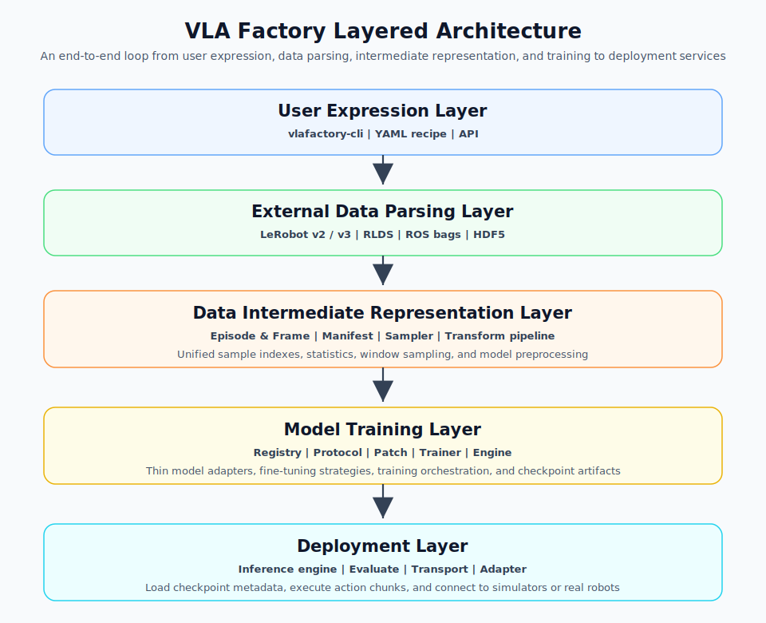
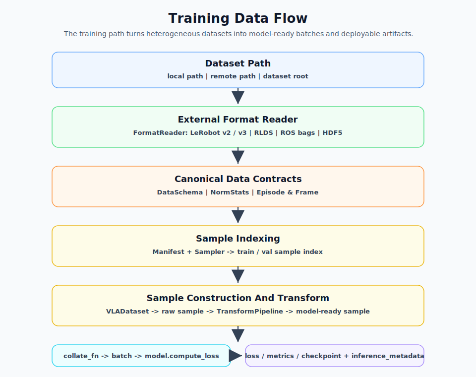
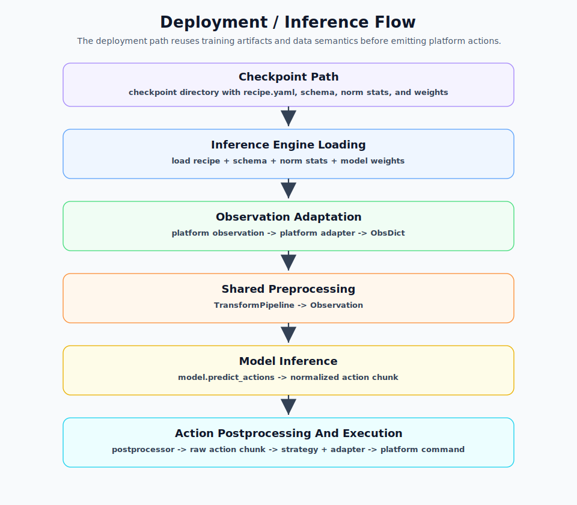

# VLA Factory Architecture Design

## 0. Overview

VLA Factory is a recipe-driven framework for training and deploying robot Vision-Language-Action models. A YAML recipe describes the model, data, fine-tuning strategy, training parameters, and output directory. The framework then completes the full loop from data loading, sample construction, model adaptation, training, checkpoint artifact generation, and online inference service.

The core positioning of the system is not to reimplement VLA or imitation-learning models. Instead, it provides a stable engineering glue layer:

- For users: start training, evaluation, inference, and deployment through a unified recipe.
- For data: convert different data formats into a unified intermediate representation and training samples.
- For models: wrap external model ecosystems through thin adapters.
- For training: reuse PyTorch, HuggingFace Trainer, and mature upstream model libraries.
- For deployment: connect simulators and real robots through a unified inference engine and platform adapters.

The current main execution path is:

```text
YAML recipe
    -> TrainRecipe
    -> model registry
    -> data reader / codec / transforms / sampler
    -> VLADataset / DataLoader
    -> VLATrainer
    -> checkpoint + inference_metadata
    -> InferenceEngine
    -> ZMQ serve / dataset infer / evaluate
```

This document describes VLA Factory's design principles, architectural boundaries, core module design, and future evolution.

### Table of Contents

- [0. Overview](#0-overview)
- [1. Background and Challenges](#1-background-and-challenges)
  - [1.1 Core Need for a Unified Framework](#11-core-need-for-a-unified-framework)
- [2. Design Principles](#2-design-principles)
- [3. Global Architecture](#3-global-architecture)
  - [3.1 Layered Architecture Diagram](#31-layered-architecture-diagram)
  - [3.2 Data Flow](#32-data-flow)
  - [3.3 Code Directory Structure](#33-code-directory-structure)
- [4. Configuration System](#4-configuration-system)
- [5. Core Module Design](#5-core-module-design)
- [6. Dependency Management Strategy](#6-dependency-management-strategy)
- [7. Reliability Design](#7-reliability-design)
- [8. Testing Strategy](#8-testing-strategy)
- [9. Extension and Evolution](#9-extension-and-evolution)

---

## 1. Background and Challenges

The core motivation for VLA Factory is to provide a unified framework for a fragmented robot VLA engineering workflow. "Unified" does not mean rewriting every model, dataset format, or runtime platform into one implementation. It means defining stable engineering contracts across data, models, training, artifacts, and validation, so capabilities from different ecosystems can enter the same workflow through explicit boundaries.

### 1.1 Core Need for a Unified Framework

For robot policy models, the path from data preparation to validation is usually not a single task but a complete workflow: data conversion, training configuration, model adaptation, checkpoint management, offline evaluation, simulation validation, and real-robot validation. Today, these steps often depend on many manual scripts and temporary conventions. Reuse across different models, datasets, and experiments is difficult.

Specific issues include:

- Inconsistent data formats: LeRobot, HDF5, RLDS, ROS bags, and other formats represent images, states, actions, episode boundaries, and statistics differently.
- Inconsistent training configuration: each model ecosystem usually has its own configuration system, training entry point, checkpoint layout, and hyperparameter naming. Migrating experiments requires repeated adaptation.
- Inconsistent model interfaces: different upstream models make different assumptions about observation, action, loss computation, action prediction, and checkpoint organization, making it hard to reuse one training and evaluation path.
- Inconsistent artifact contracts: the metadata, schema, norm stats, and configuration snapshots needed after training often depend on project-specific conventions, increasing the cost of reproduction, debugging, and later validation.

Therefore, VLA Factory aims to provide a unified recipe, intermediate data representation, model registry, training entry point, and artifact contract, turning manual adaptation work into reusable module boundaries. The primary goal is to let users describe experiments, connect data, select models, start training, generate artifacts, and reuse results in one consistent way. Other capabilities should be built on top of this unified contract instead of becoming parallel paths.

---

## 2. Design Principles

### 2.1 Recipe Driven

A training run should be fully described by a recipe. Model selection, data path, sampling window, action space, fine-tuning strategy, training steps, and output directory should all come from configuration instead of being scattered across scripts.

The authoring recipe is the highest-priority user configuration entry point. Any configurable behavior that VLA Factory exposes should be representable from the recipe, either as a common top-level field or inside a model-specific `model.config` subtree. This keeps experiments auditable: the user can see every intentional override in one file instead of chasing hidden script defaults.

Model default profiles such as `vla_factory/config/model/act.yaml` are defaults for the `model.config` subtree, not a separate configuration source at runtime. They carry model-specific baseline settings such as upstream model hyperparameters and transform defaults. At training entry, VLA Factory deep-merges the selected model profile with the recipe's `model.config`; fields explicitly written in the recipe win over profile defaults, and CLI overrides win over both when provided. The resolved `model.config` then becomes the single model configuration consumed by data transforms, model adapters, training, and deployment.

The CLI may provide a small number of temporary overrides, such as `--steps`, `--batch-size`, and `--output-dir`, for smoke tests or debugging. The recipe remains the primary contract.

### 2.2 Adaptation Over Reimplementation

VLA Factory does not own upstream model architecture code. Model capabilities are exposed through registry entries. Each entry is responsible only for:

- Declaring `ModelMetadata`.
- Parsing the recipe and dataset schema.
- Constructing the upstream model object.
- Translating between VLA Factory's `Observation` / action tensor and the upstream model's input/output format.

This reduces subtle behavioral deviations introduced by self-written model implementations and keeps maintenance cost lower when upstream ecosystems evolve.

### 2.3 Protocols Do Not Assume Model Structure

The unified model protocol only requires two core capabilities:

- `compute_loss(observation, actions, ...)`
- `predict_actions(observation, ...)`

Parameter access, device transfer, training mode, and similar capabilities are extended by backend. For example, PyTorch models implement `parameters()`, `named_parameters()`, `train()`, and `to()`. The framework does not require all models to expose the same internal modules.

### 2.4 Data Contract Decoupled From Models

The data module outputs unified observation/action samples. The model module only consumes the abstracted `Observation` and action tensor. Field paths, video encoding, episode indices, statistics, and vector key ordering from the source data format should not leak into model implementations.

### 2.5 Dependencies Are Installed On Demand

The core package stays lightweight. Upstream ecosystem dependencies such as ACT, OpenPI, and GR00T should be introduced through optional extras. If a model is not used, missing dependencies for that model should not affect registration, training, or deployment of other models.

---

## 3. Global Architecture

### 3.1 Layered Architecture Diagram



Five layers: **user expression layer (recipe) -> external data parsing layer -> intermediate data representation layer -> training layer -> deployment layer**. The recipe is the central hub; the other four layers consume it.

### 3.2 Data Flow

The core data flow is divided into training data flow and deployment inference flow. The two paths share recipe, schema, norm stats, and transform definitions, ensuring that the data semantics seen during training can be reused during deployment.

Training data flow:



| Stage | Input | Processing | Output |
|---|---|---|---|
| Data parsing | dataset path | `FormatReader` reads schema, norm stats, and episode information | `DataSchema` / `NormStats` / `Episode` |
| Sample indexing | episode information | `Manifest` + `Sampler` builds sliding-window sample indices | train / val sample index |
| Sample construction | sample index | `VLADataset` reads frames, decodes images, and assembles observation/action | raw sample |
| Data transform | raw sample | `TransformPipeline` performs normalization, resize, and padding | model-ready sample |
| Batching | model-ready sample | `collate_fn` aggregates batches | Trainer batch |
| Training forward | Trainer batch | `VLATrainer` calls `model.compute_loss` | loss / metrics / checkpoint + inference metadata |

Deployment inference flow:



| Stage | Input | Processing | Output |
|---|---|---|---|
| Artifact loading | checkpoint path | Read recipe, schema, norm stats, and load model weights | `InferenceEngine` |
| Observation adaptation | platform observation | platform adapter converts wire protocol | `ObsDict` |
| Preprocessing | `ObsDict` | Reuse training-side transform logic | `Observation` |
| Model inference | `Observation` | `model.predict_actions` | normalized action chunk |
| Postprocessing | action chunk | postprocessor denormalizes and crops dimensions | raw action chunk |
| Action execution | raw action chunk | execution strategy + action adapter | platform action command |

### 3.3 Code Directory Structure

The current core code is under `vla_factory/`. This structure describes relatively stable directory boundaries and module responsibilities only. Concrete file names may be added or changed as implementation evolves, so this architecture document does not maintain a file-level inventory.

```text
vla_factory/
├── examples/                      # recipe examples and minimal runnable cases
├── docs/                          # architecture, usage notes, and design records
├── config/                        # recipe parsing, default merging, and runtime config contracts
│   └── ...
├── data/                          # data format integration, IR, sampling, transforms, and dataloaders
│   ├── formats/                   # external data format readers
│   ├── codec/                     # video decoding and frame cache
│   ├── transforms/                # transforms such as normalization, resize, and padding
│   ├── sampling/                  # sampling strategies
│   └── ...
├── model/                         # model protocols, metadata, registry, and upstream adapters
│   ├── protocols/
│   ├── registry/
│   └── ...
├── training/                      # training orchestration, Trainer integration, and fine-tuning strategies
│   ├── strategies/
│   └── ...
├── deploy/                        # inference engine, platform adapters, transports, and action execution strategies
│   └── ...
├── utils/                         # shared constants, utilities, and lightweight helpers
│   └── ...
└── test/                          # unit tests, contract tests, and integration smoke tests
```

---

## 4. Configuration System

The configuration system converts a user-readable YAML recipe into structured objects consumed by training and deployment. It serves two kinds of users: regular users can start experiments by writing only a small number of key fields, while advanced users can override fine-grained model, data preprocessing, and training parameters in the recipe.

Conceptually, VLA Factory distinguishes two configuration forms:

- authoring recipe: the recipe written or maintained by the user, expressing only the explicit intent of the experiment.
- resolved recipe: the complete configuration produced at runtime by merging CLI overrides, user recipe, model default profile, and common defaults. It represents the final configuration actually used by the run.

Training artifacts store only the resolved recipe, always named `recipe.yaml`. This allows deployment to read a single configuration file without deciding whether the original or final configuration is the source of truth.

### 4.1 Recipe Structure

A recipe usually contains the following top-level blocks:

```yaml
model:
  name: act
  path: null
  config:
    transforms:
      inputs:
        - type: image_to_float
          range: [0, 1]
        - type: image_layout
          to: CHW
        - type: image_normalize
          mode: imagenet

action_spec:
  action_dim: 6
  action_horizon: 100
  action_type: joint_pos

data:
  source:
    path: /path/to/dataset
    format: lerobot-v3
    video_codec: auto
  sampler:
    type: sliding_window
    n_obs_steps: 1
    action_horizon: 100
  split:
    strategy: episode
    train_ratio: 0.9
    val_ratio: 0.1
    seed: 42

finetuning:
  strategy: full

training:
  backend: pytorch
  lr: 1.0e-4
  batch_size: 8
  total_steps: 10000

output:
  output_dir: outputs/default
```

`vla_factory/config/recipe.py` defines `TrainRecipe`, `ActionSpecConfig`, `DataConfig`, `SamplerConfig`, `SplitConfig`, `OutputConfig`, and other dataclasses. `parser.py` constructs these objects from YAML.

The recipe schema should cover the main capabilities that the framework allows users to customize, including model selection, action space, data source, sampling strategy, split strategy, fine-tuning strategy, training parameters, output directory, and model-specific `model.config`. `model.config` is the model-level extension area for model-specific hyperparameters and preprocessing configuration. Users do not need to fill every field in every recipe; they only write fields when overriding default behavior.

### 4.2 Configuration Sources and Priority

The configuration system needs to support both common training fields and model-specific fields. Configuration merging follows the principle that values closer to the current run have higher priority:

| Priority | Source | Scope | Description |
|---|---|---|---|
| 1 | CLI explicit overrides | Temporary override for this run | Highest priority, used for smoke tests, tuning, and temporary output directory changes. |
| 2 | YAML recipe | Configuration for this experiment | Main user configuration entry point, describing model, data, action space, training strategy, and output. |
| 3 | Model default profile | Model-specific defaults | Located at `vla_factory/config/model/<name>.yaml`, such as `act.yaml`. Used for default hyperparameters, transform pipeline, preprocessing preferences, and similar model-specific values. |
| 4 | Common defaults | Framework-level fallback | Defaults from `TrainRecipe` and child dataclasses, ensuring a minimal recipe can still be parsed. |

The current `train()` entry point supports the following overrides:

- `override_steps`
- `override_batch_size`
- `override_output_dir`

Model-specific hyperparameters live under the `model.config` field. Different models may have different defaults and processing details, such as the default transform list, action horizon, backbone learning rate, or upstream model config parameters. To avoid stuffing these differences into the common recipe schema, a model entry can read the corresponding model default profile, such as `vla_factory/config/model/act.yaml`, and deep-merge it with `model.config` from the recipe.

In the current design, a model default profile is a model-level experimental baseline, not an immutable protocol. Its role is to provide reasonable defaults for a model. If a YAML recipe explicitly specifies the same field, the recipe wins; if the CLI provides an override for the relevant field, the CLI wins. This supports both simple out-of-the-box configuration and precise experiment reproduction.

For advanced users, customization should not require copying the entire model profile. Users should locally override only the fields they need to change in the recipe. For example:

```yaml
model:
  name: act
  config:
    transforms:
      inputs:
        - type: image_to_float
          range: [0, 1]
        - type: image_layout
          to: CHW
        - type: image_normalize
          mode: imagenet
        - type: resize_images
          height: 320
          width: 240
```

This keeps the authoring recipe readable: users can clearly see what the experiment actually changes. The `recipe.yaml` stored in training artifacts records the fully expanded final configuration for reproduction and debugging.

### 4.3 Configuration Boundaries

The configuration system only expresses user intent. It does not execute heavy logic:

- The parser does not create models.
- The parser does not scan datasets.
- The parser does not import optional model dependencies.
- The recipe supports fine-grained overrides but does not require users to write every detail; the model default profile provides model-specific defaults, and `recipe.yaml` in training artifacts records the final complete configuration.

This boundary keeps configuration parsing fast and testable, while avoiding the need for users to understand every model's internal preprocessing details.

### 4.4 Configuration in Training Artifacts

Before training starts, `training/train.py` writes deployment metadata into `inference_metadata/` under the output directory. These files are used for inference, serving, reproduction, and debugging:

- `recipe.yaml`
- `schema.json`
- `norm_stats.json`

Here, `recipe.yaml` stores the resolved recipe: the final configuration after merging CLI overrides, user recipe, model default profile, and common defaults. Deployment, reproduction, and debugging all use this `recipe.yaml` as the source of truth. The original authoring recipe can be stored by an experiment management system or version control, but it is not the deployment contract of a checkpoint. This allows `InferenceEngine` to read a single configuration file and ensures that intermediate checkpoints can be loaded directly, avoiding the limitation that only a final checkpoint can be deployed.

---

## 5. Core Module Design

### 5.1 Data Module

The data module converts external datasets into model-agnostic training samples.

For the full design, see [Data Module Design](../modules/data-module.md).

Its main responsibilities include:

- Reading external data formats.
- Decoding or caching video frames.
- Computing or reading schema and norm stats.
- Building episode-level train/val splits.
- Slicing episodes into training samples with sliding windows.
- Applying the transform pipeline required by the model.
- Producing PyTorch DataLoaders.

#### 5.1.1 FormatReader

`data/formats/` defines data format readers. A reader exposes a unified set of capabilities:

- `get_schema(path)`
- `get_norm_stats(path)`
- `get_episode_ranges(path)`
- `get_episode_lengths(path)`
- `read_episode(path, episode_index, codec)`

The current main implementation is LeRobot v3. Future HDF5, RLDS, and Zarr support should primarily extend readers instead of changing the training module.

#### 5.1.2 VideoCodec

`data/codec/` abstracts video decoding. The PyAV codec reads video frames and supports `.npy` frame caching. Before training, the frame cache can be prebuilt with:

```bash
python -m vla_factory preprocess --config <recipe.yaml>
```

This reduces repeated decoding overhead during training.

#### 5.1.3 DataSchema and NormStats

The schema describes dataset structure, such as:

- state dimension
- action dimension
- camera list
- fps
- episode count
- frame count
- state/action key ordering

Norm stats describe statistics such as the mean, standard deviation, minimum, and maximum of state/action. Training and deployment must use the same statistics; otherwise, model output actions will have inconsistent scales.

#### 5.1.4 TransformPipeline

The transform pipeline handles normalization, image resizing, action dimension padding, and similar processing. The actual transform chain is determined jointly by model metadata and data statistics.

The current data loading entry point `_build_transforms()` reads `model_metadata["default_transforms"]`, then combines it with:

- norm stats
- image size
- model action dim
- dataset action dim

to construct the actual transforms. Each transform should skip itself when its preconditions are not met. For example, if norm stats are unavailable, normalization should not run.

#### 5.1.5 Manifest and Sampling

The manifest is the sample indexing layer. It turns episode ranges, episode lengths, observation windows, action horizon, and split configuration into indexable training/validation sample lists.

The default split should be episode-level to prevent adjacent frames from the same episode from appearing in both train and validation sets and causing leakage.

#### 5.1.6 VLADataset

`VLADataset` locates a sample from the manifest in `__getitem__`, reads frames, applies transforms, and outputs the data structure required by batching. `collate_fn` aggregates individual samples into batches consumed by Trainer.

The data module does not care about model internals. It only guarantees that the output satisfies the input contracts of `VLATrainer` and `VLAModel`.

### 5.2 Model Abstraction Module

The goal of the model abstraction module is to isolate model implementation differences so training and deployment depend only on minimal protocols.

#### 5.2.1 ModelMetadata

`ModelMetadata` is the static capability descriptor of a model. It includes:

- model name
- backend type
- action dim / horizon
- action head type
- architecture type
- training paradigm
- trainable component mapping
- whether a prompt is required
- image size
- supported fine-tuning methods
- default transform list
- installation hint

The training module uses metadata for dispatching instead of guessing model internals. In other words, VLA models are described by `ModelMetadata`, and their construction inputs are the data schema and training recipe.

#### 5.2.2 VLAModel Protocol

The unified protocol defines only the minimal methods required for training and inference:

```python
compute_loss(observation, actions, ...)
predict_actions(observation, **kwargs)
```

PyTorch models additionally implement `parameters()`, `named_parameters()`, `train()`, and `to()`, which are used by optimizers, freezing strategies, device transfer, and Trainer.

#### 5.2.3 Registry

Models are registered through decorators:

```python
@register_vla(ModelMetadata(name="act", ...))
def load_act(recipe, schema):
    ...
```

`get_entry(name)` lazily imports `model/registry/entries/*` on first access, triggering registration for each entry. The registry loader treats entry import failures as real errors, avoiding cases where syntax errors or missing hard dependencies are disguised as "model not registered."

Missing optional dependencies should produce clear errors when the factory is called. For example, the ACT entry can be registered and listed, but when actually creating the ACT model, if lerobot is not installed, the user should be told to install the `[act]` extra.

#### 5.2.4 Thin Adapter

Each model entry should be a thin adapter. Taking ACT as an example:

- Upstream `lerobot` owns ACTPolicy and the network structure.
- VLA Factory's wrapper only converts `Observation` into the lerobot batch dict.
- Loss and action chunk prediction call the upstream policy.
- Checkpoint loading handles key-prefix differences between the wrapper and upstream model.

This boundary requires that VLA Factory does not copy upstream model code into the repository and does not reimplement model details inside adapters.

### 5.3 Training Module

The entry point of the training module is `train()` in `vla_factory/training/train.py`.

Training flow:

```text
parse recipe
    -> prepare output_dir
    -> read schema / norm_stats
    -> resolve state/action vector keys
    -> save inference_metadata
    -> create model from registry
    -> apply fine-tuning strategy
    -> create dataloaders
    -> build TrainingArguments
    -> VLATrainer.train()
    -> save final/model.pt
```

#### 5.3.1 Fine-tuning Strategy

Fine-tuning strategies decide which parameters are trainable. They should operate on parameters based on `ModelMetadata.components` and `named_parameters()`, rather than hardcoding model types.

Current core strategies include:

- `full`: train all parameters.
- `freeze`: freeze specified components.
- `selective`: train only specified components.
- `lora`: extension for models that support LoRA.

ACT training from scratch usually uses `full`; pretrained VLA models may use full, freeze, selective, or LoRA.

#### 5.3.2 VLATrainer

`VLATrainer` is a thin subclass of HuggingFace `Trainer`. Its job is to bridge batches produced by the data pipeline:

```python
{
    "observation": Observation,
    "actions": Tensor,
    "action_is_pad": Tensor | None,
}
```

to:

```python
model.compute_loss(observation, actions, action_is_pad=...)
```

The Trainer ecosystem provides mixed precision, gradient accumulation, checkpointing, logging, optimizer scheduling, and other capabilities. VLA Factory only adds VLA batch adaptation, auxiliary loss logging, and the `lr_backbone` parameter group.

#### 5.3.3 Checkpoint and Final Model

Before training starts, `training/train.py` writes deployment metadata into `inference_metadata/` under the output directory. Intermediate checkpoints are written by HF Trainer. After training finishes, the framework additionally writes:

```text
<output_dir>/final/model.pt
```

During inference, loading searches for final weights, root directory weights, safetensors, or the latest `checkpoint-*` by priority.

### 5.4 Deployment Module

The deployment module turns training artifacts into real-time policy services callable by a platform.

#### 5.4.1 InferenceEngine

`InferenceEngine` is the core of deployment. During initialization, it:

1. Loads `inference_metadata` from the checkpoint directory.
2. Creates the model from recipe and schema.
3. Resolves the checkpoint weight path and loads the state dict.
4. Builds the preprocessor and postprocessor consistent with training.
5. Resolves camera keys, state keys, and action keys.
6. Initializes action chunk execution strategy state.

During inference, the platform observation is first converted to `ObsDict`:

```python
ObsDict(
    video={"front": np.ndarray, ...},
    state=np.ndarray | None,
    language=str | None,
)
```

Then it flows through:

```text
ObsDict
    -> Observation
    -> preprocessor
    -> model.predict_actions
    -> postprocessor
    -> raw action array
```

#### 5.4.2 Action Chunk Execution Strategy

Three strategies are currently supported:

- `synchronous`: return the full action chunk at once.
- `temporal_ensembling`: temporally ensemble overlapping chunks and return a single-step action.
- `receding_horizon`: predict a chunk, execute several steps from it, then predict again.

`receding_horizon` is important for chunked policies such as ACT because key actions may appear deeper in the chunk; using only the first step each time is insufficient.

#### 5.4.3 Platform Adapter

Deployment adapters convert between platform wire protocols and `ObsDict` / action dicts.

The simulator path uses the generic ZMQ transport, with observations expected to contain image and state fields.

The lerobot real-robot path uses `LerobotHostObsAdapter` and `LerobotHostActionAdapter`:

- The observation adapter converts per-motor state scalars and base64 images into `ObsDict`.
- The action adapter maps action vectors back to per-motor commands according to `action_keys`.

The state/action key ordering comes from the schema and recipe contract resolved during training and must not be generated by ad-hoc sorting during deployment.

---

## 6. Dependency Management Strategy

Dependency management follows the principle of "lightweight core, ecosystem dependencies on demand."

### 6.1 Core Dependencies

Core dependencies only cover configuration parsing, data pipelines, PyTorch training basics, CLI, and generic deployment capabilities. The core package should not install all model ecosystem dependencies by default.

### 6.2 Optional Extras

Model dependencies are exposed through optional extras, for example:

```bash
pip install -e ".[act]"
pip install -e ".[all]"
pip install -e ".[dev]"
```

`ModelMetadata.install_hint` provides clear guidance when dependencies are missing. The CLI `list` command should list registered models and their installation hints.

### 6.3 Adapter Dependency Boundary

A model entry module being importable does not mean upstream model dependencies must already be installed. The recommended approach is:

- Entry top-level code imports only stable VLA Factory internal modules.
- Upstream model libraries are imported lazily inside the factory.
- Missing optional dependencies raise a clear ImportError.
- Real entry import errors are reported explicitly by the registry loader.

### 6.4 Do Not Copy Upstream Model Code

VLA Factory does not maintain `vendor/` model implementations. Upstream models should come from pip extras or installable packages in the user environment. If an adapter needs to handle upstream version differences, that handling should remain local, removable, and testable.

---

## 7. Reliability Design

> TODO: This chapter describes reliability design that still needs to be implemented and refined. It is kept as an architecture target and implementation checklist.

Reliability design is organized around three paths: data, training, and deployment. The goal is not merely to throw an exception at final failure, but to detect anomalies as early as possible during data preparation, training, and deployment inference, and to provide actionable information to the user.

### 7.1 Data Reliability

Data reliability asks whether the data entering training is structurally correct, numerically reasonable, and semantically consistent. These checks should happen as much as possible at reader, manifest, dataset, and transform boundaries, preventing obviously bad data from entering long training runs.

Main checks include:

- Schema checks: confirm that state/action dimensions, camera list, episode count, and frame count match the recipe and model requirements.
- State/action key ordering checks: confirm that key ordering can be resolved and written into the schema. The dimension order of state/action vectors is a strong contract between data and the robot. Deployment should reuse the order resolved during training.
- Episode split checks: use episode-level train/val splitting by default to reduce false validation performance caused by adjacent-frame leakage.
- Sample index checks: confirm that sliding-window sampling does not generate out-of-bound samples and that train/val splits are not empty.
- Numerical checks: confirm that state/action contains no NaN, Inf, or values clearly outside expected ranges.
- Image checks: confirm images can be decoded and that shape, channels, and dtype match transform expectations.
- Statistics checks: confirm norm stats match data dimensions.

Automatically fixable issues should be logged as warnings. Issues that break training semantics should fail directly. If state/action key information is missing, the system may remain lenient for platforms that do not need per-key reconstruction, but for lerobot real-robot deployment, where commands must be sent by motor name, adapter construction or sending should fail clearly.

### 7.2 Training Reliability

Training reliability asks whether the training process is healthy, whether artifacts are reproducible, and whether checkpoints can be used directly for inference. Training should not only finish; it should continuously expose key states so users do not discover configuration or data issues only after hours of training.

The training process should monitor:

- Batch checks: record summaries such as observation/action shape, dtype, and padding ratio.
- Loss checks: detect NaN, Inf, abnormal spikes, or long-term non-decrease.
- Gradient checks: record gradient norm and clipping status in debug or diagnostic mode.
- Metric logging: output loss, auxiliary loss, learning rate, throughput, and similar metrics to console or TensorBoard/W&B.
- Checkpoint checks: confirm that checkpoint and `inference_metadata` are written successfully.

Training artifacts should be self-describing. The checkpoint directory contains deployment metadata, including `recipe.yaml`, `schema.json`, and `norm_stats.json`. This makes it possible to:

- Run inference with intermediate checkpoints.
- Evaluate checkpoints offline.
- Avoid requiring users to remember training-time statistics manually.
- Reduce the risk of passing the wrong recipe during deployment.

The default mode should avoid excessive logging that slows down training; debug mode can enable more detailed batch, transform, and model-call information.

### 7.3 Deployment Reliability

Deployment reliability asks whether training artifacts can be loaded correctly, whether the inference path is consistent with training, and whether model outputs can be safely converted into platform action commands.

First, training and deployment should share transform registration and construction logic. The deployment preprocessor/postprocessor is built from the checkpoint's recipe, schema, norm stats, and model metadata, avoiding a separately hand-written normalization path.

Deployment should check:

- Shape checks: confirm model output action shape matches `action_horizon` and `action_dim`.
- Numerical checks: confirm action contains no NaN or Inf.
- Range checks: if `action_spec` or the platform adapter declares action bounds, check, clip, or reject outputs before sending.
- Key mapping checks: confirm that action vectors can be completely mapped to platform-required action keys.
- Frequency checks: record inference latency, control-loop frequency, and observation timeout.
- Exception strategy: when illegal actions are produced, fail clearly or enter a safe fallback instead of silently sending untrusted commands.

These checks do not replace lower-level robot safety control. Their purpose is to detect model, configuration, and protocol adaptation issues as early as possible within VLA Factory.

### 7.4 Logging and Feedback Mechanism

Logging spans the data, training, and deployment paths. It records key events, configuration summaries, data summaries, training status, and deployment status. Logs should support levels such as `INFO`, `WARNING`, `ERROR`, and `DEBUG`:

- `INFO`: normal progress, such as recipe parsing results, dataset episode/frame counts, model name, training steps, and checkpoint save path.
- `WARNING`: issues that allow execution to continue but deserve user attention, such as missing optional statistics, unavailable logging backends, or minor data-field inconsistencies.
- `ERROR`: issues that cause the current task to fail, such as missing checkpoints, unregistered models, or data dimension mismatches.
- `DEBUG`: fine-grained call details and key parameters, such as fields parsed by a reader, transform pipeline composition, schema content, and adapter input/output shape.

Logs should include "what happened, in which module, what the current input summary is, and what the user should check." Critical failures should surface early:

- When a model is not registered, list available models.
- When registry entry import fails, report the specific module and exception.
- When an optional dependency is missing, suggest the corresponding extra.
- When a checkpoint does not exist or weights cannot be found, list the expected paths.
- When a deployment observation is missing a camera, report the missing and available cameras.
- When action/state dimensions mismatch, fail explicitly in the transform, adapter, or model wrapper.

Video frame caching reduces repeated decoding overhead during training. The current MVP uses a single-process DataLoader worker. Later, the number of workers can be increased after codec and reader thread/process safety is verified.

---

## 8. Testing Strategy

> TODO: This chapter describes the testing strategy that still needs to be completed. It is kept as a coverage target and regression checklist.

Tests should cover the key contracts from configuration parsing to training, inference, and deployment adapters.

### 8.1 Configuration Tests

Configuration tests focus on:

- YAML can be parsed into `TrainRecipe`.
- Defaults match expectations.
- Nested configuration structure remains stable.
- CLI overrides correctly affect training parameters.
- Compatibility strategy between top-level fields and nested fields is clear.

### 8.2 Data Pipeline Tests

Data tests focus on:

- Readers can read schema, norm stats, and episode information.
- Manifest sample count, split, and index ranges are correct.
- Transform pipeline behavior for normalize, resize, and padding is correct.
- `VLADataset` outputs observation/action shapes expected by the model.
- `collate_fn` can aggregate batches.

### 8.3 Model Registry and Adapter Tests

Model tests focus on:

- The registry can discover model entries.
- Duplicate registration fails.
- Error messages are clear when optional dependencies are missing.
- Wrappers implement `compute_loss` and `predict_actions`.
- State dict save/load round trips correctly.

### 8.4 Training Smoke Test

Training tests do not need to run full experiments, but should cover minimum-step training:

- Small dataset.
- Small batch.
- Few steps.
- Can write `inference_metadata`.
- Can write final weights.
- Loss logging does not retain the autograd graph.

### 8.5 Inference and Deployment Tests

Inference tests focus on:

- `InferenceEngine` can load metadata and weights from checkpoints.
- Dataset sample inference outputs the correct action shape.
- Postprocessor restores raw action scale.
- `synchronous`, `temporal_ensembling`, and `receding_horizon` strategies behave predictably.
- Simulator and lerobot adapters have correct input/output key mappings.

### 8.6 Regression Test Principles

Every fixed contract issue should be converted into a test, especially:

- state/action key ordering.
- action dim padding and reverse cropping.
- checkpoint path resolution.
- optional dependency lazy import.
- consistency between training and deployment transforms.

---

## 9. Extension and Evolution

VLA is one of the mainstream directions in embodied intelligence today, covering the three modalities of vision, language, and action. It may not be the final model form of embodied intelligence, but it is highly representative at the current stage: academia and industry continue to produce new methods around VLA data, models, post-training, and deployment. Therefore, the evolution goal of VLA Factory is not only to build a usable fine-tuning tool, but also to explore how infrastructure software should be designed under the VLA technical route.

In other words, VLA Factory is both an engineering framework and a research vehicle. Through a unified recipe, data contract, model adapters, training engine, and deployment engine, it continuously studies the following questions:

- How data should be collected, cleaned, calibrated, converted, and reused.
- How VLA and imitation-learning models can be fine-tuned, resumed, and post-trained at low cost.
- How model-specific techniques can be abstracted into framework capabilities and shared by other models.
- How embodied models can be deployed on edge devices in a stable, real-time, and safe manner.
- How training and inference infrastructure can adapt to and optimize for domestic software/hardware environments.

### 9.1 Horizontal Evolution: Broaden Ecosystem Coverage

Horizontal evolution means expanding the ecosystem coverage of VLA Factory. Since the framework is positioned as a glue layer, horizontal expansion focuses on supporting more data formats, model ecosystems, training strategies, and deployment platforms, allowing the same recipe and deployment interface to cover more real scenarios.

Horizontal expansion includes:

- Data formats: expand from LeRobot to HDF5, RLDS, ROS bags, Zarr, and mixed multi-source sampling.
- Model ecosystems: expand from ACT to OpenPI, OpenVLA, GR00T, SmolVLA, and others.
- Fine-tuning methods: expand from full/freeze/selective to LoRA, QLoRA, adapter tuning, and model-specific tuning.
- Deployment platforms: expand from ZMQ simulation and lerobot real robots to more robot middleware, edge devices, and remote inference services.
- Runtime environments: expand from the CUDA ecosystem to domestic environments such as OpenEuler + Ascend.

Horizontal expansion has high engineering cost and is suitable for exploration with AI coding and loop engineering. However, it must not sacrifice architectural boundaries: new data formats should stop at `FormatReader`, new models should stop at registry entries and adapters, and new platforms should stop at deployment adapters and transports.

### 9.2 Vertical Evolution: Go Deep Around Real Scenarios

Vertical evolution means taking a real need or scenario and deepening the full technical chain around it. The hard part of embodied intelligence is not only "can this model be integrated," but whether the full loop from data, fine-tuning, post-training, to deployment validation can work reliably.

Vertical evolution includes:

- Data path: automatic calibration, cleaning, quality checks, statistic generation, and format conversion for recorded data.
- Fine-tuning path: checkpoint resume training, parameter-efficient fine-tuning for different models, cross-dataset transfer, and training stability diagnosis.
- Post-training path: extend from behavior cloning to RL, preference optimization, failure sample mining, and world-model exploration.
- Deployment path: edge real-time inference, action chunk strategies, frequency control, abnormal action detection, and safe fallback.
- Evaluation path: offline metrics, simulation validation, real-robot validation, and deployment-log feedback loops.

Vertical evolution emphasizes technical accumulation. It must iterate from real scenarios instead of only doing interface adaptation. Deployment is especially important: embodied models add an action layer compared with LLM/VLM and often run inside edge-side closed loops. LLM/VLM deployment infrastructure cannot simply be reused. Real-time behavior, stability, validity, and safety boundaries of action outputs are research questions that embodied infrastructure needs to address separately.

### 9.3 Contract Abstraction: Turn Model-Specific Tricks Into Framework Capabilities

One important value of VLA Factory is to abstract certain model-specific tricks into framework-level capabilities so they can be reused by other models. A typical example is delta action: if it was originally used only by one model, but the framework abstracts action transforms, normalization, denormalization, and deployment reconstruction into a unified transform, then other VLA models can also try delta-action fine-tuning under the same data and training contract.

Such abstractions should follow these principles:

- A trick should not be hardcoded into a single model adapter; it should be captured in data transforms, training strategies, action specs, or deployment postprocessors.
- The abstracted capability should be reusable across models as much as possible, while allowing models to declare enablement through metadata or recipe.
- Training and deployment must share the same semantics; the capability must not only take effect during training.
- Every abstraction should have a testable input/output contract, avoiding "apparently generic but actually serving only one model."

This "unified contract abstraction" is key for the framework to evolve from a glue layer into infrastructure. It means VLA Factory is not just integrating models; it can also turn new methods into composable, reusable, and verifiable foundation modules.

### 9.4 Deployment and Inference Evolution

Deployment and inference are important evolution directions after the unified framework extends into real robot loops, but they are not the core motivation for building the framework in the first phase. The first phase should stabilize training artifacts, data contracts, and model protocols. On top of that foundation, deployment and inference can deepen around the same recipe, schema, norm stats, and transform definitions.

This direction focuses on:

- Inference consistency: training and inference share data transforms, normalization statistics, camera/state/action key ordering, and action specs.
- Real-time control: optimize end-to-end latency, control frequency, action chunk strategies, caching, and asynchronous execution.
- Platform adaptation: connect more simulators, robot middleware, and real-robot platforms through observation adapters, action adapters, and transports.
- Safety and observability: add abnormal-observation checks, action validity checks, frequency monitoring, trace logs, and fallback strategies.
- Deployment evaluation: build unified methods for offline replay, simulation validation, real-robot validation, and deployment-log feedback.

The boundary for this direction is that deployment should reuse the unified contracts formed during training. It should not redefine independent data semantics or model input/output protocols on the deployment side.

### 9.5 Domestic Compute Evolution

Domestic compute support is also a future evolution direction, not a prerequisite for the current framework to exist. The core architecture of VLA Factory should first keep backend, adapter, and optional dependency boundaries clear, leaving room for later validation of training, inference, and deployment on environments such as OpenEuler + Ascend.

This direction focuses on:

- Training backend adaptation: validate operator support, mixed precision, distributed training, checkpoint formats, and performance tuning methods.
- Upstream model compatibility: identify implicit CUDA dependencies in ACT, OpenPI, OpenVLA, GR00T, and similar ecosystems, then reduce migration cost through adapters or dependency isolation.
- Inference runtime validation: evaluate end-to-end stability across model loading, data preprocessing, action postprocessing, communication protocols, and hardware runtimes.
- Performance baselines: compare data loading, training throughput, inference latency, and control frequency between CUDA and domestic environments.
- Engineering knowledge: document environment setup, debugging methods, operator substitutions, precision differences, and deployment constraints.

The boundary for this direction is that domestic compute support should be introduced gradually through backends, adapters, and dependency management. Core data contracts and model protocols should not bind themselves to one hardware or operating-system environment.

### 9.6 Extension Path Constraints

Both horizontal and vertical evolution should respect existing module boundaries:

- New data format: implement a new `FormatReader` that outputs unified schema, norm stats, episodes, and frames.
- New model: add a registry entry, declare `ModelMetadata`, and wrap the upstream model with a thin adapter.
- New training strategy: select parameters through metadata components or parameter-name rules instead of hardcoding model internals.
- New deployment platform: add observation adapter, action adapter, and necessary transport without modifying the core prediction logic of `InferenceEngine`.

During evolution, two constraints should be preserved: the main path depends only on stable contracts, and ecosystem differences stay inside adapters. Horizontal expansion broadens ecosystem coverage; vertical evolution deepens technical capability. They are orthogonal and can proceed in parallel.
