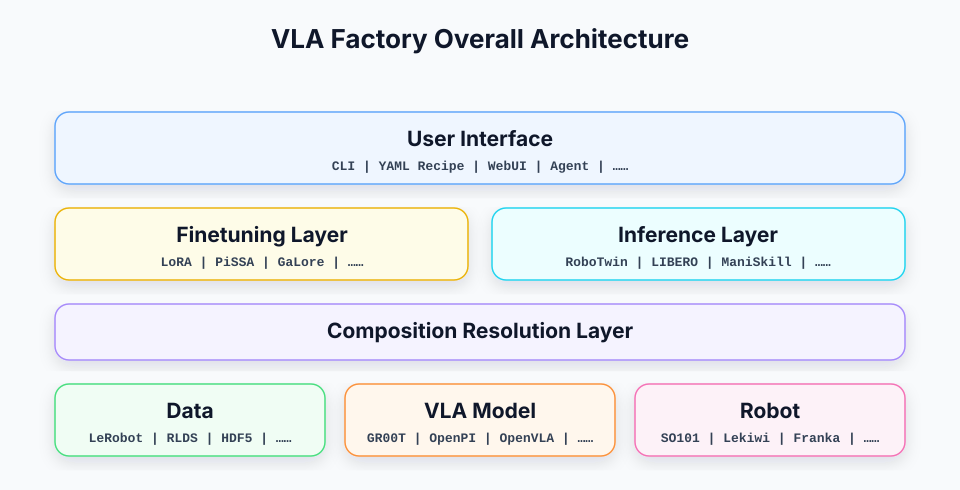

# VLA Factory Architecture

> **Document positioning**: this document is a top-level design describing VLA Factory's target architecture and **may include ideas not yet implemented**; the per-module design documents (linked in each section) always align with the **currently implemented** behavior and are intended for readers to study. The architecture document explains "what to build and why"; the module documents explain "how it works today".

## 0. Overview

### 0.1 Engineering Problems in Embodied AI

A robot policy model is not a single-point task from data preparation to validation; it is a complete workflow: data collection and conversion, training configuration, model adaptation, checkpoint management, offline evaluation, simulation validation, and real-robot validation. Today this pipeline is highly fragmented — data formats (LeRobot/HDF5/RLDS/ROS bags) differ in images, states, actions, episode boundaries, and statistics; each model ecosystem ships its own configuration system and training entry point; and training artifacts' metadata and norm stats follow project-specific conventions. Switching to a different model or dataset means rewriting a whole layer of glue code, and experience barely accumulates across experiments.

The most acute pain point is **post-training fine-tuning**. Pretrained VLA models (e.g. OpenPI, OpenVLA, GR00T) typically have billions of parameters, making full-parameter fine-tuning prohibitively expensive; real-world usage therefore relies on parameter-efficient methods like LoRA/QLoRA. But the training scripts shipped by upstream models support these strategies unevenly — switching fine-tuning methods often means hacking the training loop directly. Worse, fine-tuning must balance "preserving pretrained capability" against "adapting to a new scene or a new robot": new data may come from a different embodiment, a different joint order, or a different camera layout, while the pretrained model has fixed assumptions about input semantics. The slightest mismatch in normalization, camera mapping, or joint order can break what the model has already learned, or even cause catastrophic forgetting. These semantics must then be carried intact to the deployment side, otherwise the fine-tuned checkpoint cannot go online — and today this consistency is almost entirely maintained by hand, which is extremely error-prone. On top of that, post-training data is usually limited (dozens to hundreds of demos), and there is no unified way to diagnose training stability and generalization.

### 0.2 Why Existing Frameworks Fall Short

The open-source community already has many excellent training frameworks, but most of them cannot directly solve VLA's engineering problems.

**Training scripts shipped with each model ecosystem are not directly reusable.** ACT, OpenPI, OpenVLA, GR00T, SmolVLA, etc., each carry their own training entry point, configuration files, and data-loading logic, assuming different data formats and robots, with almost no reusable interface between them.

**Why you cannot just use an LLM fine-tuning framework like Llama Factory.** Llama Factory is a mature LLM fine-tuning framework, but it targets a "text-in → text-out" paradigm, which differs fundamentally from how VLA works:

| Dimension | Llama Factory assumption | VLA Factory reality |
|---|---|---|
| I/O | Pure text token sequences | Multimodal temporal data: images, robot states, action sequences, language instructions |
| Output form | One-shot generated text | Continuous action sequences (action chunks), streamed frame-by-frame to real joints |
| Data carrier | Text corpora | Multimodal temporal data with episode boundaries, video codecs, and normalization stats |
| Embodiment constraints | None | DoF, joint order, control mode, safety bounds, gripper conventions |
| Deployment form | One inference call returns a result | On-device real-time closed-loop control requiring stable frequency and low latency |
| Train-deploy consistency | Weights alone are enough | Must share normalization, camera mapping, and joint order, or the model cannot be deployed |
| Safety boundary | Bad output is at worst a wrong answer | Bad output can damage hardware or injure people; action-legality checks and fallbacks are required |

In other words, VLA adds the **action** modality on top of LLM/VLM and usually runs in an on-device closed loop. The real-time performance, stability, legality, and safety boundary of action output are problems that LLM training frameworks do not cover at all. Directly adopting Llama Factory means either bolting on a thick adaptation layer outside it, or losing train-deploy consistency — in the end you are still rebuilding a framework from scratch.

### 0.3 Positioning and Goals

VLA Factory is a recipe-driven framework for training and deploying robot Vision-Language-Action models. A single YAML recipe describes the model, data, robot, fine-tuning strategy, training parameters, and output directory; the framework then closes the loop from data loading, composition resolution, sample construction, model adaptation, training, and checkpoint artifacts through to an online inference service.

The core positioning of the framework is not to reimplement various VLA or imitation-learning models, but to provide a stable engineering glue layer:

- For users: start training, evaluation, inference, and deployment through one unified recipe.
- For data: convert different data formats into a unified intermediate representation and training samples.
- For models: wrap external ecosystem model implementations through thin adapters.
- For training: reuse the mature capabilities of PyTorch, HuggingFace Trainer, and upstream model libraries.
- For deployment: connect to simulators and real robots through a unified inference engine and platform adapters.

**VLA Factory's goal**: establish stable engineering standards across data, models, training, artifacts, and validation, so that capabilities from different ecosystems can enter the same workflow through clear boundaries. "Unified" here does not mean reshaping every model, data format, or runtime platform into one implementation; it means defining stable description formats and composition rules among the three dimensions — dataset, robot, and VLA model. A new dataset can be combined with existing models, and a new model can be combined with existing data and robots, without writing per-combination adapter code. Quantitatively, N datasets × M models × K robots yield up to `N × M × K` candidate combinations; as long as the N datasets come from F formats, the code assets the framework maintains over the long term approach `F + M + K` rather than `N × M × K` dedicated adapters. `N × M × K` is a candidate space, not a promise that every combination is compatible — the composition resolution layer produces a deterministic result or a structured error for every actual combination. At the ecosystem level, the framework integrates mainstream data formats, model ecosystems, and deployment platforms, and can interoperate with reinforcement-learning and evaluation frameworks such as RLinf in the post-training stage, rather than reimplementing an RL training system internally.

### Table of Contents

- [0. Overview](#0-overview)
- [1. Design Principles](#1-design-principles)
- [2. Global Architecture](#2-global-architecture)
- [3. User Expression Layer](#3-user-expression-layer)
- [4. Core Module Design](#4-core-module-design)
- [5. Dependency Management Strategy](#5-dependency-management-strategy)
- [6. Testing Strategy](#6-testing-strategy)
- [7. Extension and Evolution](#7-extension-and-evolution)

---

## 1. Design Principles

### 1.1 Recipe Driven

A training run should be fully described by a recipe. Model selection, data paths, robot selection, sampling windows, action space, fine-tuning strategy, training steps, and output directory all come from configuration, not from scattered scripts.

The recipe is the user's highest-priority configuration entry point. The top-level fields of the recipe express experiment intent (model/data/robot selection, fine-tuning strategy, training parameters, output); the model's own capabilities and defaults are carried by the model declaration (ModelMetadata) and are not in the recipe; adjustments to the relationships among data/model/robot go in the `composition` block. This keeps experiment configuration auditable: the user can see every intentional override in one file, rather than tracing behavior through scripts and implicit defaults.

Model-related defaults (default preprocessing, image size, camera slot layout, inference steps, etc.) are published with the model declaration YAML and cannot be modified in the recipe; the recipe only carries the user's composition selection, composition adjustments, and training parameters.

The CLI may provide a few temporary overrides such as `--steps`, `--batch-size`, `--output-dir` for smoke tests or debugging, but the recipe remains the primary contract.

### 1.2 Adaptation Over Reimplementation

VLA Factory does not hold upstream model architecture code. Model capabilities are exposed through registry entries. Each entry is only responsible for:

- Declaring `ModelMetadata`.
- Parsing the recipe and dataset schema.
- Constructing the upstream model object.
- Translating between VLA Factory's `Observation` / action tensors and the upstream model's input/output format.

This reduces subtle behavioral deviations introduced by self-written models and keeps maintenance cost low as upstream ecosystems evolve.

### 1.3 Protocols Do Not Assume Model Structure

The unified model protocol requires only two core capabilities:

- `compute_loss(observation, actions, ...)`
- `predict_actions(observation, ...)`

Parameter access, device transfer, training mode, and similar capabilities are extended by backend. For example, PyTorch models implement `parameters()`, `named_parameters()`, `train()`, `to()`. The framework does not require all models to expose the same internal modules.

### 1.4 Data Contract Decoupled From Models

The data module outputs unified observation/action samples; the model module only consumes the abstracted `Observation` and action tensors. Field paths, video codecs, episode indices, statistics, and vector key ordering from the source data format must not leak into model implementations.

### 1.5 Dependencies Installed On Demand

The core package stays lightweight. Upstream ecosystem dependencies such as ACT, OpenPI, and GR00T should be introduced through optional extras. When a model is not in use, missing dependencies for that model must not affect the registration, training, or deployment of other models.

### 1.6 Composition Resolution Over Implicit Conventions

The relationships among dataset, robot, and VLA model (which camera maps to which model visual slot, how action dimensions are padded, how joint orders are aligned, how gripper direction is flipped) must be derived explicitly by the framework from each dimension's description, not triggered as hidden branches keyed on "model name + dataset name + robot name".

The allowed inputs are data description, model description, robot description, and controlled overrides; writing hidden conditional branches for a specific combination is forbidden.

### 1.7 Determinism and Conservative Failure

Composition resolution must satisfy:

- Same inputs produce the same output.
- Results do not depend on registration order.
- "Equal array length" is never substituted for "semantic match".
- Automatic generation happens only when the mapping is unique.
- Ambiguity requires a controlled override.
- Missing conditions for a high-risk transform is an explicit failure, not a guessed silent execution.

---

## 2. Global Architecture

### 2.1 Overall Architecture Diagram



Four layers, top to bottom. The diagram shows only the ecosystem each layer plugs into, not internal implementations:

- **User Expression Layer**: `vlafactory-cli | YAML recipe | API | ……`, the framework entry point; the recipe describes the data, model, robot, and fine-tuning config of a run.
- **Finetuning Layer / Inference Layer**: two peer execution engines. The finetuning layer plugs in fine-tuning strategies such as LoRA / PiSSA / GaLore; the inference layer connects to simulation and evaluation environments such as RoboTwin / LIBERO / ManiSkill.
- **Composition Resolution Layer**: built on top of the three unified descriptions, it further composes data, VLA model, and robot into an **embodiment composition** (producing `ResolvedComposition` on success or `ResolutionError` on failure) shared by the finetuning and inference layers. This layer does not plug into any external ecosystem.
- **Data / VLA Model / Robot**: three dimensions, each with a unified description — a unified data description (`DataSchema`), a unified model description (`ModelMetadata`), and a unified robot description (`RobotProfile`); together they are the framework's "three unifications". Each dimension integrates a concrete ecosystem: LeRobot / RLDS / HDF5 on the data side, GR00T / OpenPI / OpenVLA on the model side, and SO101 / Lekiwi / Franka on the robot side.

Dependencies: the recipe drives the two execution engines; the descriptions of the three dimensions flow into the composition resolution layer; the embodiment composition is then handed to the finetuning and inference layers. The finetuning and inference layers only consume the embodiment composition and no longer derive the relationships among the three dimensions on their own.

### 2.2 Code Directory Structure

The current core code lives under `vla_factory/`. This structure describes only relatively stable directory boundaries and module responsibilities; concrete file names may be added or adjusted as the implementation evolves, and the architecture document does not maintain a file-level inventory.

```text
vla_factory/
├── examples/        # recipe examples and minimal runnable samples
├── docs/            # architecture, usage notes, and design records
├── recipe/          # user expression layer: recipe parsing, CLI/API entry, runtime config
│   └── ...
├── data/            # data reader and intermediate representation
│   ├── formats/     # FormatReader interface and per-format implementations (LeRobot / HDF5 / RLDS / Zarr)
│   └── ...          # DataSchema / Episode / Frame / NormStats IR (read-only, no sample construction)
├── composition/     # composition resolution of dataset × robot × VLA model
│   ├── resolver/    # embodiment composition resolver (Resolver / ResolvedComposition)
│   ├── transforms/  # TransformStep / TransformPipeline / TransformRegistry and step implementations
│   └── ...
├── model/           # model abstraction and upstream adapters
│   ├── interfaces/  # VLAModel interface (compute_loss / predict_actions) and the Observation canonical type
│   ├── registry/    # model registry (@register_vla)
│   └── ...          # ModelMetadata / BaseContract and per-upstream model adapters
├── robot/           # robot embodiment description (RobotProfile) registration and validation
├── training/        # training orchestration: Observation sample construction, dataloader, Trainer, fine-tuning strategies
│   ├── strategies/
│   └── ...
├── inference/       # inference engine, platform adapters, transports, and action execution strategies
│   ├── connectors/  # lightweight connectors imported by remote robot environments and their bootstrap configs
│   ├── platforms/   # adaptation between native platform observation/action and the unified inference interface
│   ├── transports/  # wire protocols and serialization such as ZMQ and length-prefixed JSON RPC
│   └── ...
├── utils/           # shared constants, utilities, and lightweight helpers across modules
│   └── ...
└── test/            # unit tests, contract tests, and integration smoke tests
```

**Dependency direction (top-down, no back-edges):** `data/`, `model/`, `robot/` are leaf layers — `data/` only produces IR such as `DataSchema` / `Episode` / `Frame` / `NormStats`; `model/` holds the VLAModel interface, `Observation`, and `ModelMetadata` / `BaseContract`; none of them depend upward. `composition/` reads the three descriptions and produces the embodiment composition; `training/` and `inference/` consume the embodiment composition and each assemble `Observation` samples from IR / platform observations via a TransformPipeline (`data/` does not construct samples). `Observation` lives in `model/interfaces/` and is depended on by `composition/`, `training/`, and `inference/`, while `model/` does not depend back on any of them — the graph is acyclic.

---

## 3. User Expression Layer

The user expression layer turns a human-readable YAML recipe into structured objects that both training and inference can consume. It serves two kinds of needs: ordinary users can launch an experiment with only a few key fields, while advanced users can override finer-grained training parameters in the recipe.

The recipe written by the user is the single source of truth for configuration. Model defaults are published with the model declaration (ModelMetadata) and cannot be modified in the recipe; the CLI provides a few temporary overrides. Detailed design: [User Expression Layer Module Design](../modules/recipe-module.cn.md) (TODO).

### 3.1 The Three Zones of a Recipe

The recipe is cleanly divided into three zones with distinct responsibilities:

**① Composition Selection Zone** — only specifies "which dataset, which model, which robot", one or two fields per dimension, without touching the relationships among them:

```yaml
model:
  name: pi05                    # registered model name
  path: lerobot/pi05_base       # pretrained weights path (omit for from-scratch models)
data:
  path: /datasets/aloha_transfer_cube
  format: auto                  # auto-detects LeRobot / HDF5 / RLDS / Zarr
robot:
  name: aloha_vx300s_bimanual   # robot embodiment declaration
```

**② Composition Adjustment Zone (optional)** — by default, the relationships among the three are derived automatically by the composition resolution layer (Section 4.2) from their descriptions; this zone is filled only when the resolver cannot decide uniquely or the user wants a non-default policy (Section 4.2 calls this a "controlled override"):

```yaml
composition:                    # optional, empty by default
  camera_mapping:               # model visual slot -> data/robot camera (specified on ambiguity)
    base_0_rgb: front
    left_wrist_0_rgb: wrist
  accept_fps_mismatch: true     # explicitly accept frequency mismatch
  gripper_flip: true            # accept gripper convention flip
  default_task: "pick up the block"  # language fallback (used when data/deploy has no task)
```

**③ Training Parameter Zone** — describes "how to train" and is completely independent of the relationships among data, model, and robot:

```yaml
finetuning:
  strategy: lora                # full | lora | freeze | selective
  lora:
    r: 16
    target_components: [llm]    # references keys of ModelMetadata.components
training:
  lr: 2.5e-5
  batch_size: 8
  total_steps: 20000
  num_workers: 4
output:
  output_dir: outputs/pi05_aloha
  report_to: tensorboard
```

The relationships among the three — which camera goes into which model visual slot, how action dimensions are padded, how joint orders are aligned, how the gripper is flipped, how normalization is aligned — **do not appear in the recipe by default**; they are derived automatically by the composition resolution layer (Section 4.2) from the three descriptions, and are only written explicitly in the composition adjustment zone when there is ambiguity or a policy choice.

### 3.2 Field Overview

The table below summarizes the main recipe fields by zone (full fields, defaults, and allowed values are in `examples/reference.yaml` and `vla_factory/config/recipe.py`):

| Zone | Block | Main fields | Notes |
|---|---|---|---|
| Composition selection | `model` | `name`, `path` | Model selection; `path` is required for fine-tuning, optional for from-scratch |
| Composition selection | `data.source` | `path`, `format`, `video_codec` | Dataset path and format; `format: auto` auto-detects |
| Composition selection | `robot` | `name` | Robot embodiment declaration |
| Composition adjustment (optional) | `composition` | `camera_mapping`, `state_mapping`, `action_mapping`, `joint_mapping`, `language_mapping`/`default_task`, `accept_fps_mismatch`, `gripper_flip` | Explicitly specify the three-way relationship when the resolver cannot decide uniquely; cannot rewrite objective facts (shape, checkpoint slots, joint topology, fixed dim caps) |
| Training params | `data.sampler` | `type`, `n_obs_steps`, `action_horizon` | Window strategy for slicing episodes into training samples |
| Training params | `data.split` | `strategy`, `train_ratio`, `seed` | Train/val split |
| Training params | `finetuning` | `strategy`, `lora`, `freeze_components`, `trainable_components` | Fine-tuning strategy and component selection |
| Training params | `training` | `lr`, `lr_backbone`, `batch_size`, `total_steps`, `gradient_checkpointing`, `inference_steps`, `num_workers`, `augmentation` | Optimizer, scheduling, memory, and data loading |
| Training params | `output` | `output_dir`, `report_to`, `logging_steps`, `save_steps`, `save_total_limit`, `overwrite_output_dir` | Checkpoint, logging, and final weights |
| Extension | `transforms.imports` | custom transform module paths | Register user-defined transforms |

`TrainRecipe` and its sub-dataclasses (`DataConfig`, `SamplerConfig`, `SplitConfig`, `LoraConfig`, `OutputConfig`, `AugmentationConfig`, etc.) in `vla_factory/config/recipe.py` are the structural definitions of these fields; `parser.py` constructs them from YAML. Users do not need to fill every field — only the ones whose defaults they want to override.

### 3.3 Configuration Sources and Priority

Configuration merging follows "the closer to this run, the higher the priority":

| Priority | Source | Scope | Notes |
|---|---|---|---|
| 1 | Explicit CLI | Temporary override for this run | Highest priority, for smoke tests, tuning, and ad-hoc output dir changes. |
| 2 | YAML recipe | This experiment's config | The user's main configuration entry point, describing composition selection, adjustment, and training params. |
| 3 | Framework defaults | Fallback | Defaults of `TrainRecipe` and its sub-dataclasses, plus model-builtin defaults (declared via ModelMetadata, immutable). |

The training entry `train()` currently supports CLI overrides `override_steps`, `override_batch_size`, `override_output_dir`.

---

### 3.4 Resolution Workflow and Validation

Once the recipe is written, the composition resolution layer (Section 4.2) derives the relationships among data, model, and robot from it. Facts of different dimensions are determined by their own sources and cannot be governed by a uniform "later-write-wins":

| Field type | Source policy |
|---|---|
| Data attributes and semantics | FormatReader inspects the actual data and produces DataSchema |
| Model static capability | ModelMetadata |
| Model instance facts | BaseContract, preferred within ModelMetadata's capability envelope |
| Robot facts | RobotProfile / URDF |
| Three-way relationship | Generated by the resolver; explicitly specified in the recipe's `composition` block when ambiguous |

The embodiment composition (Section 4.2) must record the source of every final field. Ordinary users do not need to read the DataSchema or RobotProfile field reference first — the first-use flow is:

```text
fill in the three selections
    -> resolve
       ├─ success: show summary, can be handed directly to downstream modules
       └─ failure: show only the relevant fields, candidates, and a minimal override example
```

Only when debugging do `inspect` and `resolve --explain` reveal the framework-derived internal facts; error messages follow the principle of progressive disclosure: for example, on a camera-mapping ambiguity they show only the target slot, candidate cameras, and the corresponding override snippet, not the full declarations. The CLI provides four capabilities: resolve and preview a three-way composition; explain Mapping / Transform / provenance by topic; inspect actual data, model instances, and robot declarations; and emit the embodiment composition to downstream or debugging tools. These commands must run without optional model heavy-dependencies installed, without a GPU initialized, and without a robot platform connected.

---

## 4. Core Module Design

This chapter splits an experiment into four layers: first describe the three dimensions — data, VLA model, robot (4.1); then the composition resolution layer composes them into an embodiment composition (4.2); finally the finetuning layer (4.3) and the inference layer (4.4) consume it. The composition resolution layer (4.2) in particular is target-oriented and does not imply all capabilities are implemented yet.

### 4.1 Data × Model × Robot

Any embodied-AI experiment is essentially composing three things:

```text
dataset ──┐
          │
VLA model ┼──> resolver ──> embodiment composition
          │
robot ────┘
```

- **Dataset**: the actual content of the training data — which cameras, which state/action fields, what dimensions, what ordering, what fps, what action statistics. It varies with the actual data content.
- **VLA model**: what inputs the model needs — how many visual slots, what image size, whether state/action dimensions are fixed or padded, how long the action horizon is, what normalization is required. Model-family capability is described by the registry; instance facts of a specific checkpoint are supplemented by its own metadata.
- **Robot**: what the robot is physically — how many DoF, what the joints are named, how they are ordered, which control modes are supported, what values represent gripper open/close, where the joint limits are, what the recommended control frequency is. It evolves with robot model and embodiment variant.

Each of the three dimensions has a "description", and the resolver only consumes these descriptions — it does not read raw data, create models, or connect to robot platforms.

#### 4.1.1 Dataset: DataSchema and NormStats

`DataSchema` is a fact snapshot generated by the data reader after inspecting an actual dataset; it describes the fields, dimensions, cameras, temporal information, and action semantics that truly exist in the data. Different datasets of the same format can produce different DataSchemas. Composition resolution cares about the following categories of information:

- Camera names, resolution, layout, color space, and frame semantics;
- state keys, ordering, dimensions, units, and coordinate frames;
- action keys, ordering, dimensions, units, control modes, and rotation representations;
- gripper conventions;
- timestamps, fps, and episode boundaries;
- language fields and default task description;
- the robot identity the data corresponds to;
- the schema source.

`NormStats` is the normalization statistics bound to the actual data content (mean/std, min/max, or quantiles). Together with DataSchema it is read by the reader or computed by the framework, but kept as an independent structure.

The data module parses external datasets into VLA Factory's Canonical IR (`DataSchema` / `Episode` / `Frame` / `NormStats`); video decoding is used as a replaceable capability during reading. It also saves and reuses schema, norm stats, and recipe for the inference side, so that training and inference share the same data standard. **Sample construction** (assembling IR into `Observation` via a transform pipeline) and batching are not in the data layer — they are done in the finetuning layer (4.3). Detailed design: [Data Module Design](../modules/data-module.md), which covers the responsibility boundary between the external-data parsing layer and the data IR layer, the core objects `FormatReader` / `Episode` / `Frame` / `VideoRef` / `DatasetManifest`, and how to add new data formats, video-decoding strategies, and transform steps.

#### 4.1.2 VLA Model: ModelMetadata and BaseContract

The model-dimension description (interface capability, default preprocessing, camera slot layout, input size, inference steps, etc.) lives in the **model's own declaration YAML**, is published with the model, and is reflected here as the Model dimension's facts; it is not in the recipe and cannot be modified per-run. If an experiment needs to adjust the relationships among data/model/robot (e.g. camera mapping, language fallback), express it in the recipe's `composition` block (see Chapter 3) rather than editing the model declaration. Detailed design: [Model Abstraction Module Design](../modules/model-module.cn.md) (TODO).

##### ModelMetadata

`ModelMetadata` is the static capability description of a model, reusing and extending existing model metadata to describe the relatively stable interface capabilities and constraints of a model family. It carries two categories of information at once: the interface facts needed for composition resolution, and the model's own capabilities such as backend, trainable components, and fine-tuning abilities (the resolver reads only the former for composition resolution; the latter is kept in the embodiment composition for the training module to access). Specific fields include: model name, backend type, action dim / horizon, action head type, architecture type, training paradigm, trainable-component map, whether prompt is required, image size, supported fine-tuning methods, default transform list, install hint. The key information categories composition resolution depends on:

- visual slots, names, and input shapes;
- state/action dimension policy: fixed, flexible, padded;
- action horizon;
- action representation and control mode;
- rotation, gripper, and unit conventions;
- normalization method and required statistics;
- whether a prompt is required;
- supported input resolutions and dtypes.

The number of model slots does not equal the number of real cameras that must exist. A fixed model slot only means a corresponding key/tensor must be preserved on the model's call boundary. The current design introduces no extra type for missing cameras: any model slot without a real-camera mapping is uniformly padded, with the model input adapter generating the placeholder image and invalid mask the model needs. For example, if the robot or data has only 2 real cameras while the model has 3 fixed slots, the resolver still produces 3 model input slots and plans padding for the third — a mere count mismatch is not deemed incompatible.

##### BaseContract

`BaseContract` describes the input slots, dimensions, temporal info, image specs, and normalization facts that a specific model instance or checkpoint can self-report; it is read by the checkpoint-metadata reader. Merge rules:

- Facts reliably self-reported by the checkpoint or model instance take precedence;
- BaseContract cannot declare anything beyond ModelMetadata's capability envelope;
- ModelMetadata provides semantics that instance metadata cannot express;
- On conflict, fail;
- Each merged fact records its source.

##### VLAModel Protocol

The unified protocol defines only the minimal methods needed for training and inference:

```python
compute_loss(observation, actions, ...)
predict_actions(observation, **kwargs)
```

PyTorch models additionally implement `parameters()`, `named_parameters()`, `train()`, `to()` for optimizers, freeze strategies, device transfer, and Trainer.

##### Registry

Models are registered via a decorator:

```python
@register_vla(ModelMetadata(name="act", ...))
def load_act(recipe, schema):
    ...
```

`get_entry(name)` lazily imports `model/registry/entries/*` on first access, triggering each entry's registration. The registry loader treats an entry-import failure as a real error, so that syntax errors or missing hard dependencies are not disguised as "model not registered". A missing optional dependency should produce a clear error at factory call time. For example, the ACT entry can be registered and listed, but when actually creating an ACT model, if lerobot is not installed, the user should be prompted to install the `[act]` extra.

##### Thin Adapter

Each model entry should be a thin adapter. Taking ACT as an example:

- The upstream `lerobot` holds ACTPolicy and the network structure.
- VLA Factory's wrapper only converts `Observation` into the lerobot batch dict.
- Loss and action-chunk prediction call into the upstream policy.
- Checkpoint loading handles the key-prefix difference between the wrapper and the upstream model.

This boundary requires VLA Factory neither to copy upstream model code into the repo nor to rewrite model details in the adapter.

#### 4.1.3 Robot: RobotProfile

`RobotProfile` describes the robot embodiment and **does not describe which process it connects to or which transport it uses**. It is responsible for:

- robot identity and embodiment variant;
- stable semantic names for sensors and cameras;
- joint names, ordering, units, types, and limits;
- native action representation and supported control modes;
- gripper conventions;
- coordinate frames and URDF references;
- static safety bounds needed for composition resolution;
- recommended control frequency.

The three dimensions share strict schema and provenance recording but differ in lifecycle: the dataset varies with content, the model varies with model family and instance, and the robot varies with embodiment model. The framework only unifies their resolution interface and does not force them to use the same registration and dispatch mechanism. Detailed design: [Robot Module Design](../modules/robot-module.cn.md) (TODO).

#### 4.1.4 How to Extend the Three Dimensions

External developers do not need to learn the full composition protocol; they only need to complete the minimal extension entry for one dimension. The framework should provide scaffolding and registration-time validation for each of the three entries — data format, model, and robot. The scaffolding generates only that dimension's adapter, minimal declaration, and contract test, and splits fields into: must-fill (facts the resolver needs that cannot be read from upstream objects), auto-read (obtained from actual data, checkpoint metadata, URDF, or adapter), and optional-supplement (filled only when a specific capability exists).

**Adding a data format**: implement `FormatReader`; produce unified DataSchema, NormStats, and episode/frame from the actual data; validate strictly via DataSchema; add reader-contract and representative composition tests. Adding a new dataset of an existing format usually only requires providing a path, not registering a data instance. A reader must not, to fit some model, rename fields to model-specific names, do model-specific padding, reorder actions per a model's requirement, or inject model-specific normalization.

**Adding a model**: add or extend a ModelMetadata registry entry; declare the model's observation, action, language, normalization, and temporal interface; wrap the upstream implementation with a thin ModelAdapter; support BaseContract extraction as needed; add metadata-contract and representative composition tests. A ModelAdapter must not select cameras by dataset name, adjust output semantics by robot name, guess field correspondences by sorting, or re-execute the resolver's compatibility checks.

**Adding a robot**: add a RobotProfile; reference URDF or other standard embodiment descriptions as needed; declare sensors, joints, control modes, gripper, coordinate frames, and static safety bounds; add profile-contract and representative composition tests. A RobotProfile should support importing determinable fields from URDF, vendor descriptions, or existing adapters; developers only supplement VLA semantics not present in the standard description. The robot's runtime platform, connectors, and transports are out of scope for this section.

---

### 4.2 Composition Resolution Layer

The composition resolution layer resolves the three dimensions into a unified embodiment composition and is the common upstream of the finetuning and inference layers; it is a deterministic, pure-logic layer and also the target architecture's direction of evolution. Detailed design: [Composition Resolution Module Design](../modules/composition-module.cn.md) (TODO).

#### 4.2.1 Embodiment Composition (ResolvedComposition)

**The "embodiment composition" is a core concept defined by this framework.** It is the **sole product** of successfully resolving "dataset × robot × VLA model", and corresponds to `ResolvedComposition` in code.

The reason for defining this concept explicitly is that both the training module and the inference module need to know "exactly which three things are being used this run and how they relate" — and this is precisely what is most error-prone and most often silently assumed by each side. The embodiment composition extracts this knowledge from training code and inference code and fixes it as a non-bypassable handoff object.

##### What the embodiment composition contains

The embodiment composition contains four categories of information, together answering "which descriptions are used, what the final interface is, how fields correspond, and which transforms must run":

```text
embodiment composition ResolvedComposition
├─ normalized references to the three descriptions
│   ├─ dataset description (DataSchema + NormStats)
│   ├─ VLA model description (ModelMetadata + BaseContract)
│   └─ robot description (RobotProfile)
├─ canonical interface shared by all three
│   (the observation / action / language / temporal semantics ultimately used by this composition)
├─ field mappings
│   ├─ CameraMapping  : cameras -> model visual slots
│   ├─ StateMapping   : state fields -> model state vector
│   ├─ ActionMapping  : dimension and semantic relations among data actions / model output / robot commands
│   ├─ LanguageMapping: task-text field -> model prompt
│   └─ JointMapping   : canonical joint order -> robot-native joint names
└─ declarative descriptions of three Transform Pipelines (TransformPipelineSpec)
    ├─ data_to_model  : data sample -> model training interface
    ├─ robot_to_model : robot real-time observation -> model input
    └─ model_to_robot : model action output -> robot canonical command
```

- **Normalized references to the three descriptions**: downstream no longer needs to query each registry; all facts are in one object. From the downstream perspective they are part of the embodiment composition, not external inputs to be queried again.
- **Canonical interface**: the final interface all three obey; it is the "fact standard" after composition, and every downstream module reads/writes observation/action against it.
- **Field mappings**: only describe local field and semantic correspondences; they perform no tensor computation themselves.
- **Transform Pipeline declarations**: declarative descriptions telling downstream "which transforms to run, in order, along this path", but containing no instantiated executable objects.

##### What the embodiment composition does not contain

To keep responsibilities clear, the embodiment composition **does not** contain:

- learning rate, batch size, or training steps;
- LoRA, optimizer, or Trainer config;
- checkpoint save layout;
- deployment platform, IP, port, or transport;
- client/server topology;
- any instantiated runtime object (Trainer, DataLoader, PlatformAdapter, model weights, etc.).

These belong to downstream execution config or runtime dependencies and are managed by the training module and the inference module respectively.

##### The embodiment composition is the sole entry point for downstream

The training module and the inference module can access the descriptions and three-way relationships of this composition **only** through the embodiment composition:

```text
embodiment composition + downstream's own config and runtime dependencies
    ├─> training module
    └─> inference module
```

They must not bypass the embodiment composition to independently query the data, model, or robot registries, nor re-derive the three-way relationships from model/dataset/robot names. The two downstream modules may each further parse the embodiment composition into a "training plan" or "inference plan", but there can be only one source of truth.

#### 4.2.2 Resolver

The resolver is the entry point for three-way composition resolution; its public entry is `resolve_composition()`. It is a **deterministic, pure-logic component**:

- it creates no models;
- it builds no DataLoader;
- it starts no training;
- it loads no deployment platform;
- it modifies no dataset;
- it depends on no GPU;
- it creates no downstream output directory;
- its result is serializable, diffable, and unit-testable.

##### Inputs

- DataSchema generated by the data reader for the actual data;
- NormStats;
- ModelMetadata already in the model registry;
- an optional BaseContract;
- RobotProfile;
- controlled overrides (explicit user specifications for ambiguous cases);
- resolution rules and the existing TransformRegistry.

Training hyperparameters and deployment session config **do not** enter the resolver.

##### Resolution phases

A single composition resolution executes in these phases:

```text
1. Load            load DataSchema, NormStats, ModelMetadata, BaseContract, RobotProfile
2. Materialize     merge ModelMetadata with BaseContract, normalize controlled vocabularies of the three
3. Validate        validate the internal structure and provenance of each
4. Check Pairs     check dataset×model, model×robot, dataset×robot pairwise relations
5. Build Interface determine the post-composition observation, action, language, and temporal semantics
6. Resolve Mapping generate Camera, State, Action, Language, Joint mappings
7. Plan Pipeline   generate declarative TransformPipelineSpec, marking order, risk, and reversibility
8. Emit            on success emit the embodiment composition; on failure raise a structured ResolutionError
```

The resolver must not create models, DataLoaders, training output directories, or deployment connections before completing all validations.

##### Compatibility checks

Compatibility checks cover:

| Check | Comparison | On mismatch |
|---|---|---|
| State dim | data vs model | flexible/padded convertible; fixed errors |
| Action dim | data vs model vs robot | plan a transform if paddable; otherwise error |
| Camera slots | data/robot cameras vs model slots | unique match → Mapping; unmapped slots padded; ambiguity errors |
| Language input | data language vs model requirement | controlled default → warning; otherwise error |
| Control mode | data/model/robot | handled by transform tier |
| Gripper convention | data/model/robot | plan a transform when flip is determinable |
| Rotation representation | data/model/robot | plan a transform when conditions are complete |
| Normalization stats | data stats vs model method | pass if stats satisfy; otherwise error |
| Frequency | data fps vs model/robot | warning by default; no implicit resampling |
| Joint order | data keys vs robot joints | Mapping if uniquely reorderable; otherwise error |
| Safety bounds | model output vs robot limits | record constraints; do not mask severe mismatches |

Camera compatibility is checked per model slot, not by total camera count. When there is a unique real view, a Mapping is established; when there is no real view, an empty mapping is kept and padding is planned; failure happens only when multiple candidates exist and cannot be decided uniquely.

The final success criterion is not the simple sum of the three pairwise checks, but that all three can form a consistent result under one canonical interface.

##### Transform tiers

Transforms are classified by reliability into three tiers:

**T1: deterministic syntactic or mathematical transforms** — planned automatically when conditions are complete:

- field renaming and unambiguous reordering;
- image layout, dtype, and deterministic resize;
- dimension padding / unpadding;
- normalization / denormalization;
- explicit gripper-convention flip;
- rotation-representation conversion under the same coordinate-frame definition;
- padding of model slots without a real-camera mapping.

**T2: transforms depending on the robot model or runtime conditions** — generated only when conditions are complete and requiring user audit by default:

- FK/IK between joint position and EEF pose/delta;
- resampling across frequencies;
- coordinate-frame conversion depending on extrinsics;
- selection or projection of structured actions for single-arm vs bimanual.

When conditions are insufficient, only a structured "unsupported / extra conditions needed" diagnostic is emitted; T2 is never auto-generated.

**T3: unreliable automatic transforms** — direct failure:

- converting between tokenized actions and an unknown continuous action space;
- camera or coordinate-frame conversion without calibration info;
- joint semantics that cannot be uniquely determined;
- cross-robot-topology action conversion without an explicit projection rule;
- mappings that require task-semantic reasoning to decide.

#### 4.2.3 Mapping

Mapping only expresses stable semantic correspondences and performs no tensor operations. Taking cameras as an example, each relation centers on a model visual slot and describes both the training-time and runtime sources:

```text
model visual slot
├─ training source: a camera in DataSchema, or empty mapping
└─ runtime source:  a camera in RobotProfile, or empty mapping
```

For example, the same model head visual slot may come from the top camera in the data at training time and from the robot head camera at runtime. An empty source does not make the model slot disappear; the resolver still keeps the slot and plans padding along the corresponding path, with the specific placeholder values and mask form implemented by the model input adapter.

Mappings must satisfy:

- every model slot has an explicit source relation or empty mapping;
- a non-empty source must be findable in the corresponding DataSchema or RobotProfile;
- an empty mapping must plan camera-slot padding along the corresponding path;
- one camera relation simultaneously describes both "data → model" and "robot → model";
- automatic mapping uses only deterministic rules;
- a controlled override directly produces the final Mapping;
- semantics are never guessed from dictionary order or string sorting.

#### 4.2.4 Transform Pipeline

The framework reuses the existing Transform system rather than adding another transform abstraction:

| Object | Responsibility |
|---|---|
| `TransformStepSpec` | serializable single-step type and config |
| `TransformPipelineSpec` | ordered list of TransformStepSpec produced by the resolver |
| `TransformRegistry` | resolves a step type to an implementation and maintains capability metadata |
| `TransformStep` | instantiated, executable single-step transform |
| `TransformPipeline` | ordered TransformSteps actually run by downstream |

The embodiment composition stores only `TransformPipelineSpec` (declarative). Downstream uses `TransformRegistry` to instantiate an executable `TransformPipeline`. The embodiment composition must not write a `TransformPipeline` containing Python objects and runtime context directly into the resolution result.

##### Three semantic pipelines

The embodiment composition describes three possibly-different semantic adaptation paths:

**data_to_model**: converts a data sample into the model training interface, including data cameras and state fields to model input slots, image dtype/layout/resize/normalization, state/action normalization, action padding, and task/language field mapping.

**robot_to_model**: converts a **normalized semantic object** of the robot's real-time observation into a model input, including robot camera semantics to model visual slots, state-key and joint-order reordering, units/coordinate-representation/normalization, and the padding and input-format conversion the model needs. It does not handle ROS messages, HTTP JSON, shared memory, or vendor SDK objects — the inference module should first use a PlatformAdapter to convert the platform payload into a canonical robot observation before running this pipeline. Even if the training data comes from the same robot, `robot_to_model` cannot default to equaling `data_to_model`: data field names, collection encoding, and the runtime observation contract may differ.

**model_to_robot**: converts the model's internal action output into the robot's canonical command semantics, including action unpadding, denormalization, joint/action key reordering, unit and action-representation conversion, and explicit, supported control-space conversion. It only produces canonical actions conforming to the RobotProfile and is not responsible for sending commands, executing safety stops, or choosing transports.

##### Forward and inverse cannot rely on list reversal

Each transform implementation must explicitly state whether it is exactly invertible, approximately invertible, or non-invertible; when an inverse exists, the corresponding implementation must also be explicit — downstream must not guess by name. For example:

- the inverse of pad is unpad;
- the inverse of normalize is denormalize;
- resize usually has no exact inverse;
- safety clamp is irreversible;
- temporal resampling can be lossy.

The resolver plans three explicit TransformPipelineSpecs. Downstream modules instantiate the appropriate pipeline per target path and must not simply reverse `data_to_model` and treat it as `robot_to_model` or `model_to_robot`.

##### Rule provenance

Resolution rules and TransformPipelineSpecs may depend only on explicit facts from the three dimensions. It is forbidden to trigger branches on hardcoded model names, dataset names, robot names, the current deployment platform, or implementation details of some Trainer. When a specific object does have a unique constraint, that constraint should be lifted into a declaration field of its dimension and consumed by a generic rule.

#### 4.2.5 Failure Handling

A resolution failure must become a structured result before entering downstream, rather than an opaque exception thrown deep inside training or deployment code. The error contract keeps only three stable concepts:

- `code`: a stable machine error code for tests, the CLI, and external tools to classify the problem;
- `path`: the resolution target the error corresponds to, not necessarily the user's original recipe field;
- `params`: the JSON-serializable facts needed to render a message.

`params` is not arbitrary debug context. Each `code` must define its allowed parameter set and be constructed via a dedicated entry point. Check rules must not ad-hoc concatenate error strings or drop in full DataSchemas, model objects, tensors, or other uncontrolled content.

Human-readable messages are not part of the stable error contract. The CLI selects a template from a unified error catalog by `code` and renders it with `params`. For example, a camera-mapping ambiguity needs to show only the target slot, the stably-sorted candidates, and a local override hint. This lets wording be changed independently, supports multilingual output, and prevents tests from depending on full error strings.

The resolver may collect mutually-independent problems and raise a single `ResolutionError`; if a declaration itself is invalid, subsequent checks depending on it stop.

#### 4.2.6 Boundary with the Training and Inference Modules

The **training module** may read: DataSchema and NormStats kept in the embodiment composition, ModelMetadata with its backend/training components/fine-tuning abilities, the canonical model interface, the data × model Mapping, and the `data_to_model` TransformPipelineSpec. The training module is itself responsible for training mode, objective function, fine-tuning strategy, backend, Trainer, sampler, DataLoader, batch construction, optimizer, scheduler, distributed execution, and checkpoints/training artifacts. It must not re-derive camera mappings from model names, guess action semantics from array shapes, bypass the embodiment composition to query the registry independently, override joint orders already fixed by the resolver, or silently ignore composition errors.

The **inference module** may read: RobotProfile and embodiment capability and static safety constraints kept in the embodiment composition, ModelMetadata and model runtime capability, the canonical model interface, the robot × model Mapping, and the `robot_to_model` and `model_to_robot` TransformPipelineSpecs. The inference module is itself responsible for platform adapters and connectors, transports, client/server topology, session config, platform wire format, action-chunk execution strategy, connection retry/timeout/lifecycle, and runtime safety execution. It must not bypass the embodiment composition to query the registry independently, nor use platform information to re-derive the three-way semantic relationships; it may parse platform runtime parameters as long as the composition facts remain unchanged.

### 4.3 Finetuning Layer

The finetuning layer is implemented by the `training/` module; its entry point is `train()` in `vla_factory/training/train.py`. Detailed design: [Finetuning Layer Module Design](../modules/training-module.cn.md) (TODO). Training flow:

```text
parse recipe
    -> prepare output_dir
    -> read schema / norm_stats
    -> resolve state/action vector keys
    -> save inference_metadata
    -> create model from registry
    -> apply fine-tuning strategy
    -> create dataloaders
    -> build TrainingArguments
    -> VLATrainer.train()
    -> save final/model.pt
```

As the composition-resolution capability of Section 4.2 lands, the training entry will first call `resolve_composition()` to obtain the embodiment composition, then read data description, model description, and Mappings from it — replacing the manual field parsing currently scattered across train().

The finetuning layer assembles `Observation` samples from the Canonical IR (`Episode` / `Frame`) produced by the data layer, according to the `data_to_model` TransformPipeline obtained from the embodiment composition, then performs window sampling and batching and hands the result to `VLATrainer`.

#### 4.3.1 Fine-tuning Strategy

The fine-tuning strategy decides which parameters are trainable. It should operate on parameters via `ModelMetadata.components` and `named_parameters()`, not by hardcoding model types. Current core strategies include:

- `full`: full-parameter training.
- `freeze`: freeze specified components.
- `selective`: train only specified components.
- `lora`: for models that support LoRA.

ACT trained from scratch usually uses `full`; pretrained VLA models may use full, freeze, selective, or LoRA.

#### 4.3.2 VLATrainer

`VLATrainer` is a thin subclass of the HuggingFace `Trainer`. Its job is to bridge the batch produced by the data pipeline:

```python
{
    "observation": Observation,
    "actions": Tensor,
    "action_is_pad": Tensor | None,
}
```

to:

```python
model.compute_loss(observation, actions, action_is_pad=...)
```

The Trainer ecosystem provides mixed precision, gradient accumulation, checkpointing, logging, and optimizer scheduling. VLA Factory only adds VLA batch adaptation, auxiliary loss logging, and the `lr_backbone` parameter group.

#### 4.3.3 Checkpoint and Final Model

Before training starts, `training/train.py` writes the metadata needed by inference into `inference_metadata/` under the output directory. Intermediate checkpoints are written by the HF Trainer. After training, the framework additionally writes:

```text
<output_dir>/final/model.pt
```

At inference load time, final weights, root weights, safetensors, or the most recent `checkpoint-*` are searched in this priority order.

### 4.4 Inference Layer

The inference module turns training artifacts into a platform-callable real-time policy service: it rebuilds an inference chain consistent with training from the checkpoint (model + preprocessor/postprocessor), translates each simulator's/real robot's native observation into a unified `ObsDict`, assembles it into an `Observation` via the `robot_to_model` TransformPipeline, runs the model forward, and then restores the normalized action chunk into a platform-executable action command via `model_to_robot` according to the execution strategy. It uses the checkpoint's `inference_metadata` (recipe, schema, norm stats) as the single source of truth — it does not rescan the training dataset or re-derive the relationships among data, model, and robot.

Detailed design: [Inference Module Design](../modules/deploy-module.md), which covers:

- The responsibility boundaries of the inference core layer, the platform adaptation layer, and the transport/remote-service layer.
- Core objects `InferenceEngine`, `ObsDict`, platform adapters, `PolicyRunner`, `RemotePolicyModel`, `ZmqPolicyClient`, `LengthPrefixedJsonRpcServer`.
- ObsDict → Observation preprocessing and postprocessing inverse transforms, and the three action-chunk execution strategies: synchronous / temporal_ensembling / receding_horizon.
- In-process and remote service forms (ZMQ and length-prefixed JSON RPC) and the zero-dependency connector.
- How to add new platform adapters, transports, and external connectors.

---

## 5. Dependency Management Strategy

Dependency management follows the "lightweight core, on-demand ecosystem" principle, with a toolchain based on **uv + venv**: each model environment is an independent virtual environment managed by uv, mutually isolated.

### 5.1 Why uv + venv

Core dependencies cover only configuration parsing, the data pipeline, PyTorch training basics, the CLI, and general deployment capability (see `dependencies` in `pyproject.toml`); model-ecosystem dependencies are introduced on demand. The framework uses [uv](https://github.com/astral-sh/uv) to manage versions, virtual environments, and package installation, rather than system Python or conda:

- uv's PubGrub resolver can resolve the strict `==` version pins of upstream ecosystems (especially openpi); these pins, combined with openpi's in-place transformers patch, make a plain `pip install -e ".[pi0]"` fail outright.
- uv natively supports routing torch/torchvision through the PyTorch CUDA wheel index (`--torch-backend`), with no need for hand-written `--find-links` or `PIP_EXTRA_INDEX_URL`.
- uv creates and manages venvs extremely fast; each model environment is isolated, preventing lerobot/openpi dependency conflicts from polluting the global environment.

### 5.2 Environment Setup

Model environments are wrapped by `scripts/install.sh`, the recommended entry point:

```bash
bash scripts/install.sh [venv_dir] [model]
# defaults: venv_dir=.venv, model=pi0
```

The script performs, in order:

- Creates a virtual environment with `uv venv --python 3.12` (default `.venv`) and activates it.
- Auto-selects the torch CUDA wheel backend by the GPU's **compute capability** (not the driver CUDA version): Blackwell (sm_100 and above, e.g. RTX 5090 sm_120) → `cu128`; others (Hopper sm_90 and earlier) → `cu126`. Override with `VLA_TORCH_BACKEND=cu126|cu128`. The reason for checking compute capability rather than driver version is that a Blackwell card reports driver CUDA 12.4 but needs cu128's torch 2.8+ to get sm_100/sm_120 kernels.
- Auto-detects a PyPI mirror (Tsinghua for CN networks, otherwise PyPI); override with `VLA_PYPI_INDEX`.
- Downloads openpi (and lerobot when `VLA_LOCAL_LEROBOT=1`) as a tarball into `.local-deps/` and installs from a local path, avoiding GitHub git-transport instability on weak networks; openpi is pinned to a known-good commit.
- After installing openpi, overlays its `transformers_replace` patch onto site-packages (dtype fixes for SigLIP/PaliGemma/Gemma required by PI0Pytorch).
- Installs vla-factory itself in editable mode (`uv pip install -e .`).

Once done:

```bash
source .venv/bin/activate
vlafactory-cli list
vlafactory-cli train --config examples/pi0_lora.yaml
```

### 5.3 Optional Extras

Model-ecosystem dependencies are declared in `[project.optional-dependencies]` of `pyproject.toml`:

| extra | contents | install |
|---|---|---|
| `act` | lerobot (ACT policy) | `uv pip install -e ".[act]"` directly |
| `pi0` / `pi05` | openpi (pinned commit) | **must go through `scripts/install.sh`** |
| `robotwin` | h5py (RoboTwin native hdf5 data) | `uv pip install -e ".[robotwin]"` directly |
| `all` | all of the above | the pi0/pi05 part still needs install.sh |
| `dev` | pytest, pytest-cov, tensorboard | `uv pip install -e ".[dev]"` |

To emphasize: **pi0 / pi05 cannot be installed with plain pip** — openpi's strict pins and transformers patch must be handled by `install.sh` together with uv.

`ModelMetadata.install_hint` gives a clear message when a dependency is missing, and the CLI `list` command shows registered models and their install hints.

### 5.4 Adapter Dependency Boundary

A model entry module being importable does not mean the upstream model dependency must already be installed. The recommended practice is:

- The entry top level imports only stable internal VLA Factory modules.
- Upstream model libraries are imported lazily inside the factory.
- A missing optional dependency raises a clear ImportError.
- A genuine entry-import error is reported explicitly by the registry loader.

### 5.5 No Upstream Model Code Copying

VLA Factory does not maintain `vendor/` model implementations. Upstream models should come from a pip extra, an installable package in the user's environment, or a local source dependency pulled by `install.sh` (openpi / lerobot). Any handling of upstream version differences in an adapter should be local, removable, and testable.

---

## 6. Testing Strategy

> TODO: This chapter describes the testing strategy to be filled in later and currently serves as a coverage-target and regression checklist.

Tests should cover the key criteria from configuration parsing through composition resolution, training, inference, and deployment adapters.

### 6.1 Configuration Tests

Configuration tests care about:

- YAML parsing into `TrainRecipe`.
- Defaults matching expectations.
- Stable nested-config structure.
- CLI overrides correctly affecting training parameters.
- A clear compatibility policy between top-level and nested fields.

### 6.2 Composition Resolution Tests

Composition-resolution testing is a new focus; see Section 4.2:

- Input-contract tests for each of the three dimensions (required fields, unknown fields, enum vocabularies, dimension and key counts, ModelMetadata/BaseContract merging, RobotProfile/URDF consistency).
- Resolution-rule tests cover each row of the compatibility matrix: direct compatibility, auto-generated Mapping, auto-generated TransformPipelineSpec, warning, error, success after controlled override, and result stability under identical input.
- Failure tests assert `ResolutionError`'s `code`, `path`, and `params` rather than matching the full user-facing text.
- Golden-composition tests save embodiment-composition golden files for a few representative combinations (e.g. LeRobot ACT data × ACT × LeKiwi; RoboTwin data × ACT × simulation robot; LeRobot ALOHA data × PI0/PI0.5 × ALOHA).
- Mapping and Transform-Pipeline tests cover unique field matching, camera-slot ambiguity, padding of unmapped camera slots, state/action key reordering, normalize/denormalize pairing, pad/unpad pairing, gripper flip, rotation conversion, risk and reversibility declarations, and the prohibition on name hardcoding.
- Embodiment-composition serialization round-trips stably, and resolution does not load model heavy-dependencies, GPUs, or deployment runtimes.

### 6.3 Data Pipeline Tests

Data tests care about:

- The reader can read schema, norm stats, and episode info.
- Manifest sample counts, splits, and index ranges are correct.
- The transform pipeline's normalize, resize, and padding behave correctly.
- `VLADataset` output observation/action shapes match model expectations.
- `collate_fn` handles batch aggregation.

### 6.4 Model Registry and Adapter Tests

Model tests care about:

- The registry can discover model entries.
- Duplicate registration fails.
- Missing optional dependencies produce clear error messages.
- The wrapper implements `compute_loss` and `predict_actions`.
- State-dict save/load round-trips.

### 6.5 Training Smoke Test

Training tests need not run a full experiment but should cover minimal-step training:

- small dataset, small batch, a few steps;
- able to write `inference_metadata`;
- able to write final weights;
- loss logging does not retain the autograd graph.

### 6.6 Inference and Deployment Tests

Inference tests care about:

- `InferenceEngine` can load metadata and weights from a checkpoint.
- Dataset sample inference outputs the correct action shape.
- The postprocessor restores the original action scale.
- `synchronous`, `temporal_ensembling`, and `receding_horizon` strategies behave predictably.
- Simulator and lerobot adapter input/output key mappings are correct.

### 6.7 Regression-Test Principle

Any standard issue that has been fixed should be pinned as a test, especially: state/action key ordering; action-dim padding and inverse cropping; checkpoint path resolution; optional-dependency lazy import; train/deploy transform consistency; resolver stability on three-way relationship derivation.

---

## 7. Extension and Evolution

VLA is currently one of the mainstream routes in embodied AI. It may not be the final model form of embodied intelligence, but it is strongly representative at this stage: academia and industry keep producing new methods around VLA data, models, post-training, and deployment. VLA Factory's evolution goal is therefore not only to be a usable fine-tuning tool but also to explore, along the VLA route, how foundational software should be designed.

VLA Factory is both an engineering framework and a research vehicle. Through its unified recipe, data standards, model adapters, training engine, and deployment engine, it keeps studying:

- how data is collected, cleaned, calibrated, converted, and reused;
- how VLA and imitation-learning models can be fine-tuned, continued, and post-trained at low cost;
- how model-specific tricks can be abstracted into framework capabilities shared by other models;
- how embodied models can be deployed stably, in real time, and safely on-device;
- how training and inference infrastructure can be adapted and optimized on domestic hardware/software stacks.

### 7.1 Horizontal Evolution: Expanding Ecosystem Coverage

Horizontal evolution means expanding VLA Factory's ecosystem coverage. Because the framework is positioned as a glue layer, horizontal expansion focuses on integrating more data formats, model ecosystems, training strategies, and deployment platforms, letting one recipe and deployment interface cover more real scenarios.

Horizontal expansion includes:

- Data formats: from LeRobot to HDF5, RLDS, ROS bags, Zarr, and mixed multi-source sampling.
- Model ecosystems: from ACT to OpenPI, OpenVLA, GR00T, SmolVLA, etc.
- Fine-tuning methods: from full/freeze/selective to LoRA, QLoRA, adapter tuning, and model-specific tuning.
- Deployment platforms: from ZMQ simulation and lerobot real robots to more robot middleware, edge devices, and remote inference services.
- Training and evaluation frameworks: in the post-training stage, integrate with RL and evaluation frameworks such as RLinf, feeding behavior-cloning artifacts into RL or offline evaluation rather than reimplementing RL training inside this framework.
- Runtime environments: from the CUDA ecosystem to domestic stacks such as OpenEuler + Ascend.

Horizontal expansion is engineering-heavy and well suited to AI-coding and loop-engineering acceleration. But it must not come at the cost of architectural boundaries: a new data format stops at `FormatReader`; a new model stops at a registry entry and adapter; a new platform stops at a deploy adapter and transport.

### 7.2 Vertical Evolution: Going Deep Around Real Scenarios

Vertical evolution means going deep along a real need or scenario. The hard part of embodied AI is not "can we integrate some model" but whether the complete loop — data, fine-tuning, post-training, and deployment validation — works stably.

Vertical evolution includes:

- Data pipeline: auto-calibration, cleaning, quality checks, statistics generation, and format conversion of recorded data.
- Fine-tuning pipeline: checkpoint continuation, parameter-efficient fine-tuning across models, cross-dataset transfer, and training-stability diagnosis.
- Post-training pipeline: from behavior cloning to RL, preference optimization, failure-sample mining, and world-model exploration.
- Deployment pipeline: on-device real-time inference, action-chunk strategy, frequency control, abnormal-action detection, and safe fallback.
- Evaluation pipeline: offline metrics, simulation validation, real-robot validation, and deployment-log closed loops.

Vertical evolution emphasizes technical accumulation and requires iterating from real scenarios rather than just interface adaptation. The deployment direction in particular adds the action layer on top of LLM/VLM and often runs in an on-device closed loop, so LLM/VLM deployment facilities cannot be directly reused. The real-time performance, stability, legality, and safety boundary of action output are problems that embodied infrastructure must study on its own.

### 7.3 Standard Abstraction: Distilling Model-Specific Tricks into Framework Capabilities

A key value of VLA Factory is abstracting tricks specific to some model into framework-level capabilities that other models can reuse. A typical example is delta action: if it first appeared only in one model, but the framework abstracts the action transform, normalization, denormalization, and deployment restoration into unified transforms, then other VLA models can also try delta-action fine-tuning on the same data and training standards.

Such abstractions should follow these principles:

- A trick is not hardcoded inside a model adapter; it is distilled into data transforms, training strategies, the action spec, or deployment postprocessors.
- The abstracted capability should be reusable across models, but a model may declare via metadata or recipe whether to enable it.
- Training and deployment must share the same semantics; a trick must not take effect only on the training side.
- Every abstraction must have testable input/output standards, to avoid "looks general but actually serves only one model".

This "unified standard abstraction" is what turns the framework from a glue layer into infrastructure. It lets VLA Factory not just plug in models but also distill new methods into composable, reusable, verifiable foundational modules.

### 7.4 Migration Path for Composition Resolution

The "dataset × robot × VLA model composition resolution" described in Section 4.2 is the target architecture and must be migrated in stages, not switched over all at once:

- **Stage 0: Fix terminology and data structures.** Extend existing DataSchema and ModelMetadata; introduce BaseContract; introduce RobotProfile; introduce the resolver, embodiment composition, and ResolutionError; keep existing training and deployment behavior unchanged; add a resolve dry-run that does not take over downstream execution.
- **Stage 1: Extract existing implicit facts.** Migrate the current `action_spec` fields into DataSchema, ModelMetadata, and RobotProfile respectively; migrate stable input/output capability from model config into ModelMetadata's interface section; have readers supplement detectable data semantics; lift relationship assumptions in model adapters into declarations or resolution rules; lift stable embodiment facts in deploy adapters into RobotProfile.
- **Stage 2: Resolution diagnostics.** The resolver first runs compatibility checks and produces an explain trace or ResolutionError; fail early on dimensions, cameras, statistics, control modes, and field orderings; existing downstream keeps using the original construction logic; pin representative ResolutionErrors and explain traces with golden tests.
- **Stage 3: Generate Mapping and T1 TransformPipelineSpec.** Generate camera, state, action, language, and joint mappings; plan pipelines containing T1 steps such as normalize, padding, joint reorder, and gripper flip; pin representative embodiment compositions with golden tests; provide dry-run and diff first, without immediately requiring full downstream execution.
- **Stage 4: Downstream integration.** The training module starts consuming the "data × model" composition result; the inference module starts consuming the "model × robot" result; delete duplicated relationship derivation in adapters; keep an explicit compatibility layer with migration warnings.
- **Stage 5: Recipe slimming.** Mark duplicated action/state facts as deprecated; auto-convert old recipes into temporary descriptions and controlled overrides; the composition part of a new recipe keeps only the three-way selection and necessary overrides; provide a migration command or readable hints; set an explicit removal timeline for the compatibility layer.
- **Stage 6: Controlled T2 extension.** Add FK/IK, coordinate-frame, and frequency conversion based on real use cases and tests; review each capability independently; keep conservative failure by default; do not make T2 a precondition for composition resolution to exist.

Legacy-config compatibility path:

```text
legacy action_spec / embodiment fields
    -> ephemeral data/model/robot descriptions
    -> resolve_composition
    -> warning with migration suggestion
```

The compatibility layer must not become a long-term second source of truth.

### 7.5 Deployment/Inference Evolution

Deployment inference is an important evolution direction once the unified framework extends to real-robot closed loops, but it is not the core demand of the first stage. The first stage should first stabilize training artifacts, data standards, and the model protocol; on that basis, deployment inference can deepen around the same recipe, schema, norm stats, and transforms.

Key points of this direction include:

- Inference consistency: training and inference share data transforms, normalization statistics, camera/state/action key ordering, and the action spec.
- Real-time control: system optimization around end-to-end latency, control frequency, action-chunk strategy, caching, and asynchronous execution.
- Platform adaptation: connect to more simulators, robot middleware, and real-robot platforms via observation adapters, action adapters, and transports.
- Safety and observability: abnormal-observation detection, action-legality checks, frequency monitoring, log tracing, and fallback strategies.
- Deployment evaluation: distill unified evaluation methods for offline replay, simulation validation, real-robot validation, and deployment-log closed loops.

The boundary of this direction: deployment capability should reuse the unified standards formed during training and must not redefine an independent set of data semantics or model I/O protocols on the deployment side.

### 7.6 Domestic-Compute Evolution

Domestic-compute support is also a follow-up direction, not a precondition for the current framework. VLA Factory's core architecture should first keep the backend, adapter, and optional-dependency boundaries clean, leaving room to later validate the training, inference, and deployment pipelines on domestic stacks such as OpenEuler + Ascend.

Key points include:

- Training-backend adaptation: validate operator support, mixed precision, distributed training, checkpoint format, and performance tuning.
- Upstream-model compatibility: identify implicit CUDA dependencies in ecosystems such as ACT, OpenPI, OpenVLA, and GR00T, and reduce migration cost via adapters or dependency isolation.
- Inference-runtime validation: evaluate end-to-end stability of model loading, data preprocessing, action postprocessing, communication protocols, and the hardware runtime.
- Performance baselines: build comparisons of data loading, training throughput, inference latency, and control frequency between CUDA and domestic environments.
- Engineering know-how: form reusable documentation on environment installation, issue localization, operator substitution, precision differences, and deployment constraints.

The boundary: domestic support should be introduced progressively through backend, adapters, and dependency management, and must not tie core data standards and model protocols to any single hardware or system environment.

### 7.7 Extension-Path Constraints

Whether horizontal or vertical, evolution should obey existing module boundaries:

- New data format: implement a new `FormatReader` that outputs unified schema, norm stats, episode, and frame.
- New model: add a registry entry declaring `ModelMetadata` and wrap the upstream model with a thin adapter.
- New robot: add a RobotProfile declaring embodiment capability and safety constraints; the runtime platform remains the inference module's responsibility.
- New training strategy: select parameters via metadata components or parameter-name rules; do not hardcode model internals.
- New deployment platform: add observation/action adapters and necessary transports; do not modify the `InferenceEngine` core prediction logic.
- New three-way relationship rule: depend only on explicit declarations of the three dimensions; do not branch on object names.

Two constraints should hold throughout evolution: the main path depends only on stable standards, and ecosystem differences stay inside adapters. Horizontal expansion widens ecosystem coverage; vertical evolution deepens technical depth — the two are orthogonal and can proceed in parallel.
