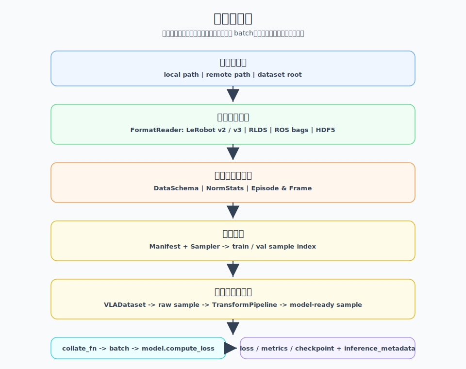
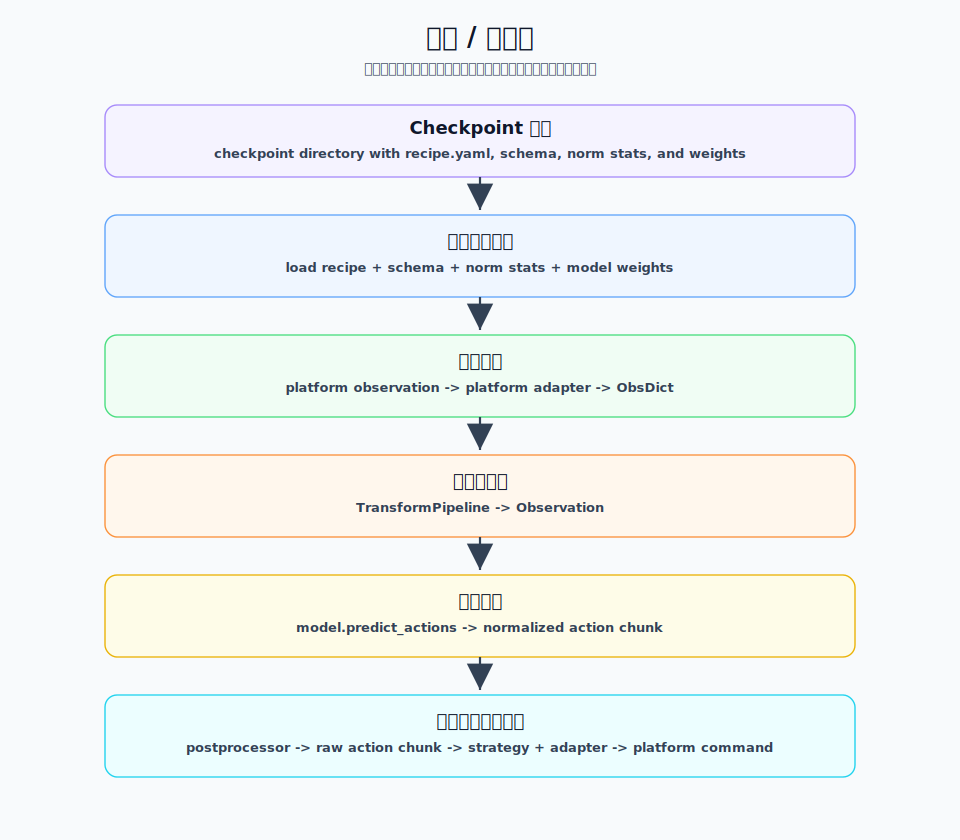

# 数据模块设计

## 0. 总览

数据模块是 VLA Factory 的输入端。它负责将外部格式的机器人数据集（LeRobot v3 等）解析为框架内部统一的数据中间表示（Canonical IR），再由数据变换流水线、训练样本构建与批处理共同组装，向训练侧输出模型可直接消费的 `{"observation": Observation, "actions": Tensor}` batch。

数据模块不只服务训练。训练开始时写出的 `schema.json`、`norm_stats.json` 和 resolved `recipe.yaml` 也会在部署推理侧复用，用于重建 schema / stats / transform 语义。因此，数据模块的核心职责不是“喂给训练一个 batch”这么窄，而是建立一套从外部数据到训练、部署都能复用的数据契约。

### 层级职责边界

在整体架构层面，数据模块对应两层：

| 层 | 职责 | 边界 |
|---|---|---|
| **外部数据解析层** | 理解 LeRobot、HDF5、RLDS、ROS bag 等外部格式，把外部 metadata、episode 边界、帧索引、state/action、视频引用等解析成内部数据事实。 | 可以感知外部格式；不向上层泄漏外部字段名、目录布局或文件结构；不做模型预处理、不构造 batch。 |
| **数据中间表示层** | 用稳定对象表达数据事实，并把这些事实组织成训练和部署共享的数据契约。 | 不理解外部存储格式；不表达上游模型原生 batch；不把数据模块变成按模型分支的 adapter。 |

数据模块在整体架构中对应主架构文档里的“外部数据解析层”和
“数据中间表示层”。它消费 recipe / model profile 中的数据、采样和
transform 配置，并向训练和部署提供统一数据契约。训练产物中的
`recipe.yaml`、`schema.json` 和 `norm_stats.json` 是部署侧重建数据语义
的事实来源。

本文覆盖：

- 第 1 章讲数据模块在训练和部署中的整体流转。
- 第 2 章讲数据模块涉及的核心对象。
- 第 3 章讲外部数据如何被解析为数据事实。
- 第 4 章讲数据事实如何成为训练和部署共享的数据契约。
- 第 5 章讲如何扩展数据模块。
- 第 6 章讲设计约束和使用注意事项。
- 第 7 章讲后续可以继续演进的方向。

本文不覆盖：

- 模型 adapter 的内部实现。
- 训练 loop、优化器、checkpoint 保存策略。
- 部署 transport、ZMQ 协议、真机平台 adapter 的细节。

### 目录

- [0. 总览](#0-总览)
- [1. 数据流全景](#1-数据流全景)
  - [1.1 训练数据流](#11-训练数据流)
  - [1.2 部署推理流](#12-部署推理流)
  - [1.3 配置、metadata 与数据流的关系](#13-配置metadata-与数据流的关系)
- [2. 核心对象速览](#2-核心对象速览)
  - [2.1 外部数据解析对象](#21-外部数据解析对象)
  - [2.2 数据事实与契约对象](#22-数据事实与契约对象)
  - [2.3 训练索引与样本对象](#23-训练索引与样本对象)
  - [2.4 训练样本与 batch 对象](#24-训练样本与-batch-对象)
  - [2.5 变换流水线对象](#25-变换流水线对象)
- [3. 外部数据解析层设计](#3-外部数据解析层设计)
  - [3.1 层职责与边界](#31-层职责与边界)
  - [3.2 FormatReader 协议](#32-formatreader-协议)
  - [3.3 Reader 注册与发现机制](#33-reader-注册与发现机制)
  - [3.4 LeRobot V3 Reader](#34-lerobot-v3-reader)
- [4. 数据中间表示层设计](#4-数据中间表示层设计)
  - [4.1 层职责与边界](#41-层职责与边界)
  - [4.2 延迟加载与视频解码机制](#42-延迟加载与视频解码机制)
  - [4.3 模型变换流水线设计](#43-模型变换流水线设计)
  - [4.4 训练侧数据契约](#44-训练侧数据契约)
  - [4.5 部署侧复用契约](#45-部署侧复用契约)
  - [4.6 Canonical IR 的非目标](#46-canonical-ir-的非目标)
- [5. 扩展指南](#5-扩展指南)
  - [5.1 新增数据格式](#51-新增数据格式)
  - [5.2 新增视频解码策略](#52-新增视频解码策略)
  - [5.3 新增变换步骤](#53-新增变换步骤)
- [6. 设计约束与注意事项](#6-设计约束与注意事项)
  - [6.1 Reader 不做模型预处理](#61-reader-不做模型预处理)
  - [6.2 Dataset 输出 canonical raw sample](#62-dataset-输出-canonical-raw-sample)
  - [6.3 Transform 决定模型输入契约](#63-transform-决定模型输入契约)
  - [6.4 Observation 字段需求由模型声明](#64-observation-字段需求由模型声明)
  - [6.5 Schema 是数据事实来源](#65-schema-是数据事实来源)
  - [6.6 训练产物 metadata 是部署侧事实来源](#66-训练产物-metadata-是部署侧事实来源)
- [7. 未来演进思路](#7-未来演进思路)
  - [7.1 Reader 索引与性能](#71-reader-索引与性能)
  - [7.2 视频与图像 schema](#72-视频与图像-schema)
  - [7.3 数据格式与视频解码策略扩展](#73-数据格式与视频解码策略扩展)
  - [7.4 manifest 持久化](#74-manifest-持久化)
  - [7.5 数据可视化](#75-数据可视化)
  - [7.6 数据格式互转](#76-数据格式互转)

## 1. 数据流全景

数据模块的核心数据流分为训练数据流和部署推理流。两条链路共享
schema、norm stats、transform 语义和 resolved recipe，保证训练阶段的
数据契约能在部署阶段复用。

### 1.1 训练数据流



| 阶段 | 输入 | 处理 | 输出 |
|---|---|---|---|
| 数据解析 | dataset path | `FormatReader` 读取 schema、norm stats、episode 信息 | `DataSchema` / `NormStats` / `Episode` |
| 数据变换配置 | resolved recipe + schema/stats | `TransformPipeline` 按 `model.config.transforms.inputs` 构建 | model input transform |
| 样本索引 | episode 信息 + sampler config | `DatasetManifest` + `SlidingWindowSampler` 构造滑窗样本索引 | train / val sample index |
| 样本构造 | sample index | `VLADataset` 读取帧、解码图像、组装 observation/action | raw sample |
| 数据变换 | raw sample | `TransformPipeline` 执行归一化、resize、padding 或 tokenization | model-ready sample |
| 批处理 | model-ready sample | `collate_fn` 聚合 batch | Trainer batch |
| 训练前向 | Trainer batch | `VLATrainer` 调用 `model.compute_loss` | loss / metrics / checkpoint + inference metadata |

训练侧只看到统一 Dataset 和 batch，不需要理解 LeRobot 的 parquet、
MP4、feature names 或 stats 文件结构。

### 1.2 部署推理流

部署推理不重新扫描训练数据集作为事实来源。训练开始时会写出
`inference_metadata/`，其中包含：

- `recipe.yaml`：训练时使用的 resolved recipe，是部署侧配置事实来源。
- `schema.json`：训练数据的 `DataSchema` 快照。
- `norm_stats.json`：训练数据的 `NormStats` 快照。



| 阶段 | 输入 | 处理 | 输出 |
|---|---|---|---|
| 产物加载 | checkpoint path | 读取 recipe、schema、norm stats，加载模型权重 | `InferenceEngine` |
| 观测适配 | platform observation | platform adapter 转换线协议 | `ObsDict` |
| 前处理 | `ObsDict` | 复用训练侧 transform 逻辑 | `Observation` |
| 模型推理 | `Observation` | `model.predict_actions` | normalized action chunk |
| 后处理 | action chunk | postprocessor 反归一化、裁剪维度 | raw action chunk |
| 动作执行 | raw action chunk | execution strategy + action adapter | platform action command |

部署推理流和训练数据流共享同一套 schema / stats / transform 语义，但不
共享训练 Dataset。

### 1.3 配置、metadata 与数据流的关系

数据流中有四类事实来源：

- **authoring recipe**：用户最直接维护的实验配置入口。
- **model profile**：模型默认配置来源，作为 `model.config` 的默认值。
- **schema / stats**：从数据集解析出的数据事实。
- **训练产物 metadata**：部署侧读取训练时保存的 `recipe.yaml`、
  `schema.json`、`norm_stats.json`。

训练入口负责把 authoring recipe、CLI 覆盖和 model profile 合并成
resolved recipe。部署侧只读取训练产物中的 resolved `recipe.yaml`，
不重新合并当前代码里的 model profile。

## 2. 核心对象速览

### 2.1 外部数据解析对象

| 对象 | 作用 | 边界 |
|---|---|---|
| `FormatReader` | 数据格式 reader 协议，定义外部格式如何被解析成内部数据事实。 | 理解外部格式；不做模型预处理、不构造训练 batch。 |
| `LeRobotV3Reader` | 当前主实现，读取 LeRobot v3 的 metadata、stats、parquet 和 video layout。 | LeRobot v3 细节只在 reader 内部消化，不泄漏到 Dataset 或模型 adapter。 |

### 2.2 数据事实与契约对象

| 对象 | 作用 | 关键字段 |
|---|---|---|
| `DataSchema` | 数据集的静态特征空间描述。 | `state_dim`, `action_dim`, `cameras`, `image_sizes`, `fps`, `state_keys`, `action_keys` |
| `FeatureStats` | 单个向量或图像特征的统计量。 | `mean`, `std`, `min`, `max` |
| `NormStats` | 全数据集的归一化统计量集合。 | `state`, `action`, `images`, `method` |
| `VideoRef` | 延迟视频帧引用，只记录定位信息。 | `video_path`, `frame_index`, `height`, `width`, `channels` |
| `Frame` | 单个时间步的数据事实。 | `index`, `images`, `state`, `action`, `timestamp`, `is_first`, `is_last` |
| `Episode` | 一个 episode，支持延迟加载 frame。 | `episode_id`, `episode_index`, `num_frames`, `_frame_loader` |

### 2.3 训练索引与样本对象

| 对象 | 作用 | 关键字段 |
|---|---|---|
| `SampleLocator` | 指向一个训练样本的位置指针。 | `episode_index`, `start_frame_index`, `n_obs_steps`, `action_horizon` |
| `DatasetManifest` | 全数据集样本索引和 split 索引。 | `locators`, `schema`, `norm_stats`, `episode_ranges`, `splits` |
| `SlidingWindowSampler` | 将 episode 切成滑窗样本 locator。 | `n_obs_steps`, `action_horizon` |

### 2.4 训练样本与 batch 对象

| 对象 | 作用 | 边界 |
|---|---|---|
| `VLADataset` | 根据 `SampleLocator` 读取样本，按需解码图像，组装 flat sample，并调用 transform pipeline。 | 不理解外部格式字段；不实现模型内部逻辑。 |
| `collate_fn` | 将 flat sample 聚合成训练协议使用的 batch。 | 不按 `model_name` 分支，不创建模型专属 Observation 类型。 |
| `Observation` | 模型协议中的统一 observation 容器。 | 字段可选；字段需求由模型 metadata / profile 声明。 |

### 2.5 变换流水线对象

| 对象 | 作用 | 关键接口或字段 |
|---|---|---|
| `TransformStep` | 单个样本级变换步骤。 | `from_config`, `inverse_for_output` |
| `TransformPipeline` | 有序 step 列表，负责 raw sample 到 model-ready sample 的转换。 | `steps`, `__call__(sample)` |
| `TransformContext` | 构造 transform step 的运行时上下文。 | `norm_stats`, `schema`, `model_config`, `model_action_dim`, `dataset_action_dim` |

## 3. 外部数据解析层设计

### 3.1 层职责与边界

外部数据解析层负责把外部格式翻译成 VLA Factory 的内部数据事实。
Reader 可以理解外部格式的文件布局、字段名、metadata 结构和版本信息，
但不应该把这些细节泄漏到上层。

Reader 可以做：

- 读取外部 metadata、parquet、JSON、HDF5、TFDS record 或 ROS bag index。
- 解析 camera 名称、图像尺寸、state/action 维度和 key 顺序。
- 解析 episode 边界、frame index、timestamp、first/last 标记。
- 构造 `DataSchema`、`NormStats`、`Episode`、`Frame`、`VideoRef`。

Reader 不应该做：

- 不解码视频帧，只生成 `VideoRef`。
- 不构造 `SampleLocator` 或 `DatasetManifest`。
- 不做图像 resize、layout 转换、归一化或 action padding。
- 不构造训练 batch。
- 不依赖具体模型 adapter。

#### 数据事实契约

Reader 解析出的数据事实进入 VLA Factory 后，应成为训练和部署期间一致可信
的事实来源。camera 名、图像原始尺寸、state/action 维度、key 顺序、episode
边界、视频帧位置和统计量都来自数据集，不由模型、transform 或部署侧临时
猜测。

`DataSchema` 表达 feature space、camera、图像尺寸、state/action 维度和
key 顺序；`NormStats` 表达训练 normalize 与部署 unnormalize 共享的统计量；
`Episode`、`Frame` 和 `VideoRef` 表达 episode 边界、逐帧事实和视频帧定位。
这些对象共同构成 Reader 向上层交付的数据事实契约。

#### 数据事实解析职责

| 数据事实 | Reader 负责解析什么 |
|---|---|
| `DataSchema` | feature space、camera、image size、state/action dim、key 顺序、fps。 |
| `NormStats` | state/action/image stats，训练和部署 normalize/unnormalize 所需统计量。 |
| `Episode` | episode id、episode index、num frames、frame loader。 |
| `Frame` | frame index、state、action、timestamp、is_first/is_last。 |
| `VideoRef` | video path、frame index、height、width、channels。 |

### 3.2 FormatReader 协议

```python
@runtime_checkable
class FormatReader(Protocol):
    def can_read(self, path: Path) -> bool: ...
    def get_schema(self, path: Path) -> DataSchema: ...
    def get_norm_stats(self, path: Path) -> NormStats: ...
    def get_episode_lengths(self, path: Path) -> dict[int, int]: ...
    def get_episode_ranges(self, path: Path) -> dict[int, tuple[int, int]]: ...
    def read_episode(self, path: Path, episode_index: int, codec: VideoCodec) -> Episode: ...
```

协议设计意图：

- `can_read()` 用于格式嗅探，用于 "auto" 发现。
- `get_schema()` / `get_norm_stats()` 读取静态数据事实。
- `get_episode_lengths()` / `get_episode_ranges()` 读取 episode 级索引信息。
- `read_episode()` 读取一个 episode，返回由 `Frame` 组成的 `Episode`；其中图像字段只包含 `VideoRef`，不包含解码后的图像数组。

`read_episode()` 接受 `VideoCodec` 参数，但 Reader 不主动解码视频。这个参数
保留给未来需要在读取阶段建立解码引用或校验视频信息的实现；具体解码仍然
发生在 Dataset 读取样本时。

### 3.3 Reader 注册与发现机制

Reader 通过 registry 注册。`get_reader("auto", path)` 会遍历所有 reader 的
`can_read()`，找到第一个声称能处理该路径的 reader。

`can_read()` 应尽量保守：只有当关键 metadata 和版本信息足以证明该 reader
能正确解析数据集时，才返回 `True`。部分文件相似但 schema 不完整的目录
不应该被误识别。

### 3.4 LeRobot V3 Reader

`LeRobotV3Reader` 是当前主 Reader，实现 LeRobot v3 数据集解析。

#### 3.4.1 支持的数据布局

```text
dataset_path/
  meta/
    info.json
    stats.json
    tasks.parquet
  data/
    *.parquet
  videos/
    observation.images.front/
      chunk-000/
        episode_000000.mp4
```

`can_read()` 以 `meta/info.json` 作为格式识别入口，并检查
`codebase_version >= 3.0`。当前实现按 `>= 3.0` 识别 v3 系列格式；如果未来
LeRobot 更高版本改变目录或 schema 结构，应收紧兼容版本范围或引入独立
Reader。

#### 3.4.2 Schema 解析

从 `info.json` 的 `features` 字段推断：

- `state_dim` / `action_dim` — 从 `features["observation.state"]["shape"]` / `features["action"]["shape"]`
- `cameras` — 从所有 `dtype == "video"` 的 feature key 提取摄像头名
- `image_sizes` — 从 video feature 的 shape 或 `video_info` 推断 `(height, width)`
- `state_keys` / `action_keys` — 从 `features["observation.state"]["names"]` / `features["action"]["names"]` 提取维度→语义映射
- `has_language` — 检查 `meta/tasks.parquet` 或 `meta/tasks.jsonl` 是否存在

#### 3.4.3 NormStats 解析

从 `stats.json` 读取 state、action、每个摄像头的 mean/std/min/max。键名匹配规则：`"state"` 对应 state，`"action"` 对应 action，`"observation.images.{cam}"` 对应 per-camera stats。

#### 3.4.4 Episode index 解析

遍历 `data/*.parquet`，按 `episode_index` 列分组统计帧数，输出 `dict[int, int]`（episode_index → num_frames）和 `dict[int, tuple[int, int]]`（episode_index → global_start, global_end）。

#### 3.4.5 Frame 解析

从 parquet 读取该 episode 的所有行，为每行构建 `Frame`：

- `state` / `action` — 从 parquet 列直接读取为 `NDArray`
- `images` — 每个摄像头指向一个 `VideoRef`
- `timestamp` — 优先读取 parquet 中的 `timestamp` 字段，缺失时保持 `None`
- `is_first` / `is_last` — 根据 `frame_index == 0` 和 `frame_index == num_frames - 1` 设置

#### 3.4.6 VideoRef 解析

为每个摄像头的每帧构建 `VideoRef`：`video_path` 为视频文件路径，`frame_index` 为视频内的帧号，`height`/`width`/`channels` 从 `info.json` 的 video feature metadata 读取。

视频路径按以下模式依次查找：

1. `videos/{cam_key}/chunk-*/episode_{ep_idx:06d}.mp4`
2. `videos/{cam_key}/chunk-*/{any}.mp4`
3. `videos/{cam_key}/{any}.mp4`

per-episode 视频使用 episode 内局部 `frame_index`，multi-episode 视频使用
数据集全局 `index`。

#### 3.4.7 已知限制

- 多 chunk / 多 MP4 文件场景下，视频文件选择必须与 episode range 或全局
  index 对齐，不能简单取排序后的第一个文件。
- Reader 层不处理图像 resize、normalize 或 layout 转换。
- 当前 `can_read()` 按 `codebase_version >= 3.0` 识别 v3 系列格式；如果未来
  LeRobot 更高版本改变结构，应收紧版本范围或引入独立 Reader。
- multi-episode 视频的帧号使用全局 `index`，如果视频编码不是从 episode 0
  开始顺序编码，帧号可能错位。
- parquet 读取按文件排序后拼接，大数据集可能较慢。

## 4. 数据中间表示层设计

### 4.1 层职责与边界

数据中间表示层负责把 Reader 解析出来的数据事实组织成训练和部署共享的
数据契约。这里的“契约”不是某个 dataclass 的字段说明，而是跨模块必须
共同遵守的稳定语义约定：一个模块交出去的数据，另一个模块可以做哪些
确定假设。

中间表示层不再理解外部存储格式，也不重新猜测 schema、stats 或 key 顺序。
它以前一章 Reader 输出的数据事实为输入，围绕训练侧和部署侧两条契约主线
组织内部数据流。

- **训练侧数据契约**：从 episode 到训练样本的过程必须稳定定义：一个 sample
如何定位、observation window 如何取、action chunk 从哪个 timestep 开始、
episode 尾部如何 padding、padding 如何显式标记，以及 flat sample 如何聚合
成 `Observation` 和 batch。这些约定让 Trainer 和 loss 逻辑不需要理解
episode、视频或外部文件结构。
- **部署侧复用契约**：训练产物必须保存部署所需的数据语义，包括 resolved
recipe、schema 和 stats。部署侧以这些 metadata 为事实来源，复用训练时的
transform 和 key 顺序，而不是重新解析训练数据集或重新合并当前代码里的
model profile。

这两条主线由两个核心机制支撑：延迟加载与视频解码机制负责让数据事实按需
物化；模型变换流水线负责把 raw sample 转成模型可消费的输入，并在部署侧
生成输出反变换。

### 4.2 延迟加载与视频解码机制

在隔离约束之下，中间表示层的核心数据结构是一条延迟加载链：

```text
VideoRef  (frozen dataclass)
  ├── video_path: Path      ← 视频文件位置
  ├── frame_index: int      ← 视频内的帧号
  ├── height, width, channels  ← 声明的尺寸（供解码器预分配）
  └── 不持有解码后的数据，不解码

Frame  (dataclass)
  ├── index: int            ← 全局帧号
  ├── images: dict[str, VideoRef]  ← 每个摄像头的延迟引用
  ├── state: NDArray | None ← Reader 解析出的向量
  ├── action: NDArray | None ← Reader 解析出的向量
  ├── is_first / is_last    ← episode 边界标记

Episode  (dataclass)
  ├── episode_id, episode_index, num_frames
  ├── _frame_loader: Callable[[], Iterator[Frame]]  ← 闭包，延迟执行
  ├── _frames_cache: list[Frame] | None  ← load_frames() 后缓存
  ├── frames() → Iterator[Frame]  ← 遍历（用缓存或重新加载）
  └── load_frames() → list[Frame]  ← 强制物化 + 缓存
```

延迟加载的设计理由：

- 训练时 `VLADataset` 使用 64-episode LRU 缓存，只保留最近访问的 episode 帧数据，避免一次性加载全部数据撑爆内存。
- `VideoRef` 不解码视频——解码发生在 `VLADataset.__getitem__` 中调用 `codec.decode_frame(ref)` 时，按需触发。
- `Episode._frame_loader` 是闭包，只在 `load_frames()` 或 `frames()` 被调用时才执行，避免加载不需要的 episode。

#### 4.2.1 视频解码策略

视频解码是 `VLADataset` 读取样本时使用的可替换能力。Reader 只生成 `VideoRef`，Dataset 在需要某一帧图像时调用 codec 解码：

- `VideoCodec.name`
- `VideoCodec.decode_frame(ref: VideoRef) -> NDArray`

`decode_frame()` 的输出契约是 `numpy HWC uint8`。这是 Dataset 与 transform pipeline 之间的图像格式边界。当前默认实现是 `PyAVCodec`，用于把 `VideoRef` 解码成 raw image。

缓存策略不改变数据语义。无论帧来自视频解码还是 `.npy` cache，输出都应保持 `HWC uint8`。

后续可以扩展新的视频解码策略，例如 `DecordCodec`、`OpenCVCodec`、`ImageFolderCodec` 或 `RemoteCodec`。新增 codec 不应要求修改 Reader 或 Dataset，只需要遵守 `VideoCodec` 协议和 `HWC uint8` 输出契约。详见 [新增视频解码策略](#52-新增视频解码策略)。

#### 4.2.2 PyAVCodec 与缓存策略

`PyAVCodec` 支持两层缓存：

- **内存缓存**：每个视频文件维护帧缓存并复用打开的视频 container。
- **磁盘缓存**：解码后的帧保存到 `<video>.frame_cache/*.npy`，后续运行可以直接加载。

### 4.3 模型变换流水线设计

`TransformPipeline` 是模型输入契约的执行层——它负责把 canonical raw sample 转成模型可消费的 model-ready sample。它会体现模型对图像尺寸、layout、归一化、action 维度等输入格式的要求，但这种耦合是**声明式的**（由 YAML 配置驱动），不是按 `model_name` 写死在 Dataset 或 collate 里。

真正把 `Observation` 编排成上游模型库原生 batch dict 的逻辑仍属于 model adapter，例如 ACT adapter 将 `Observation.images["front"]` 转成 LeRobot 期望的 `observation.images.front`。

**input transform**（训练侧）：

```yaml
# vla_factory/config/model/act.yaml
transforms:
  inputs:
    - {type: image_to_float}
    - {type: image_layout, layout: "chw"}
    - {type: image_normalize}
    - {type: normalize_vector, fields: ["state", "actions"]}
    - {type: pad_dimensions}
```

`build_preprocessor()` 遍历 `inputs` 列表，对每个条目调用 `TransformRegistry.create_from_config()`，构建 `TransformPipeline`。`TransformContext` 在构建时注入 norm_stats、action_dim、schema 等，运行时不变。

用户也可以注册自定义 transform step 扩展输入处理逻辑，具体扩展方式见 [新增变换步骤](#53-新增变换步骤)。

**output postprocessor**（部署侧）：

TransformPipeline 的每个步骤可以声明 `inverse_for_output()`，生成反变换步骤：

- `NormalizeVector` → `UnnormalizeActionStep`（z-score 反归一化）
- `PadDimensions` → `UnpadAction`（截断到原始 action_dim）

部署时 `InferenceEngine` 用反变换将模型输出还原为原始尺度和维度。

**tokenizer / prompt 字段生成**：

对于需要语言指令的模型（PI0、OpenVLA），`Observation` 预留了 `tokenized_prompt` 和相关 mask 字段，但当前 `collate_fn` 不生成这些字段，它只负责通用堆叠。后续 tokenizer 应作为显式 transform step 纳入 TransformPipeline，由配置声明 tokenizer 类型、参数和 artifact 路径，而不是让 `collate_fn` 承担模型语义处理。

### 4.4 训练侧数据契约

训练侧数据契约定义从 episode 到训练 batch 的稳定路径：

```text
Episode / Frame / VideoRef
  -> SampleLocator
  -> canonical raw sample dict
  -> TransformPipeline
  -> collate_fn
  -> {"observation": Observation, "actions": Tensor, "action_is_pad": Tensor}
```

#### 4.4.1 样本索引与划分

`SampleLocator` 是指向一个训练样本的指针——它不持有数据，只记录「从哪个 episode 的哪个 timestep 构建训练样本，以及该样本对应的 observation window 和 action horizon」：

```python
@dataclass(frozen=True)
class SampleLocator:
    episode_index: int
    start_frame_index: int
    n_obs_steps: int = 1
    action_horizon: int = 100
```

`SlidingWindowSampler` 为每个 episode 中的每个有效观测位置生成一个 `SampleLocator`：

```text
episode (长度 = L, n_obs_steps = 1, action_horizon = H)

  frame 0: locator(episode=0, start=0, n_obs=1, horizon=H)
  frame 1: locator(episode=0, start=1, n_obs=1, horizon=H)
  ...
  frame L-1: locator(episode=0, start=L-1, n_obs=1, horizon=H)
```

当前 `VLADataset._load_sample()` 只物化 observation window 的最后一帧作为 images/state；`n_obs_steps` 是后续扩展多帧观测的契约入口。action chunk 从 observation window 的最后一帧开始，长度为 `action_horizon`。

**tail padding**：当 action_horizon 超出 episode 长度时，`VLADataset._load_sample` 使用 repeat-last padding——用 episode 最后一个有效 action 填充超出部分。如果 episode 所有帧的 action 均为 None，则抛出 `ValueError`。

`DatasetManifest` 由 `build_manifest()` 工厂函数构建：

1. **构建 locators**：对每个 episode，`SlidingWindowSampler.sample_episode()` 为每个有效观测位置生成 `SampleLocator`。
2. **episode-level split**：所有 episode_index 随机打散（`seed` 控制），按 `train_ratio` 划分 train/val，默认 `train_ratio=0.9`。只支持 `"episode"` 分裂策略——整个 episode 归入同一个 split，避免同一 episode 的帧横跨 train 和 val。
3. **映射 locator → split**：遍历 all_locators，根据 `locator.episode_index` 属于 train_eps 还是 val_eps，填入 `_train_indices` / `_val_indices`。

分裂粒度选择 episode 而非 frame 的理由：同一 episode 内的帧高度相关（时序依赖），train/val 混入同一 episode 的帧会导致验证集无法有效评估泛化能力。

#### 4.4.2 Dataset 与 batch

`VLADataset.__getitem__` 的职责是将 Canonical IR 转为 **canonical raw sample dict**——一个 key 使用通用命名（`images.front`、`state`、`actions`）的 flat numpy dict。它不做模型预处理，只做数据物化（VideoRef → numpy）和 repeat-last padding。

```python
def __getitem__(self, idx):
    # 1. locator → episode → frames (LRU cache)
    # 2. VideoRef → VideoCodec.decode_frame() → HWC uint8
    # 3. 组装 canonical raw sample dict
    sample = self._load_sample(locator, frames)
    # 4. TransformPipeline 变换
    sample = self.transforms(sample)
    return sample
```

Episode 缓存策略：`_episode_cache` 最多缓存 64 个 episode 的帧数据，LRU 淘汰。

`collate_fn` 将多个 numpy dict 堆叠为训练 batch：

- `"images.*"` key 按摄像头分组 → `Observation.images` dict
- `"image_masks.*"` key 按摄像头分组 → `Observation.image_masks` dict
- `"state"` → `Observation.state`
- `"actions"` → `Tensor[B, horizon, dim]`
- `"action_is_pad"` → `Tensor[B, horizon]`

**Observation 是统一容器**——所有模型共享同一个 `Observation` 类，字段 optional（`tokenized_prompt`、`token_ar_mask` 等可为 None）。`collate_fn` **不按 model_name 分支**，也不创建模型专属字段或模型专属 Observation 类型——它只做通用结构聚合，不根据模型类型调整输出格式。模型特需的字段由 TransformPipeline 决定是否填入，或由 model adapter 在 `compute_loss()` 内部从 `Observation` 中选取。

不同模型需要的 Observation 字段编排不同，但这个差异**不在数据层消化**。数据层的职责是产出包含所有可用字段的 `Observation`，模型 adapter 自己选取需要的子集并做内部转换（如 ACT 的 `_obs_to_lerobot_batch()`）。这种设计的代价是每个 adapter 都要写一次转换逻辑，好处是数据管线稳定——新增模型不改数据代码。

### 4.5 部署侧复用契约

部署侧不运行完整数据管线，但复用训练时产出的元数据：

| 元数据文件 | 来源 | 部署用途 |
|---|---|---|
| `recipe.yaml` | 训练时的完整配置 | 知道模型名、策略、参数 |
| `schema.json` | `DataSchema` 序列化 | 约定输入格式（cameras、state_dim、action_dim、keys） |
| `norm_stats.json` | `NormStats` 序列化 | 反归一化模型输出 |

**核心原则**：部署侧的 metadata 是 checkpoint 中保存的版本，**不是重新解析训练数据集的版本**。训练数据集可能已经不在原地、可能被更新，但部署使用的是训练时的「快照」——这正是 checkpoint 保存 metadata 的意义。

TransformPipeline 的 inverse 变换（UnnormalizeAction、UnpadAction）由 checkpoint 中的 resolved `recipe.yaml`、`schema.json` 和 `norm_stats.json` 重建，保证部署侧不重新合并当前代码里的 model profile。大型 transform 参数或拟合结果应作为 artifact 保存，并在 resolved recipe 中显式引用。

### 4.6 Canonical IR 的非目标

中间表示层**不负责**以下事项：

- **模型预处理**：图像 resize 到多大、向量归一化到什么尺度，由 TransformPipeline 根据模型声明决定，Canonical IR 只承载原始数据
- **模型输入格式适配**：上游模型库（lerobot、transformers）各有自己的 batch dict 格式，这个转换由 model adapter 在 `compute_loss()` 内部完成，Canonical IR 不感知
- **数据增强**：随机裁剪、颜色抖动等训练增强在 TransformPipeline 中实现，不属于中间表示层的契约职责
- **在线推理数据采集**：部署侧的观测数据来自传感器/模拟器，不经过 VLADataset 管线

## 5. 扩展指南

### 5.1 新增数据格式

新增数据格式时，应新增一个 `FormatReader` 实现，而不是修改 Dataset 或
模型 adapter。

#### 5.1.1 新增 Reader 的基本步骤

1. 在 `vla_factory/data/formats/` 下新增 reader 文件。
2. 实现 `can_read(path)`，用最小 metadata 判断格式。
3. 实现 `get_schema(path)`，填充 `DataSchema`。
4. 实现 `get_norm_stats(path)`，填充 `NormStats`。
5. 实现 `get_episode_lengths(path)` 和 `get_episode_ranges(path)`。
6. 实现 `read_episode(path, episode_index, codec)`，构造 `Episode`、
   `Frame`、`VideoRef`。
7. 在 formats registry 中注册 reader。
8. 为 schema、episode reading、dataset sample、dataloader smoke 增加测试。

#### 5.1.2 Reader 文档章节模板

新增 Reader 后，建议在本文第 3 章新增对应子章节，并按固定结构说明：

```md
### 3.x <FormatName> Reader

#### 3.x.1 支持的数据布局
#### 3.x.2 Schema 解析
#### 3.x.3 NormStats 解析
#### 3.x.4 Episode index 解析
#### 3.x.5 Frame 解析
#### 3.x.6 VideoRef 解析
#### 3.x.7 已知限制
```

### 5.2 新增视频解码策略

新增视频解码策略时，应实现 `VideoCodec` 协议：

```python
class MyCodec:
    @property
    def name(self) -> str:
        return "my-codec"

    def decode_frame(self, ref: VideoRef) -> NDArray:
        ...
```

新 codec 应保证输出为 `numpy HWC uint8`，因为这是 Dataset 与 transform
pipeline 之间的图像契约。

### 5.3 新增变换步骤

新增 transform step 时，应继承 `TransformStep` 并注册到 `TransformRegistry`。
内置 step 和用户自定义 step 都通过同一个 registry 注册，`transforms.inputs`
只依赖 `type` 名称，不关心 step 来自 VLA Factory 核心代码还是用户模块。
因此用户可以在不修改 Dataset、collate 或 model adapter 的情况下扩展输入
处理逻辑。

基本步骤：

1. 在 `vla_factory/data/transforms/` 下新增或扩展 step。
2. 使用 `@TransformRegistry.register("your_step")` 注册类型名。
3. 实现 `__call__(sample)`。
4. 如需 runtime context，实现 `from_config(cfg, ctx)`。
5. 如影响模型输出空间，实现 `inverse_for_output(ctx)`。
6. 在 model profile 或 recipe 的 `model.config.transforms.inputs` 中引用。

如果 step 放在用户项目中，而不是 VLA Factory 内置模块中，需要在 recipe
的 `transforms.imports` 中声明待导入模块。训练和部署构建 transform pipeline
前都会先导入这些模块；模块导入时执行
`@TransformRegistry.register("your_step")`，使自定义 step 进入 registry。

```yaml
transforms:
  imports:
    - my_project.transforms.prompt_tokenizer

model:
  config:
    transforms:
      inputs:
        - type: image_to_float
        - type: custom_prompt_tokenizer
          tokenizer_path: artifacts/tokenizer
```

自定义 step 仍需遵守 transform 契约：

- 输入和输出都是 flat sample dict。
- 小参数写在 transform config 中。
- 大型参数、词表或拟合结果保存为 artifact，并在 resolved recipe 中显式引用。
- 部署侧不重新拟合 transform，只按 checkpoint metadata 加载配置和 artifact。
- 如果 step 改变模型输出空间，应实现 `inverse_for_output()` 生成对应 postprocessor。

## 6. 设计约束与注意事项

### 6.1 Reader 不做模型预处理

Reader 只负责读取外部格式并构造内部数据事实。它可以解析 schema、stats、
episode、video path、frame index，但不应该做模型专属预处理。

### 6.2 Dataset 输出 canonical raw sample

Dataset 输出应尽量贴近 raw data：

- 图像是 `HWC uint8`。
- state/action 是 `float32` vector。
- action padding 用 `action_is_pad` 显式表达。

Dataset 不应该因为某个模型需要 CHW 或 `[0, 1]` 而改变全局输出契约。

### 6.3 Transform 决定模型输入契约

模型输入格式属于 transform pipeline。不同模型可以声明不同默认 transform，
用户也可以在 recipe 中覆盖。

### 6.4 Observation 字段需求由模型声明

不同模型可以需要不同的 `Observation` 语义字段，例如 ACT 只需要 images +
state，PI0 可能需要 images + state + tokenized prompt，OpenVLA 可能不需要
state。这个差异应由模型 metadata 或 model profile 声明，并由 transform
pipeline 负责生成对应字段。

数据模块只负责产出统一 `Observation` 容器、聚合已有字段并做缺字段校验；
不应该创建 `ACTObservation` / `PI0Observation` 这类模型专属类型，也不应该
把 `Observation` 编排成上游模型库的原生 batch dict。

### 6.5 Schema 是数据事实来源

`DataSchema` 来自数据集，不来自用户猜测。camera 名、图像原始尺寸、
state/action 维度和 key 顺序都应从 schema 读取。

### 6.6 训练产物 metadata 是部署侧事实来源

部署侧应读取训练产物中的 resolved `recipe.yaml`、`schema.json` 和
`norm_stats.json`。它不应该重新合并当前代码里的 model profile，也不应该
猜测原始 authoring recipe 和最终配置哪个更可信。

## 7. 未来演进思路

### 7.1 Reader 索引与性能

LeRobot v3 reader 目前多处扫描 parquet。evaluate 或大数据集场景下，应增加
episode index 缓存，避免 `get_episode_lengths()`、`get_episode_ranges()`、
`read_episode()` 重复扫描所有 parquet 文件。

### 7.2 视频与图像 schema

当同一 camera 下存在多个 MP4 chunk 时，应根据 episode/global index 精确选择
视频文件。`DataSchema.image_sizes` 后续可以扩展通道数、颜色空间、depth map
标记等。

### 7.3 数据格式与视频解码策略扩展

HDF5、RLDS、ROS bag 等格式应通过新增 Reader 接入。视频解码策略也可以继续
扩展 Decord、OpenCV、image folder、remote object storage 等实现。

### 7.4 manifest 持久化

可考虑把 `DatasetManifest` 序列化，减少重复构建成本，并增强可复现性。
manifest 持久化后需要明确它与 live dataset metadata 的一致性检查策略。

### 7.5 数据可视化

可以基于中间表示层增加数据可视化能力，用于检查 Reader 解析结果、样本构建
逻辑和 transform 前后的数据语义。例如：

- 按 episode 浏览视频帧、timestamp、state 和 action。
- 按 `SampleLocator` 展示 observation frame、action horizon 和
  `action_is_pad`。
- 对比 raw image、resize/layout/normalize 前后的图像。
- 展示某一段动作片段对应的视频帧，辅助排查 action 对齐、视频帧错位和
  padding 问题。

这类工具应优先读取 Canonical IR、manifest 和 checkpoint metadata，而不是
直接绑定某一种外部数据格式。

### 7.6 数据格式互转

未来可以在 Reader 之外增加 Writer / Exporter 层，以 Canonical IR 作为中间
桥梁，实现多种具身数据格式之间的互转。例如 LeRobot、HDF5、RLDS、ROS bag
或自定义机器人数据格式之间的转换。

格式互转应复用 Reader 解析出的 `DataSchema`、`NormStats`、`Episode`、
`Frame` 和 `VideoRef`，并在导出时显式声明目标格式支持哪些字段、哪些 metadata
会被保留、哪些信息需要降级或丢弃。这样可以避免每两个格式之间都实现一套
点对点转换逻辑。
