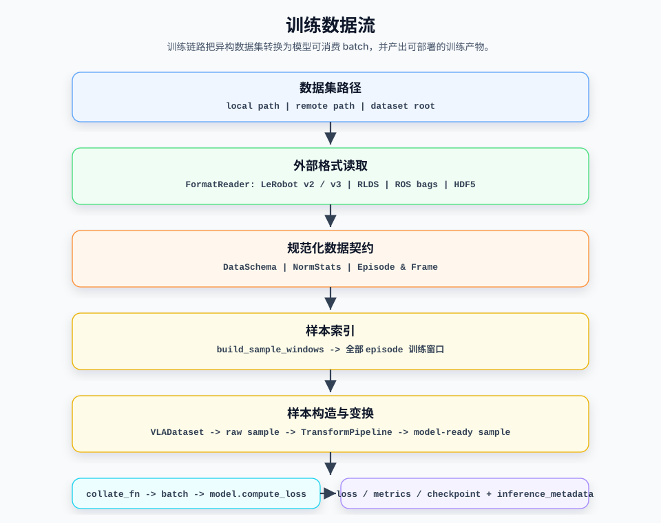

# 数据模块设计

## 0. 总览

数据模块是 VLA Factory 的输入端。它负责将外部格式的机器人数据集（LeRobot v3 等）解析为框架内部统一的数据中间表示（Canonical IR），再由数据变换流水线、训练样本构建与批处理共同组装，向训练侧输出模型可直接消费的 `{"observation": Observation, "actions": Tensor}` batch。

数据模块不只服务训练。训练产物的 `assembly.json` 会保存训练时解析出的 DataSchema、NormStats 和 TransformPipelinePlan，供部署侧直接执行。因此，数据模块的核心职责不是“喂给训练一个 batch”这么窄，而是建立一套能被组合解析、训练和部署共同消费的数据标准。

### 层级职责边界

在整体架构层面，数据模块对应两层：

| 层 | 职责 | 边界 |
|---|---|---|
| **外部数据解析层** | 理解 LeRobot、HDF5、RLDS、ROS bag 等外部格式，把外部 metadata、episode 边界、帧索引、state/action、视频引用等解析成内部数据事实。 | 可以感知外部格式；不向上层泄漏外部字段名、目录布局或文件结构；不做模型预处理、不构造 batch。 |
| **数据中间表示层** | 用稳定对象表达数据事实，并把这些事实组织成训练和部署共享的数据标准。 | 不理解外部存储格式；不表达上游模型原生 batch；不把数据模块变成按模型分支的 adapter。 |

数据模块在整体架构中对应主架构文档里的“外部数据解析层”和
“数据中间表示层”。它从实际数据生成 DataSchema、NormStats 和 episode/frame，
不消费模型或训练采样配置。Assembly 将这些数据事实与模型事实组合；训练产物中的
`assembly.json` 是部署执行路径的数据语义与 transform 计划来源。

本文覆盖：

- 第 1 章讲数据模块在训练和部署中的整体流转。
- 第 2 章讲数据模块涉及的核心对象。
- 第 3 章讲外部数据如何被解析为数据事实。
- 第 4 章讲数据事实如何成为训练和部署共享的数据标准。
- 第 5 章讲如何扩展数据模块。
- 第 6 章讲设计约束和使用注意事项。
- 第 7 章讲后续可以继续演进的方向。

本文不覆盖：

- 模型 adapter 的内部实现。
- 训练 loop、优化器、checkpoint 保存策略。
- 部署 transport、ZMQ 协议、真机平台 adapter 的细节。

### 目录

- [0. 总览](#0-总览)
- [1. 数据流全景](#1-数据流全景)
  - [1.1 训练数据流](#11-训练数据流)
  - [1.2 部署推理流](#12-部署推理流)
  - [1.3 配置、metadata 与数据流的关系](#13-配置metadata-与数据流的关系)
- [2. 核心对象速览](#2-核心对象速览)
  - [2.1 外部数据解析对象](#21-外部数据解析对象)
  - [2.2 数据事实与标准对象](#22-数据事实与标准对象)
  - [2.3 训练索引与样本对象](#23-训练索引与样本对象)
  - [2.4 训练样本与 batch 对象](#24-训练样本与-batch-对象)
  - [2.5 变换流水线对象](#25-变换流水线对象)
- [3. 外部数据解析层设计](#3-外部数据解析层设计)
  - [3.1 层职责与边界](#31-层职责与边界)
  - [3.2 FormatReader 协议](#32-formatreader-协议)
  - [3.3 Reader 注册与发现机制](#33-reader-注册与发现机制)
  - [3.4 LeRobot V3 Reader](#34-lerobot-v3-reader)
- [4. 数据中间表示层设计](#4-数据中间表示层设计)
  - [4.1 层职责与边界](#41-层职责与边界)
  - [4.2 延迟加载与视频解码机制](#42-延迟加载与视频解码机制)
  - [4.3 模型变换流水线设计](#43-模型变换流水线设计)
  - [4.4 训练侧数据标准](#44-训练侧数据标准)
  - [4.5 部署侧复用标准](#45-部署侧复用标准)
  - [4.6 Canonical IR 的非目标](#46-canonical-ir-的非目标)
- [5. 扩展指南](#5-扩展指南)
  - [5.1 新增数据格式](#51-新增数据格式)
  - [5.2 新增视频解码策略](#52-新增视频解码策略)
  - [5.3 新增变换步骤](#53-新增变换步骤)
- [6. 设计约束与注意事项](#6-设计约束与注意事项)
  - [6.1 Reader 不做模型预处理](#61-reader-不做模型预处理)
  - [6.2 Dataset 输出 canonical raw sample](#62-dataset-输出-canonical-raw-sample)
  - [6.3 Transform 决定模型输入标准](#63-transform-决定模型输入标准)
  - [6.4 Observation 字段需求由模型声明](#64-observation-字段需求由模型声明)
  - [6.5 Schema 是数据事实来源](#65-schema-是数据事实来源)
  - [6.6 训练产物 metadata 是部署侧事实来源](#66-训练产物-metadata-是部署侧事实来源)
- [7. 未来演进思路](#7-未来演进思路)
  - [7.1 Reader 索引与性能](#71-reader-索引与性能)
  - [7.2 视频与图像 schema](#72-视频与图像-schema)
  - [7.3 数据格式与视频解码策略扩展](#73-数据格式与视频解码策略扩展)
  - [7.4 样本窗口持久化](#74-样本窗口持久化)
  - [7.5 数据可视化](#75-数据可视化)
  - [7.6 数据格式互转](#76-数据格式互转)
- [8. 数据集描述（目标设计）](#8-数据集描述目标设计)
  - [8.1 取向：全部事实来自读取数据集本身](#81-取向全部事实来自读取数据集本身)
  - [8.2 字段准入原则](#82-字段准入原则)
  - [8.3 DataSchema 字段表](#83-dataschema-字段表)
  - [8.4 探测不到的语义：受控 override 与框架级约定承担](#84-探测不到的语义受控-override-与框架级约定承担)
  - [8.5 推断规则](#85-推断规则)
  - [8.6 消费方与演进节奏](#86-消费方与演进节奏)

## 1. 数据流全景

数据模块的核心数据流分为训练数据流和部署推理流。两条链路共享
schema、norm stats、transform 语义和 resolved recipe，保证训练阶段的
数据标准能在部署阶段复用。

### 1.1 训练数据流



| 阶段 | 输入 | 处理 | 输出 |
|---|---|---|---|
| 数据解析 | dataset path | `FormatReader` 读取 schema、norm stats、episode 信息 | `DataSchema` / `NormStats` / `Episode` |
| 数据变换配置 | `ResolvedAssembly` | 从 `assembly.data_to_model` 实例化 `TransformPipeline` | model input transform |
| 样本索引 | episode 信息 + 模型时序契约 | `build_sample_windows` 为全部 episode 构造 `SampleWindow` | training window list |
| 样本构造 | sample index | `VLADataset` 读取帧、解码图像、组装 observation/action | raw sample |
| 数据变换 | raw sample | `TransformPipeline` 执行归一化、resize、padding 或 tokenization | model-ready sample |
| 批处理 | model-ready sample | `collate_fn` 聚合 batch | Trainer batch |
| 训练前向 | Trainer batch | `VLATrainer` 调用 `model.compute_loss` | loss / metrics / checkpoint + inference metadata |

训练侧只看到统一 Dataset 和 batch，不需要理解 LeRobot 的 parquet、
MP4、feature names 或 stats 文件结构。

### 1.2 部署推理流

部署推理不重新扫描训练数据集作为事实来源。训练开始时会写出
`inference_metadata/`，其中包含：

- `assembly.json`：部署执行契约，包含 schema、norm stats、IO spec 和 pipeline plans。
- `recipe.yaml`：训练时使用的 resolved recipe。


| 阶段 | 输入 | 处理 | 输出 |
|---|---|---|---|
| 产物加载 | checkpoint path | 读取 assembly / recipe 快照并加载模型权重 | `InferenceEngine` |
| 观测适配 | platform observation | platform adapter 转换线协议 | `ObsDict` |
| 前处理 | `ObsDict` | 复用训练侧 transform 逻辑 | `Observation` |
| 模型推理 | `Observation` | `model.predict_actions` | normalized action chunk |
| 后处理 | action chunk | postprocessor 反归一化、裁剪维度 | raw action chunk |
| 动作执行 | raw action chunk | execution strategy + action adapter | platform action command |

部署推理流和训练数据流共享同一套 schema / stats / transform 语义，但不
共享训练 Dataset。

### 1.3 配置、metadata 与数据流的关系

数据流中有四类事实来源：

- **authoring recipe**：用户最直接维护的实验配置入口。
- **model profile**：模型默认配置来源，作为 `model.config` 的默认值。
- **schema / stats**：从数据集解析出的数据事实。
- **训练产物 metadata**：部署侧读取训练时保存的 `recipe.yaml` 与
  `assembly.json`。

训练入口负责把 authoring recipe、CLI 覆盖和 model profile 合并成
resolved recipe。部署侧只读取训练产物中的 resolved `recipe.yaml`，
不重新合并当前代码里的 model profile。

## 2. 核心对象速览

### 2.1 外部数据解析对象

| 对象 | 作用 | 边界 |
|---|---|---|
| `describe_dataset` | 数据描述编排入口，根据路径与格式返回同一 Reader 产出的 `DataSchema` 和 `NormStats`。 | Assembly 只调用此入口，不理解 Reader 注册和探测细节。 |
| `FormatReader` | 数据格式 reader 协议，定义外部格式如何被解析成内部数据事实。 | 理解外部格式；不做模型预处理、不构造训练 batch。 |
| `LeRobotV3Reader` | 当前主实现，读取 LeRobot v3 的 metadata、stats、parquet 和 video layout。 | LeRobot v3 细节只在 reader 内部消化，不泄漏到 Dataset 或模型 adapter。 |

### 2.2 数据事实与标准对象

| 对象 | 作用 | 关键字段 |
|---|---|---|
| `DataSchema` | 数据集的静态特征空间描述。 | `state_dim`, `action_dim`, `cameras`, `image_sizes`, `fps`, `state_keys`, `action_keys` |
| `FeatureStats` | 单个向量或图像特征的统计量。 | `mean`, `std`, `min`, `max` |
| `NormStats` | 全数据集的归一化统计量集合。 | `state`, `action`, `images`, `method` |
| `VideoRef` | 延迟视频帧引用，只记录定位信息。 | `video_path`, `frame_index`, `height`, `width`, `channels` |
| `Frame` | 单个时间步的数据事实。 | `index`, `images`, `state`, `action`, `timestamp`, `is_first`, `is_last` |
| `Episode` | 一个 episode，支持延迟加载 frame。 | `episode_id`, `episode_index`, `num_frames`, `_frame_loader` |

### 2.3 训练索引与样本对象

| 对象 | 作用 | 关键字段 |
|---|---|---|
| `SampleWindow` | 物化一个训练样本所需的时间窗口。 | `episode_index`, `start_frame_index`, `n_obs_steps`, `action_horizon` |
| `build_episode_windows` | 将一个 episode 切成 `SampleWindow` 列表。 | `n_obs_steps`, `action_horizon` |
| `build_sample_windows` | 按确定顺序为全部 episode 构造 window list。 | `episode_lengths`, model temporal contract |

### 2.4 训练样本与 batch 对象

| 对象 | 作用 | 边界 |
|---|---|---|
| `VLADataset` | 根据 `SampleWindow` 读取样本，按需解码图像，组装 flat sample，并调用 transform pipeline。 | 不理解外部格式字段；不实现模型内部逻辑。 |
| `collate_fn` | 将 flat sample 聚合成训练协议使用的 batch。 | 不按 `model_name` 分支，不创建模型专属 Observation 类型。 |
| `Observation` | 模型协议中的统一 observation 容器。 | 字段可选；字段需求由模型 metadata / profile 声明。 |

### 2.5 变换流水线对象

| 对象 | 作用 | 关键接口或字段 |
|---|---|---|
| `TransformStep` | 单个样本级变换步骤。 | `compile_call`（规划期）, `from_call`（执行期）, `inverse_call` |
| `TransformPipeline` | 有序 step 列表，负责 raw sample 到 model-ready sample 的转换。 | `steps`, `__call__(sample)` |
| `TransformContext` | 实例化已解析计划时的运行时上下文，只承载 call 参数带不动的活对象。 | `norm_stats` |

## 3. 外部数据解析层设计

### 3.1 层职责与边界

外部数据解析层负责把外部格式翻译成 VLA Factory 的内部数据事实。
Reader 可以理解外部格式的文件布局、字段名、metadata 结构和版本信息，
但不应该把这些细节泄漏到上层。

Reader 可以做：

- 读取外部 metadata、parquet、JSON、HDF5、TFDS record 或 ROS bag index。
- 解析 camera 名称、图像尺寸、state/action 维度和 key 顺序。
- 解析 episode 边界、frame index、timestamp、first/last 标记。
- 构造 `DataSchema`、`NormStats`、`Episode`、`Frame`、`VideoRef`。

Reader 不应该做：

- 不解码视频帧，只生成 `VideoRef`。
- 不构造训练侧的 `SampleWindow`。
- 不做图像 resize、layout 转换、归一化或 action padding。
- 不构造训练 batch。
- 不依赖具体模型 adapter。

#### 数据事实标准

Reader 解析出的数据事实进入 VLA Factory 后，应成为训练和部署期间一致可信
的事实来源。camera 名、图像原始尺寸、state/action 维度、key 顺序、episode
边界、视频帧位置和统计量都来自数据集，不由模型、transform 或部署侧临时
猜测。

`DataSchema` 表达 feature space、camera、图像尺寸、state/action 维度和
key 顺序；`NormStats` 表达训练 normalize 与部署 unnormalize 共享的统计量；
`Episode`、`Frame` 和 `VideoRef` 表达 episode 边界、逐帧事实和视频帧定位。
这些对象共同构成 Reader 向上层交付的数据事实标准。

#### 数据事实解析职责

| 数据事实 | Reader 负责解析什么 |
|---|---|
| `DataSchema` | feature space、camera、image size、state/action dim、key 顺序、fps。 |
| `NormStats` | state/action/image stats，训练和部署 normalize/unnormalize 所需统计量。 |
| `Episode` | episode id、episode index、num frames、frame loader。 |
| `Frame` | frame index、state、action、timestamp、is_first/is_last。 |
| `VideoRef` | video path、frame index、height、width、channels。 |

### 3.2 FormatReader 协议

公共阅读和调用入口位于 `data/data_schema.py`。这里的 data schema 是数据层
统一表示的统称，并非只指 `DataSchema` 类：静态数据事实、归一化统计、运行时
记录和 `describe_dataset()` 都集中在这里；Reader 扩展接口位于
`data/reader/base.py`。

```python
@runtime_checkable
class FormatReader(Protocol):
    def can_read(self, path: Path) -> bool: ...
    def get_schema(self, path: Path) -> DataSchema: ...
    def get_norm_stats(self, path: Path) -> NormStats: ...
    def get_episode_lengths(self, path: Path) -> dict[int, int]: ...
    def get_episode_ranges(self, path: Path) -> dict[int, tuple[int, int]]: ...
    def read_episode(self, path: Path, episode_index: int, codec: VideoCodec) -> Episode: ...
```

协议设计意图：

- `can_read()` 用于格式嗅探，用于 "auto" 发现。
- `get_schema()` / `get_norm_stats()` 读取静态数据事实。
- `get_episode_lengths()` / `get_episode_ranges()` 读取 episode 级索引信息。
- `read_episode()` 读取一个 episode，返回由 `Frame` 组成的 `Episode`；其中图像字段只包含 `VideoRef`，不包含解码后的图像数组。

`read_episode()` 接受 `VideoCodec` 参数，但 Reader 不主动解码视频。这个参数
保留给未来需要在读取阶段建立解码引用或校验视频信息的实现；具体解码仍然
发生在 Dataset 读取样本时。

### 3.3 Reader 注册与发现机制

仓库内 Reader 使用 `@ReaderRegistry.register(name, aliases=...)` 注册类，注册表
保存 factory 而不是共享实例，因此每次 `get_reader(name)` 都会构造独立 reader。
`get_reader("auto", path)` 先遍历内置 reader 的 `can_read()`；内置实现都无法识别
时，再加载 `vla_factory.readers` Python entry points 并继续探测。外部包因此无需
修改 VLA Factory 源码：

```toml
[project.entry-points."vla_factory.readers"]
my-format = "my_package.reader:MyFormatReader"
```

显式名称不存在、名称重复或插件没有实现 `FormatReader` 都会明确失败，不会
静默选择另一个格式。

`can_read()` 应尽量保守：只有当关键 metadata 和版本信息足以证明该 reader
能正确解析数据集时，才返回 `True`。部分文件相似但 schema 不完整的目录
不应该被误识别。

### 3.4 LeRobot V3 Reader

`LeRobotV3Reader` 是当前主 Reader，实现 LeRobot v3 数据集解析。

#### 3.4.1 支持的数据布局

```text
dataset_path/
  meta/
    info.json
    stats.json
    tasks.parquet
  data/
    *.parquet
  videos/
    observation.images.front/
      chunk-000/
        episode_000000.mp4
```

`can_read()` 以 `meta/info.json` 作为格式识别入口，并检查
`codebase_version >= 3.0`。当前实现按 `>= 3.0` 识别 v3 系列格式；如果未来
LeRobot 更高版本改变目录或 schema 结构，应收紧兼容版本范围或引入独立
Reader。

#### 3.4.2 Schema 解析

从 `info.json` 的 `features` 字段推断：

- `state_dim` / `action_dim` — 从 `features["observation.state"]["shape"]` / `features["action"]["shape"]`
- `cameras` — 从所有 `dtype == "video"` 的 feature key 提取摄像头名
- `image_sizes` — 从 video feature 的 shape 或 `video_info` 推断 `(height, width)`
- `state_keys` / `action_keys` — 从 `features["observation.state"]["names"]` / `features["action"]["names"]` 提取维度→语义映射
- `has_language` — 检查 `meta/tasks.parquet` 或 `meta/tasks.jsonl` 是否存在

#### 3.4.3 NormStats 解析

从 `stats.json` 读取 state、action、每个摄像头的 mean/std/min/max。键名匹配规则：`"state"` 对应 state，`"action"` 对应 action，`"observation.images.{cam}"` 对应 per-camera stats。

#### 3.4.4 Episode index 解析

遍历 `data/*.parquet`，按 `episode_index` 列分组统计帧数，输出 `dict[int, int]`（episode_index → num_frames）和 `dict[int, tuple[int, int]]`（episode_index → global_start, global_end）。

#### 3.4.5 Frame 解析

从 parquet 读取该 episode 的所有行，为每行构建 `Frame`：

- `state` / `action` — 从 parquet 列直接读取为 `NDArray`
- `images` — 每个摄像头指向一个 `VideoRef`
- `timestamp` — 优先读取 parquet 中的 `timestamp` 字段，缺失时保持 `None`
- `is_first` / `is_last` — 根据 `frame_index == 0` 和 `frame_index == num_frames - 1` 设置

#### 3.4.6 VideoRef 解析

为每个摄像头的每帧构建 `VideoRef`：`video_path` 为视频文件路径，`frame_index` 为视频内的帧号，`height`/`width`/`channels` 从 `info.json` 的 video feature metadata 读取。

视频路径按以下模式依次查找：

1. `videos/{cam_key}/chunk-*/episode_{ep_idx:06d}.mp4`
2. `videos/{cam_key}/chunk-*/{any}.mp4`
3. `videos/{cam_key}/{any}.mp4`

per-episode 视频使用 episode 内局部 `frame_index`，multi-episode 视频使用
数据集全局 `index`。

#### 3.4.7 已知限制

- 多 chunk / 多 MP4 文件场景下，视频文件选择必须与 episode range 或全局
  index 对齐，不能简单取排序后的第一个文件。
- Reader 层不处理图像 resize、normalize 或 layout 转换。
- 当前 `can_read()` 按 `codebase_version >= 3.0` 识别 v3 系列格式；如果未来
  LeRobot 更高版本改变结构，应收紧版本范围或引入独立 Reader。
- multi-episode 视频的帧号使用全局 `index`，如果视频编码不是从 episode 0
  开始顺序编码，帧号可能错位。
- parquet 读取按文件排序后拼接，大数据集可能较慢。

## 4. 数据中间表示层设计

### 4.1 层职责与边界

数据中间表示层负责把 Reader 解析出来的数据事实组织成训练和部署共享的
数据标准。这里的“标准”不是某个 dataclass 的字段说明，而是跨模块必须
共同遵守的稳定语义约定：一个模块交出去的数据，另一个模块可以做哪些
确定假设。

中间表示层不再理解外部存储格式，也不重新猜测 schema、stats 或 key 顺序。
它以前一章 Reader 输出的数据事实为输入，围绕训练侧和部署侧两条标准主线
组织内部数据流。

- **训练侧数据标准**：从 episode 到训练样本的过程必须稳定定义：一个 sample
如何定位、observation window 如何取、action chunk 从哪个 timestep 开始、
episode 尾部如何 padding、padding 如何显式标记，以及 flat sample 如何聚合
成 `Observation` 和 batch。这些约定让 Trainer 和 loss 逻辑不需要理解
episode、视频或外部文件结构。
- **部署侧复用标准**：训练产物必须保存部署所需的数据语义，包括 resolved
recipe、schema 和 stats。部署侧以这些 metadata 为事实来源，复用训练时的
transform 和 key 顺序，而不是重新解析训练数据集或重新合并当前代码里的
model profile。

这两条主线由两个核心机制支撑：延迟加载与视频解码机制负责让数据事实按需
物化；模型变换流水线负责把 raw sample 转成模型可消费的输入，并在部署侧
生成输出反变换。

### 4.2 延迟加载与视频解码机制

在隔离约束之下，中间表示层的核心数据结构是一条延迟加载链：

```text
VideoRef  (frozen dataclass)
  ├── video_path: Path      ← 视频文件位置
  ├── frame_index: int      ← 视频内的帧号
  ├── height, width, channels  ← 声明的尺寸（供解码器预分配）
  └── 不持有解码后的数据，不解码

Frame  (dataclass)
  ├── index: int            ← 全局帧号
  ├── images: dict[str, VideoRef]  ← 每个摄像头的延迟引用
  ├── state: NDArray | None ← Reader 解析出的向量
  ├── action: NDArray | None ← Reader 解析出的向量
  ├── is_first / is_last    ← episode 边界标记

Episode  (dataclass)
  ├── episode_id, episode_index, num_frames
  ├── _frame_loader: Callable[[], Iterator[Frame]]  ← 闭包，延迟执行
  ├── _frames_cache: list[Frame] | None  ← load_frames() 后缓存
  ├── frames() → Iterator[Frame]  ← 遍历（用缓存或重新加载）
  └── load_frames() → list[Frame]  ← 强制物化 + 缓存
```

延迟加载的设计理由：

- 训练时 `VLADataset` 使用 64-episode LRU 缓存，只保留最近访问的 episode 帧数据，避免一次性加载全部数据撑爆内存。
- `VideoRef` 不解码视频——解码发生在 `VLADataset.__getitem__` 中调用 `codec.decode_frame(ref)` 时，按需触发。
- `Episode._frame_loader` 是闭包，只在 `load_frames()` 或 `frames()` 被调用时才执行，避免加载不需要的 episode。

#### 4.2.1 视频解码策略

视频解码是 `VLADataset` 读取样本时使用的可替换能力。Reader 只生成 `VideoRef`，Dataset 在需要某一帧图像时调用 codec 解码：

- `VideoCodec.name`
- `VideoCodec.decode_frame(ref: VideoRef) -> NDArray`

`decode_frame()` 的输出标准是 `numpy HWC uint8`。这是 Dataset 与 transform pipeline 之间的图像格式边界。当前默认实现是 `PyAVCodec`，用于把 `VideoRef` 解码成 raw image。

缓存策略不改变数据语义。无论帧来自视频解码还是 `.npy` cache，输出都应保持 `HWC uint8`。

后续可以扩展新的视频解码策略，例如 `DecordCodec`、`OpenCVCodec`、`ImageFolderCodec` 或 `RemoteCodec`。新增 codec 不应要求修改 Reader 或 Dataset，只需要遵守 `VideoCodec` 协议和 `HWC uint8` 输出标准。详见 [新增视频解码策略](#52-新增视频解码策略)。

#### 4.2.2 PyAVCodec 与缓存策略

`PyAVCodec` 支持两层缓存：

- **内存缓存**：每个视频文件维护帧缓存并复用打开的视频 container。
- **磁盘缓存**：解码后的帧保存到 `<video>.frame_cache/*.npy`，后续运行可以直接加载。

### 4.3 模型变换流水线设计

`TransformPipeline` 是模型输入标准的执行层——它负责把 canonical raw sample 转成模型可消费的 model-ready sample。模型要求由 `ModelMetadata` 的不可覆盖具名事实声明，assembly resolver 据此推导操作；既不由 YAML step 列表驱动，也不按 `model_name` 写死在 Dataset 或 collate 里。

真正把 `Observation` 编排成上游模型库原生 batch dict 的逻辑仍属于 model adapter，例如 ACT adapter 将 `Observation.images["front"]` 转成 LeRobot 期望的 `observation.images.front`。

**input transform**（训练侧）：

例如 ACT 用具名事实声明图像值域、CHW layout、stretch resize 策略、ImageNet
归一化和向量归一化。resolver 将这些事实与 `DataSchema`、`ModelIOSpec` 比较，
只产出真正需要的 call：向量宽度不同才 padding，图像尺寸不同才 resize。
不存在 `model.config.transforms.inputs`，也不能逐 run 改写顺序。

resolver 对选中的 step 调用 `compile_call()`，把参数与跳过判定写入
`data_to_model`；训练与推理只用 `build_pipeline(plan, ctx)` 实例化保存的计划。
`TransformContext` 只提供 call 无法序列化的活对象，目前是统计量。

**output postprocessor**（部署侧）：

每个步骤用 `inverse_call()` 声明自己的反向步骤，解析器据此规划 `model_to_robot`：

- `NormalizeVector` → `UnnormalizeActionStep`（z-score 反归一化）
- `PadDimensions` → `UnpadAction`（截断到原始 action_dim）

没有反向的步骤（图像类）直接消失，**不是把正向列表倒序**。部署时 `InferenceEngine` 实例化 `model_to_robot` 计划，将模型输出还原为原始尺度和维度。

**tokenizer / prompt 字段生成**：

对于需要语言指令的模型（PI0、OpenVLA），`Observation` 预留了 `tokenized_prompt` 和相关 mask 字段，但 `collate_fn` 不生成这些字段，只负责通用堆叠。tokenizer repo、最大长度以及 prompt 是否包含 state 都是模型具名事实，resolver 据此推导 `task_tokenize` call。

### 4.4 训练侧数据标准

训练侧数据标准定义从 episode 到训练 batch 的稳定路径：

```text
Episode / Frame / VideoRef
  -> SampleWindow
  -> canonical raw sample dict
  -> TransformPipeline
  -> collate_fn
  -> {"observation": Observation, "actions": Tensor, "action_is_pad": Tensor}
```

#### 4.4.1 样本索引与划分

`SampleWindow` 不持有数据，只记录「从哪个 episode 的哪个 timestep 构建训练样本，以及该样本对应的 observation window 和 action horizon」：

```python
@dataclass(frozen=True)
class SampleWindow:
    episode_index: int
    start_frame_index: int
    n_obs_steps: int
    action_horizon: int
```

`build_episode_windows()` 为一个 episode 中的每个有效观测位置生成一个 `SampleWindow`：

```text
episode (长度 = L, n_obs_steps = 1, action_horizon = H)

  frame 0: window(episode=0, start=0, n_obs=1, horizon=H)
  frame 1: window(episode=0, start=1, n_obs=1, horizon=H)
  ...
  frame L-1: window(episode=0, start=L-1, n_obs=1, horizon=H)
```

当前 `VLADataset._load_sample()` 只物化 observation window 的最后一帧作为 images/state；`n_obs_steps` 是后续扩展多帧观测的标准入口。action chunk 从 observation window 的最后一帧开始，长度为 `action_horizon`。

**tail padding**：当 action_horizon 超出 episode 长度时，`VLADataset._load_sample` 使用 repeat-last padding——用 episode 最后一个有效 action 填充超出部分。如果 episode 所有帧的 action 均为 None，则抛出 `ValueError`。

`build_sample_windows()` 不构造额外的样本索引对象：它按 episode index 与 frame
顺序调用 `build_episode_windows()`，把全部窗口直接交给一个 `VLADataset`。训练期当前
没有 evaluation loop，因此不存在一份无人消费却缩小训练集的 val list。未来实现验证时，
应按 episode 而非 frame 划分，避免同一条时序轨迹泄漏到训练与验证两侧。

#### 4.4.2 Dataset 与 batch

`VLADataset.__getitem__` 的职责是将 Canonical IR 转为 **canonical raw sample dict**——一个 key 使用通用命名（`images.front`、`state`、`actions`）的 flat numpy dict。它不做模型预处理，只做数据物化（VideoRef → numpy）和 repeat-last padding。

```python
def __getitem__(self, idx):
    # 1. window → episode → frames (LRU cache)
    # 2. VideoRef → VideoCodec.decode_frame() → HWC uint8
    # 3. 组装 canonical raw sample dict
    sample = self._load_sample(window)
    # 4. TransformPipeline 变换
    sample = self.transforms(sample)
    return sample
```

Episode 缓存策略：`_episode_cache` 最多缓存 64 个 episode 的帧数据，LRU 淘汰。

`collate_fn` 将多个 numpy dict 堆叠为训练 batch：

- `"images.*"` key 按摄像头分组 → `Observation.images` dict
- `"image_masks.*"` key 按摄像头分组 → `Observation.image_masks` dict
- `"state"` → `Observation.state`
- `"actions"` → `Tensor[B, horizon, dim]`
- `"action_is_pad"` → `Tensor[B, horizon]`

**Observation 是统一容器**——所有模型共享同一个 `Observation` 类，字段 optional（`tokenized_prompt`、`token_ar_mask` 等可为 None）。`collate_fn` **不按 model_name 分支**，也不创建模型专属字段或模型专属 Observation 类型——它只做通用结构聚合，不根据模型类型调整输出格式。模型特需的字段由 TransformPipeline 决定是否填入，或由 model adapter 在 `compute_loss()` 内部从 `Observation` 中选取。

不同模型需要的 Observation 字段编排不同，但这个差异**不在数据层消化**。数据层的职责是产出包含所有可用字段的 `Observation`，模型 adapter 自己选取需要的子集并做内部转换（如 ACT 的 `_obs_to_lerobot_batch()`）。这种设计的代价是每个 adapter 都要写一次转换逻辑，好处是数据管线稳定——新增模型不改数据代码。

### 4.5 部署侧复用标准

部署侧不运行完整数据管线，但复用训练时产出的元数据：

| 元数据文件 | 来源 | 部署用途 |
|---|---|---|
| `recipe.yaml` | 训练时的完整配置 | 知道模型名、策略、参数 |
| `assembly.json` | 训练时的 `ResolvedAssembly` | 执行 schema/stats、ModelIOSpec 与三条 PipelinePlan |

**核心原则**：部署侧的 metadata 是 checkpoint 中保存的版本，**不是重新解析训练数据集的版本**。训练数据集可能已经不在原地、可能被更新，但部署使用的是训练时的「快照」——这正是 checkpoint 保存 metadata 的意义。

部署侧从 `assembly.model_to_robot` 实例化 inverse 变换（UnnormalizeAction、UnpadAction），运行时活对象从 assembly 内保存的 NormStats 构建。它不重新解析 transform 声明，也不重新合并当前代码里的 model profile。

### 4.6 Canonical IR 的非目标

中间表示层**不负责**以下事项：

- **模型预处理**：图像 resize 到多大、向量归一化到什么尺度，由 TransformPipeline 根据模型声明决定，Canonical IR 只承载原始数据
- **模型输入格式适配**：上游模型库（lerobot、transformers）各有自己的 batch dict 格式，这个转换由 model adapter 在 `compute_loss()` 内部完成，Canonical IR 不感知
- **数据增强**：随机裁剪、颜色抖动等训练增强不属于中间表示层的职责。当前**一个都没有实现**；将来要加，应作为模型声明的一个 transform step，与其余步骤同一条路径
- **在线推理数据采集**：部署侧的观测数据来自传感器/模拟器，不经过 VLADataset 管线

## 5. 扩展指南

### 5.1 新增数据格式

新增数据格式时，应新增一个 `FormatReader` 实现，而不是修改 Dataset 或
模型 adapter。

#### 5.1.1 新增 Reader 的基本步骤

1. 在 `vla_factory/data/reader/` 下新增 reader 文件。
2. 实现 `can_read(path)`，用最小 metadata 判断格式。
3. 实现 `get_schema(path)`，填充 `DataSchema`。
4. 实现 `get_norm_stats(path)`，填充 `NormStats`。
5. 实现 `get_episode_lengths(path)` 和 `get_episode_ranges(path)`。
6. 实现 `read_episode(path, episode_index, codec)`，构造 `Episode`、
   `Frame`、`VideoRef`。
7. 仓库内实现使用 `@ReaderRegistry.register("name")` 注册；外部包通过
   `vla_factory.readers` entry point 发布。
8. 为 schema、episode reading、dataset sample、dataloader smoke 增加测试。

#### 5.1.2 Reader 文档章节模板

新增 Reader 后，建议在本文第 3 章新增对应子章节，并按固定结构说明：

```md
### 3.x <FormatName> Reader

#### 3.x.1 支持的数据布局
#### 3.x.2 Schema 解析
#### 3.x.3 NormStats 解析
#### 3.x.4 Episode index 解析
#### 3.x.5 Frame 解析
#### 3.x.6 VideoRef 解析
#### 3.x.7 已知限制
```

### 5.2 新增视频解码策略

新增视频解码策略时，应实现 `VideoCodec` 协议：

```python
class MyCodec:
    @property
    def name(self) -> str:
        return "my-codec"

    def decode_frame(self, ref: VideoRef) -> NDArray:
        ...
```

新 codec 应保证输出为 `numpy HWC uint8`，因为这是 Dataset 与 transform
pipeline 之间的图像标准。仓库内实现使用
`@CodecRegistry.register("my-codec")` 注册；外部包使用：

```toml
[project.entry-points."vla_factory.codecs"]
my-codec = "my_package.codec:MyCodec"
```

`resolve_codec("auto")` 明确选择稳定默认值 PyAV；其他未知名称会报错，不会
静默回退到 PyAV。

### 5.3 新增变换步骤

新增 transform step 时，应继承 `TransformStep` 并注册到 `TransformRegistry`。
step 不再由 recipe 列表启用：它的需求必须先表示成模型/数据具名事实，再由
resolver 根据该事实选择。这样 Dataset、collate 和 model adapter 都不承担预处理
决策，同时只有一条规划路径。

基本步骤：

1. 在 `vla_factory/assembly/transform/` 下新增或扩展 step。
2. 使用 `@TransformRegistry.register("your_step")` 注册类型名。
3. 实现 `__call__(sample)`。
4. 如需读取模型事实或有跳过判定，实现 `compile_call(cfg, ctx)`（规划期）；
   如需活对象（统计量），实现 `from_call(args, ctx)`（执行期）。
5. 如影响模型输出空间，实现 `inverse_call(args, ctx)`。改变 shape 的 step 只消费 `PlanContext` 中已经解析好的源/目标 shape，不得再用 `output_*` hook 上报第二份接口事实。
6. 在 resolver 中增加由该事实选择此 step 的规则，并覆盖需要与 no-op 两类测试。

新增的 step 仍需遵守 transform 标准：

- 输入和输出都是 flat sample dict。
- 小型执行参数写入解析完成的 `TransformStepCall.args`。
- 接口 shape 不属于 transform 参数。固定模型尺寸写入 `ModelMetadata`（如 `VisionSlot.resolution`），从头训练模型的可调尺寸使用显式模型 tunable（如 ACT 的 `input_image_size`）；resolver 先写入 `ModelIOSpec`，再编译 call。
- 大型参数、词表或拟合结果保存为 artifact，并在 resolved recipe 中显式引用。
- 部署侧不重新拟合 transform，只按 checkpoint metadata 加载配置和 artifact。
- 如果 step 改变模型输出空间，应实现 `inverse_call()`——它是正/反配对的唯一归属；有损步骤必须返回 `None` 而不是找个近似的。

## 6. 设计约束与注意事项

### 6.1 Reader 不做模型预处理

Reader 只负责读取外部格式并构造内部数据事实。它可以解析 schema、stats、
episode、video path、frame index，但不应该做模型专属预处理。

### 6.2 Dataset 输出 canonical raw sample

Dataset 输出应尽量贴近 raw data：

- 图像是 `HWC uint8`。
- state/action 是 `float32` vector。
- action padding 用 `action_is_pad` 显式表达。

Dataset 不应该因为某个模型需要 CHW 或 `[0, 1]` 而改变全局输出标准。

### 6.3 Transform 决定模型输入标准

模型输入格式由 transform pipeline 执行。不同模型声明不同的不可覆盖接口事实，
resolver 据此推导操作；recipe 不能替换 step 列表或顺序。

### 6.4 Observation 字段需求由模型声明

不同模型可以需要不同的 `Observation` 语义字段，例如 ACT 只需要 images +
state，PI0 可能需要 images + state + tokenized prompt，OpenVLA 可能不需要
state。这个差异应由模型 metadata 或 model profile 声明，并由 transform
pipeline 负责生成对应字段。

数据模块只负责产出统一 `Observation` 容器、聚合已有字段并做缺字段校验；
不应该创建 `ACTObservation` / `PI0Observation` 这类模型专属类型，也不应该
把 `Observation` 编排成上游模型库的原生 batch dict。

### 6.5 Schema 是数据事实来源

`DataSchema` 来自数据集，不来自用户猜测。camera 名、图像原始尺寸、
state/action 维度和 key 顺序都应从 schema 读取。

### 6.6 训练产物 metadata 是部署侧事实来源

部署侧应读取训练产物中的 resolved `recipe.yaml` 和 `assembly.json`；后者是 schema、
stats、ModelIOSpec 与 PipelinePlan 的唯一执行来源。它不应该重新合并当前代码里的 model
profile，也不应该拼出第二份执行计划。

## 7. 未来演进思路

### 7.1 Reader 索引与性能

LeRobot v3 reader 目前多处扫描 parquet。evaluate 或大数据集场景下，应增加
episode index 缓存，避免 `get_episode_lengths()`、`get_episode_ranges()`、
`read_episode()` 重复扫描所有 parquet 文件。

### 7.2 视频与图像 schema

当同一 camera 下存在多个 MP4 chunk 时，应根据 episode/global index 精确选择
视频文件。`DataSchema.image_sizes` 后续可以扩展通道数、颜色空间、depth map
标记等。

### 7.3 数据格式与视频解码策略扩展

HDF5、RLDS、ROS bag 等格式应通过新增 Reader 接入。视频解码策略也可以继续
扩展 Decord、OpenCV、image folder、remote object storage 等实现。

### 7.4 样本窗口持久化

若未来构造 window list 成为真实瓶颈，可考虑持久化 `SampleWindow` 列表。
在此之前它由 episode length 和模型时序契约快速、确定性地生成，不引入专用 Manifest。

### 7.5 数据可视化

可以基于中间表示层增加数据可视化能力，用于检查 Reader 解析结果、样本构建
逻辑和 transform 前后的数据语义。例如：

- 按 episode 浏览视频帧、timestamp、state 和 action。
- 按 `SampleWindow` 展示 observation frame、action horizon 和
  `action_is_pad`。
- 对比 raw image、resize/layout/normalize 前后的图像。
- 展示某一段动作片段对应的视频帧，辅助排查 action 对齐、视频帧错位和
  padding 问题。

这类工具应优先读取 Canonical IR、sample windows 和 checkpoint metadata，而不是
直接绑定某一种外部数据格式。

### 7.6 数据格式互转

未来可以在 Reader 之外增加 Writer / Exporter 层，以 Canonical IR 作为中间
桥梁，实现多种具身数据格式之间的互转。例如 LeRobot、HDF5、RLDS、ROS bag
或自定义机器人数据格式之间的转换。

格式互转应复用 Reader 解析出的 `DataSchema`、`NormStats`、`Episode`、
`Frame` 和 `VideoRef`，并在导出时显式声明目标格式支持哪些字段、哪些 metadata
会被保留、哪些信息需要降级或丢弃。这样可以避免每两个格式之间都实现一套
点对点转换逻辑。

## 8. 数据集描述（目标设计）

> **状态：已实现。** 本章对齐架构文档 §3.5 的 `inspect` 能力，描述数据维度
> 描述的当前形态。
> 数据描述的所有字段来自对数据集的实际探测与确定性推断，
> 不引入数据集侧声明文件；探测不到的语义不进数据描述，由 recipe 的
> 受控 override 在组合解析时按需补齐（见 8.4）。

### 8.1 取向：全部事实来自读取数据集本身

数据描述不设配置面：所有字段由 Reader 从实际数据产出，按来源分三种：

- **measured**：直接探测（维度、分辨率、fps、episode 边界、逐维 names、
  `robot_type`……）；
- **inferred**：在受控词表下由确定性规则推断（如相机 key
  `cam_left_wrist` 的具体 directional-wrist 规则优先于通用 `wrist`）；
  最高优先级仅有一个语义时才自动（见 8.5）；
- **undeclared**：探测不到也推不出，字段为 null。null 不是错误——它是
  解析器保守失败、要求 recipe 受控 override 的依据。

### 8.2 字段准入原则

一个字段进入第一版必须同时满足两条，否则不进：

1. **可产出**——至少一种格式的 Reader 能探测它，或能在受控规则下
   确定性推断它；
2. **有消费方**——组合解析兼容性矩阵（架构 §4.2.2）的某行检查、某类
   Mapping 生成、样本构建或 inspect 需要它。

### 8.3 DataSchema 字段表

下表按块列出字段、来源与消费方；所有字段均由 Reader 探测（measured）
或确定性推断（inferred）产出，探测不到即为 null（undeclared）。
三类通道统一为**逐条目表**——cameras 逐相机、state/action 逐维，
每条记录携带该通道/维度的全部属性，不使用靠下标对齐的平行数组。

**identity —— 数据集身份**

| 字段 | 来源 | 消费方 |
|---|---|---|
| `name` | 数据集目录名 | 日志、golden test 标识 |
| `source_format` | Reader 自报（`lerobot_v3` / `robotwin_hdf5` / …） | inspect、错误提示 |
| `episodes` / `total_frames` | Reader 探测 | 数据摘要校验、inspect |

**robot_ref —— 数据来自哪个本体**

| 字段 | 来源 | 消费方 |
|---|---|---|
| `robot_ref: {name}` | Reader 探测（如 lerobot `robot_type`），探测不到为 null | 数据×机器人两两检查（关节顺序、夹爪约定对账） |

引用以字符串形式保留，**是否能在 RobotProfile 注册表中找到由解析器校验**，
Reader 与 inspect 不解析引用（分层纪律，§6 同源）。多本体混合数据集
（一份数据来自多种机器人）推迟——当前解析器只接受单一 `robot_ref`。

**observation.cameras[] —— 逐相机条目（取代现有的 `cameras: tuple[str]`）**

| 字段 | 来源 | 消费方 |
|---|---|---|
| `key` | 数据文件中的字段名 | Frame 读取、CameraMapping 训练来源 |
| `resolution` | Reader 探测 | resize 规划、兼容检查 |
| `fps` | Reader 探测 | 频率检查 |
| `encoding` | Reader 探测（info.json 视频编码） | codec 选择 |
| `semantic` | **inferred**：相机 key 的规则表产生唯一最高优先级语义（8.5），否则 null | **CameraMapping 槽位匹配的主依据**；null 时解析器要求 `assembly.camera_mapping` override |

`semantic` 受控词表（首批）：`third_person_front` / `third_person_top` /
`third_person_side` / `wrist_left` / `wrist_right` / `wrist`（单臂）。
**相机内参（intrinsics）推迟**——只有 T2 级坐标转换需要，条件不足时
解析器本就拒绝生成 T2。

**observation.state —— 本体感知向量（逐维条目表）**

| 字段 | 来源 | 消费方 |
|---|---|---|
| `dims[]` | Reader 探测，每维一条记录 | State/ActionMapping、维度检查、Frame 读取 |

`dims` 是有序列表，向量第 i 维对应第 i 条记录 `{name, source_field}`：

- `name`：逐维名称，**保留原始后缀不剥离**（lerobot features `names`，
  如 `shoulder_pan.pos`），探测不到为 null；
- `source_field`：该维来自数据中的哪个字段。lerobot 通常整段来自
  `observation.state`；RoboTwin 的向量由 `/joint_action/left_arm`、
  `left_gripper` 等多个字段拼接而成——逐维记录把拼接布局从 reader
  代码里的隐式事实变成 schema 里的显式事实。

维度数即 `len(dims)`，不设单独的 `dim` 字段。语义分段（哪几维是左臂、
哪一维是夹爪）**不在数据描述中声明**——解析器用 `dims[].name` 与
RobotProfile 的关节名做确定性对账，对不上时保守失败。

**action —— 动作事实（逐维条目表）**

| 字段 | 来源 | 消费方 |
|---|---|---|
| `dims[]` | Reader 探测 + 逐维推断（见下） | ActionMapping、维度检查、控制模式检查、Frame 读取 |
| `frequency_hz` | Reader 探测 | 频率检查 |

`dims` 结构同 state，每条记录多一个 `mode`：`{name, source_field, mode}`。
**没有全局 control_mode 字段**——人形等异构本体的动作向量本来就是多种
模式的混合（腿部速度/力矩 + 手臂位置 + 灵巧手），全局标量只能退化成
不携带信息的 "mixed"；聚合摘要（如"6 维 joint_pos + 3 维 joint_vel"）
由 inspect 从 `dims` 现算展示，不落存储。

`mode` 的取值域与来源规则：

- **取值域**（第一版，关节空间）：`joint_pos`（绝对关节位置）/
  `joint_delta` / `joint_vel`，探测不到为 null。词表与 RobotProfile 的
  `control_modes` 共用；模型输出的 tokenized 表示是模型维度的事实
  （`action_head_type`），不属于控制模式词表。
- **来源必须有证据**：格式规范绑定生产管线的，reader 直接产出
  measured（如 RoboTwin `/joint_action/*` 即 qpos 目标）；容器格式
  （lerobot 可承载任意转换来源，格式本身不保证 action 语义）从
  `name` 后缀逐维推断（`.pos` / `.vel` → inferred）；两类证据都
  没有 → 该维 mode 为 null，**不按格式设默认值**。
- **null 的消费规则**：`data_to_model` 路径放行；`model_to_robot`
  规划要求每一维 mode 已知，存在 null 维即保守失败，要求
  `assembly.control_mode` 断言（第一版 override 为单值、作用于全部
  null 维；逐维 override 按需扩展）。

逐维记录是「分段」的退化形态（每段恰好 1 维），在关节空间的世界里
即完备。EEF 类模式（`eef_pos` / `eef_delta`）、`rotation_repr` 与
跨维分段**作为一组**推迟，三者准入边界重合：eef 动作的旋转部分是
多维原子块（euler 3 维 / axis-angle 3 维 / quaternion 4 维 / 6D 6 维），
不知道编码连 action 向量都无法切分，编码间转换虽是确定性数学，但
轴序、内旋/外旋、弧度制等约定不全时即 T3 失败——引入 EEF 类模型
适配时，`dims` 条目随对应解析规则一起升级为可跨维的分段记录。
`joint_torque` 等力控量纲在 VLA 数据中极少，需要时向量纲轴追加，
不预留。

**temporal —— 时序事实**

| 字段 | 来源 | 消费方 |
|---|---|---|
| `fps` | Reader 探测 | 频率检查、采样窗口 |

action 与 obs 的时间对齐约定（`alignment`）探测不到，不进第一版；当前
样本构建沿用统一的 `action_t_follows_obs_t` 假设（4.4.1），该假设成为
框架文档化的约定而非逐数据集字段。

**instruction —— 语言指令**

| 字段 | 来源 | 消费方 |
|---|---|---|
| `task_field` | Reader 探测（tasks 文件存在性，取代现有 `has_language`） | LanguageMapping |
| `granularity` | Reader 探测（`per_episode` / `per_step`，由 tasks 结构判断） | 样本构建 |

**stats —— 统计量**

`NormStats` 由框架计算或 Reader 读取，天然是实测事实。inspect 默认只输出
统计类型与维度摘要，`--stats` 才展开逐维数值。

**明确不进第一版的字段**（探测不到且无消费方，或另有归属）：

| 字段/块 | 处理 |
|---|---|
| `provenance`（采集方式、转换链、`outcome_labels`） | 数据飞轮/审计价值，无解析器消费方；留待数据质检方向立项 |
| `splits` | 划分归 recipe `data.split` 持有，双事实源违反单一来源原则 |
| 夹爪 `convention`、`mount`、`alignment`、`repr`/`rotation_repr` | 探测不到；缺口由 recipe 受控 override 或框架级约定承担（8.4） |
| `intrinsics`、`sync_quality_ms`、`content_fingerprint` | 仅 T2 转换 / 数据质检工具需要 |
| `extra_modalities`（depth/tactile/ft） | 无 Reader 生产方；结构预留同 cameras |

### 8.4 探测不到的语义：受控 override 与框架级约定承担

不进数据描述的语义缺口，按性质分流到两个既有机制，不新增概念：

| 语义缺口 | 承担机制 |
|---|---|
| 相机语义无法唯一推断（如 `cam_0` / `cam_1`） | recipe `assembly.camera_mapping` 受控 override |
| 控制模式无证据（转换来源不明的数据） | recipe `assembly.control_mode` 受控 override；仅 `model_to_robot` 规划强制要求，纯训练不打扰 |
| 夹爪方向约定（1 是开还是关） | recipe `assembly.gripper_flip` 受控 override |
| 数据无语言指令而模型需要 | recipe `assembly.default_task` |
| 数据 fps 与模型/机器人不一致 | recipe `assembly.accept_fps_mismatch` |
| action 与 obs 的时间对齐 | 框架级统一约定（`action_t_follows_obs_t`，见 4.4.1），文档化而非逐数据集配置 |

远期方向：当框架掌握数据采集与格式转换链路（7.6）后，转换工具在产出
数据集时把语义直接写进数据集自身的 `meta/`——那时这些字段自然升级为
可探测事实进入 schema。

### 8.5 推断规则

`inferred` 类字段（当前为 `cameras[].semantic` 与 `action.dims[].mode`）
的产出规则：

- **唯一最优匹配才自动**：相机规则以表定义并带显式优先级，具体角色覆盖
  通用角色（`left` + `wrist` 同时命中 `wrist_left` 与 `wrist`，前者优先；
  `wrist_top` 中 wrist 视角优先于第三人称 top）。若最高优先级仍有两个不同
  语义（如 `top_side`），或没有规则命中，则写 null；绝不靠规则表顺序破同级
  冲突。action 仍采用精确后缀规则（`.pos` / `.vel` / `.delta`）。
- **容器格式不等于语义**：只有格式规范与生产管线绑定时（如 RoboTwin），
  格式本身才构成 measured 证据；通用容器格式（lerobot 可承载任意转换
  来源）不设按格式的默认值。
- **来源可见**：每项事实标注 `source`（`measured` / `inferred` /
  `undeclared`），随 `DataSchema` 序列化进 `assembly.json`，供 inspect 与
  `resolve --explain`
  展示——用户能一眼看出哪些语义是框架推断的，错了用 override 纠正。
- **推断规则归框架维护**：词表和匹配规则是框架代码的一部分（随版本
  演进、可测试），不是数据集或用户的配置面。

### 8.6 消费方与演进节奏

本章字段与组合解析兼容性矩阵（架构 §4.2.2）的对应关系：

| 字段 | 解析器消费 |
|---|---|
| `cameras[].semantic`（inferred） | CameraMapping 槽位匹配主依据；null 时要求 override |
| `state.dims[].name` / `action.dims[].name` | State/ActionMapping、有序向量键、维度检查；不与 RobotProfile 名称隐式对账 |
| `action.dims[].mode` | 控制模式检查；存在 null 维时 `data_to_model` 放行、`model_to_robot` 规划保守失败（要求 `assembly.control_mode` 断言） |
| `temporal.fps` / `action.frequency_hz` | 频率检查（默认 warning） |
| `instruction.task_field` | LanguageMapping、语言输入检查 |
| `robot_ref` | 数据×机器人对账入口 |

落地节奏（与架构 §7.4 对齐）：

1. **第一版**：Reader 补齐可探测字段（结构化相机条目、encoding、
   state/action 逐维 `dims` 条目表、temporal、`robot_ref`），`source`
   标注与 semantic / mode 推断规则上线，配 reader contract test；
   inspect 即可展示；
2. **后续**：provenance 块与数据质检测量（fingerprint、sync_quality），
   服务数据飞轮方向，另行评审；语义写进数据集 `meta/` 的转换工具方向
   见 8.4 末尾。
