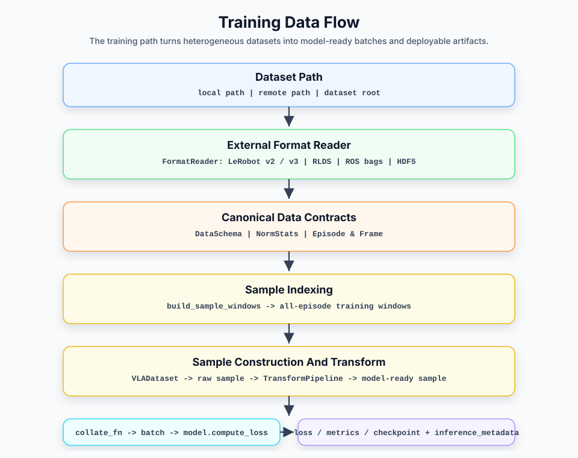

# Data Module Design

## 0. Overview

The data module is the input side of VLA Factory. It parses externally stored robot datasets, such as LeRobot v3, into a unified internal Canonical IR. The transform pipeline, training sample construction, and batching logic then assemble this IR into model-consumable batches such as `{"observation": Observation, "actions": Tensor}`.

The data module is not only for training. The training artifact's `assembly.json` preserves the resolved DataSchema, NormStats, and TransformPipelinePlans for direct deployment-side execution. The core responsibility of the data module is therefore not merely "feed a batch to training"; it is to establish a data contract consumed consistently by composition, training, and deployment.

### Layer Boundaries

At the architecture level, the data module covers two layers:

| Layer | Responsibility | Boundary |
|---|---|---|
| **External data parsing layer** | Understand external formats such as LeRobot, HDF5, RLDS, and ROS bag, and parse external metadata, episode boundaries, frame indices, state/action vectors, and video references into internal data facts. | May understand external formats; must not leak external field names, directory layouts, or file structures upward; must not perform model preprocessing or construct batches. |
| **Intermediate data representation layer** | Represent data facts with stable objects and organize them into data contracts shared by training and deployment. | Does not understand external storage formats; does not represent upstream model-native batches; does not turn the data module into a model-branching adapter. |

In the overall architecture, the data module corresponds to the "external data parsing layer" and the "intermediate data representation layer" in the main architecture document. It derives DataSchema, NormStats, and episode/frame data from the actual dataset; it does not consume model or training-sampling configuration. Assembly combines these data facts with model facts, and the resulting `assembly.json` is the deployment execution source for data semantics and transform plans.

This document covers:

- Chapter 1 describes the data module flow in training and deployment.
- Chapter 2 introduces the core objects used by the data module.
- Chapter 3 explains how external data is parsed into data facts.
- Chapter 4 explains how data facts become data contracts shared by training and deployment.
- Chapter 5 explains how to extend the data module.
- Chapter 6 lists design constraints and usage notes.
- Chapter 7 lists future evolution directions.

This document does not cover:

- Internal model adapter implementation.
- Training loops, optimizers, and checkpoint saving policies.
- Deployment transport, ZMQ protocol, and real-robot platform adapter details.

### Table of Contents

- [0. Overview](#0-overview)
- [1. Data Flow Overview](#1-data-flow-overview)
  - [1.1 Training Data Flow](#11-training-data-flow)
  - [1.2 Deployment Inference Flow](#12-deployment-inference-flow)
  - [1.3 Relationship Between Config, Metadata, and Data Flow](#13-relationship-between-config-metadata-and-data-flow)
- [2. Core Object Overview](#2-core-object-overview)
  - [2.1 External Data Parsing Objects](#21-external-data-parsing-objects)
  - [2.2 Data Fact and Contract Objects](#22-data-fact-and-contract-objects)
  - [2.3 Training Index and Sample Objects](#23-training-index-and-sample-objects)
  - [2.4 Training Sample and Batch Objects](#24-training-sample-and-batch-objects)
  - [2.5 Transform Pipeline Objects](#25-transform-pipeline-objects)
- [3. External Data Parsing Layer Design](#3-external-data-parsing-layer-design)
  - [3.1 Layer Responsibilities and Boundaries](#31-layer-responsibilities-and-boundaries)
  - [3.2 FormatReader Protocol](#32-formatreader-protocol)
  - [3.3 Reader Registration and Discovery](#33-reader-registration-and-discovery)
  - [3.4 LeRobot V3 Reader](#34-lerobot-v3-reader)
- [4. Intermediate Data Representation Layer Design](#4-intermediate-data-representation-layer-design)
  - [4.1 Layer Responsibilities and Boundaries](#41-layer-responsibilities-and-boundaries)
  - [4.2 Lazy Loading and Video Decoding](#42-lazy-loading-and-video-decoding)
  - [4.3 Model Transform Pipeline Design](#43-model-transform-pipeline-design)
  - [4.4 Training-Side Data Contract](#44-training-side-data-contract)
  - [4.5 Deployment-Side Reuse Contract](#45-deployment-side-reuse-contract)
  - [4.6 Non-Goals of Canonical IR](#46-non-goals-of-canonical-ir)
- [5. Extension Guide](#5-extension-guide)
  - [5.1 Adding a Data Format](#51-adding-a-data-format)
  - [5.2 Adding a Video Decoding Strategy](#52-adding-a-video-decoding-strategy)
  - [5.3 Adding a Transform Step](#53-adding-a-transform-step)
- [6. Design Constraints and Notes](#6-design-constraints-and-notes)
  - [6.1 Reader Does Not Perform Model Preprocessing](#61-reader-does-not-perform-model-preprocessing)
  - [6.2 Dataset Outputs Canonical Raw Samples](#62-dataset-outputs-canonical-raw-samples)
  - [6.3 Transform Defines the Model Input Contract](#63-transform-defines-the-model-input-contract)
  - [6.4 Observation Field Requirements Are Declared by Models](#64-observation-field-requirements-are-declared-by-models)
  - [6.5 Schema Is the Source of Data Facts](#65-schema-is-the-source-of-data-facts)
  - [6.6 Training Artifact Metadata Is the Deployment-Side Source of Truth](#66-training-artifact-metadata-is-the-deployment-side-source-of-truth)
- [7. Future Evolution](#7-future-evolution)
  - [7.1 Reader Indexing and Performance](#71-reader-indexing-and-performance)
  - [7.2 Video and Image Schema](#72-video-and-image-schema)
  - [7.3 Data Format and Video Decoding Strategy Extensions](#73-data-format-and-video-decoding-strategy-extensions)
  - [7.4 Sample-Window Persistence](#74-sample-window-persistence)
  - [7.5 Data Visualization](#75-data-visualization)
  - [7.6 Data Format Conversion](#76-data-format-conversion)

## 1. Data Flow Overview

The data module has two core flows: the training data flow and the deployment inference flow. The two paths share schema, norm stats, transform semantics, and the resolved recipe so that the data contract used during training can be reused during deployment.

### 1.1 Training Data Flow



| Stage | Input | Processing | Output |
|---|---|---|---|
| Data parsing | dataset path | `FormatReader` reads schema, norm stats, and episode information | `DataSchema` / `NormStats` / `Episode` |
| Transform configuration | `ResolvedAssembly` | instantiate `TransformPipeline` from `assembly.data_to_model` | model input transform |
| Sample indexing | episode information + model temporal contract | `build_sample_windows` constructs `SampleWindow` values for every episode | training window list |
| Sample construction | sample index | `VLADataset` reads frames, decodes images, and assembles observation/action | raw sample |
| Data transform | raw sample | `TransformPipeline` applies normalization, resize, padding, or tokenization | model-ready sample |
| Batching | model-ready sample | `collate_fn` aggregates batches | Trainer batch |
| Training forward | Trainer batch | `VLATrainer` calls `model.compute_loss` | loss / metrics / checkpoint + inference metadata |

The training side only sees a unified Dataset and batch. It does not need to understand LeRobot parquet files, MP4 layout, feature names, or stats files.

### 1.2 Deployment Inference Flow

Deployment inference does not rescan the training dataset as its source of truth. At the beginning of training, VLA Factory writes `inference_metadata/`, which contains:

- `assembly.json`: the deployment contract containing schema, norm stats, IO
  spec, and pipeline plans.
- `recipe.yaml`: the resolved recipe used by training.


| Stage | Input | Processing | Output |
|---|---|---|---|
| Artifact loading | checkpoint path | Read the assembly / recipe snapshots and load model weights | `InferenceEngine` |
| Observation adaptation | platform observation | platform adapter converts wire protocol | `ObsDict` |
| Preprocessing | `ObsDict` | Reuse training-side transform logic | `Observation` |
| Model inference | `Observation` | `model.predict_actions` | normalized action chunk |
| Postprocessing | action chunk | postprocessor unnormalizes and crops dimensions | raw action chunk |
| Action execution | raw action chunk | execution strategy + action adapter | platform action command |

Deployment inference and training data flow share the same schema / stats / transform semantics, but they do not share the training Dataset.

### 1.3 Relationship Between Config, Metadata, and Data Flow

There are four categories of source-of-truth in the data flow:

- **authoring recipe**: the direct experiment configuration entry point maintained by the user.
- **model profile**: the source of model defaults, used as the default value for `model.config`.
- **schema / stats**: data facts parsed from the dataset.
- **training artifact metadata**: the `recipe.yaml` and `assembly.json` saved during training and read by deployment.

The training entry point merges the authoring recipe, CLI overrides, and model profile into a resolved recipe. Deployment only reads the resolved `recipe.yaml` from the training artifacts and does not merge the current codebase's model profile again.

## 2. Core Object Overview

### 2.1 External Data Parsing Objects

| Object | Role | Boundary |
|---|---|---|
| `describe_dataset` | Dataset-description orchestration entry that returns `DataSchema` and `NormStats` from one selected reader. | Assembly calls this entry without understanding registration or detection. |
| `FormatReader` | Data format reader protocol that defines how external formats are parsed into internal data facts. | Understands external formats; does not perform model preprocessing or construct training batches. |
| `LeRobotV3Reader` | Current primary implementation; reads LeRobot v3 metadata, stats, parquet files, and video layout. | LeRobot v3 details stay inside the reader and do not leak into Dataset or model adapters. |

### 2.2 Data Fact and Contract Objects

| Object | Role | Key Fields |
|---|---|---|
| `DataSchema` | Static feature-space description of a dataset. | `state_dim`, `action_dim`, `cameras`, `image_sizes`, `fps`, `state_keys`, `action_keys` |
| `FeatureStats` | Statistics for one vector or image feature. | `mean`, `std`, `min`, `max` |
| `NormStats` | Dataset-level collection of normalization statistics. | `state`, `action`, `images`, `method` |
| `VideoRef` | Lazy video-frame reference that only records location information. | `video_path`, `frame_index`, `height`, `width`, `channels` |
| `Frame` | Data facts for one timestep. | `index`, `images`, `state`, `action`, `timestamp`, `is_first`, `is_last` |
| `Episode` | One episode with lazy frame loading. | `episode_id`, `episode_index`, `num_frames`, `_frame_loader` |

### 2.3 Training Index and Sample Objects

| Object | Role | Key Fields |
|---|---|---|
| `SampleWindow` | Temporal window needed to materialize one training sample. | `episode_index`, `start_frame_index`, `n_obs_steps`, `action_horizon` |
| `build_episode_windows` | Slices one episode into `SampleWindow` values. | `n_obs_steps`, `action_horizon` |
| `build_sample_windows` | Builds one deterministic window list from every episode. | `episode_lengths`, model temporal contract |

### 2.4 Training Sample and Batch Objects

| Object | Role | Boundary |
|---|---|---|
| `VLADataset` | Reads samples from `SampleWindow`, decodes images on demand, assembles flat samples, and calls the transform pipeline. | Does not understand external format fields; does not implement model internals. |
| `collate_fn` | Aggregates flat samples into the batch used by the training protocol. | Does not branch on `model_name`; does not create model-specific Observation types. |
| `Observation` | Unified observation container in the model protocol. | Fields are optional; field requirements are declared by model metadata / profile. |

### 2.5 Transform Pipeline Objects

| Object | Role | Key Interfaces or Fields |
|---|---|---|
| `TransformStep` | One sample-level transform step. | `compile_call` (planning), `from_call` (execution), `inverse_call` |
| `TransformPipeline` | Ordered list of steps that converts raw samples into model-ready samples. | `steps`, `__call__(sample)` |
| `TransformContext` | Runtime context for instantiating a resolved plan; carries only what a serialized call cannot. | `norm_stats` |

## 3. External Data Parsing Layer Design

### 3.1 Layer Responsibilities and Boundaries

The external data parsing layer translates external formats into VLA Factory internal data facts. A Reader may understand file layout, field names, metadata structures, and version information for an external format, but it must not leak these details upward.

Reader may:

- Read external metadata, parquet, JSON, HDF5, TFDS records, or ROS bag indices.
- Parse camera names, image sizes, state/action dimensions, and key ordering.
- Parse episode boundaries, frame indices, timestamps, and first/last markers.
- Construct `DataSchema`, `NormStats`, `Episode`, `Frame`, and `VideoRef`.

Reader must not:

- Decode video frames; it only generates `VideoRef`.
- Construct training-side `SampleWindow` values.
- Perform image resize, layout conversion, normalization, or action padding.
- Construct training batches.
- Depend on a specific model adapter.

#### Data Fact Contract

Once Reader-parsed data facts enter VLA Factory, they should become the consistent and trusted source of truth during training and deployment. Camera names, original image sizes, state/action dimensions, key ordering, episode boundaries, video frame locations, and statistics all come from the dataset. They are not guessed by the model, transform, or deployment side.

`DataSchema` represents the feature space, cameras, image sizes, state/action dimensions, and key ordering. `NormStats` represents the statistics shared by training normalization and deployment unnormalization. `Episode`, `Frame`, and `VideoRef` represent episode boundaries, per-frame facts, and video frame locations. Together, these objects form the data fact contract that Reader hands to upper layers.

#### Data Fact Parsing Responsibilities

| Data Fact | What Reader Parses |
|---|---|
| `DataSchema` | feature space, cameras, image sizes, state/action dims, key ordering, fps. |
| `NormStats` | state/action/image stats required by training normalization and deployment unnormalization. |
| `Episode` | episode id, episode index, number of frames, frame loader. |
| `Frame` | frame index, state, action, timestamp, is_first/is_last. |
| `VideoRef` | video path, frame index, height, width, channels. |

### 3.2 FormatReader Protocol

The public reading and call entry is `data/data_schema.py`. Here, data schema
means the data layer's whole format-neutral representation, not only the
`DataSchema` class: static facts, normalization statistics, runtime records,
and `describe_dataset()` live together. The reader extension interface lives
in `data/reader/base.py`.

```python
@runtime_checkable
class FormatReader(Protocol):
    def can_read(self, path: Path) -> bool: ...
    def get_schema(self, path: Path) -> DataSchema: ...
    def get_norm_stats(self, path: Path) -> NormStats: ...
    def get_episode_lengths(self, path: Path) -> dict[int, int]: ...
    def get_episode_ranges(self, path: Path) -> dict[int, tuple[int, int]]: ...
    def read_episode(self, path: Path, episode_index: int, codec: VideoCodec) -> Episode: ...
```

Protocol intent:

- `can_read()` performs format sniffing for `"auto"` discovery.
- `get_schema()` / `get_norm_stats()` read static data facts.
- `get_episode_lengths()` / `get_episode_ranges()` read episode-level index information.
- `read_episode()` reads one episode and returns an `Episode` made of `Frame` objects; image fields only contain `VideoRef`, not decoded image arrays.

`read_episode()` accepts a `VideoCodec` parameter, but the Reader does not actively decode video. This parameter is reserved for future implementations that may need to establish decoding references or validate video information during reading. Actual decoding still happens when Dataset reads a sample.

### 3.3 Reader Registration and Discovery

In-tree readers register classes with `@ReaderRegistry.register(name, aliases=...)`.
The registry stores factories rather than shared instances. `get_reader("auto", path)`
tries built-ins first, then loads Python entry points in the
`vla_factory.readers` group when no built-in recognises the path. External
packages therefore extend the framework without editing its source:

```toml
[project.entry-points."vla_factory.readers"]
my-format = "my_package.reader:MyFormatReader"
```

Unknown names, duplicate names, and plugins that do not implement
`FormatReader` fail explicitly instead of silently selecting another format.

`can_read()` should be conservative: it should return `True` only when key metadata and version information are sufficient to prove that the reader can parse the dataset correctly. Directories that look similar but have incomplete schema should not be misidentified.

### 3.4 LeRobot V3 Reader

`LeRobotV3Reader` is the current primary Reader and parses LeRobot v3 datasets.

#### 3.4.1 Supported Data Layout

```text
dataset_path/
  meta/
    info.json
    stats.json
    tasks.parquet
  data/
    *.parquet
  videos/
    observation.images.front/
      chunk-000/
        episode_000000.mp4
```

`can_read()` uses `meta/info.json` as the format entry point and checks `codebase_version >= 3.0`. The current implementation identifies the v3 family with `>= 3.0`; if a future LeRobot version changes the directory or schema structure, the compatible version range should be narrowed or a separate Reader should be introduced.

#### 3.4.2 Schema Parsing

The Reader infers the following from the `features` field in `info.json`:

- `state_dim` / `action_dim` — from `features["observation.state"]["shape"]` / `features["action"]["shape"]`
- `cameras` — extracted from every feature key whose `dtype == "video"`
- `image_sizes` — inferred as `(height, width)` from video feature shape or `video_info`
- `state_keys` / `action_keys` — dimension-to-semantic mapping from `features["observation.state"]["names"]` / `features["action"]["names"]`
- `has_language` — checks whether `meta/tasks.parquet` or `meta/tasks.jsonl` exists

#### 3.4.3 NormStats Parsing

The Reader reads state, action, and per-camera mean/std/min/max from `stats.json`. Key matching rules: `"state"` maps to state, `"action"` maps to action, and `"observation.images.{cam}"` maps to per-camera stats.

#### 3.4.4 Episode Index Parsing

The Reader scans `data/*.parquet`, groups rows by the `episode_index` column, and outputs `dict[int, int]` (episode_index -> num_frames) and `dict[int, tuple[int, int]]` (episode_index -> global_start, global_end).

#### 3.4.5 Frame Parsing

The Reader reads all rows for the episode from parquet and constructs a `Frame` for each row:

- `state` / `action` — read directly from parquet columns as `NDArray`
- `images` — each camera points to one `VideoRef`
- `timestamp` — read from the `timestamp` field in parquet when present, otherwise kept as `None`
- `is_first` / `is_last` — set from `frame_index == 0` and `frame_index == num_frames - 1`

#### 3.4.6 VideoRef Parsing

For each frame of each camera, the Reader constructs a `VideoRef`: `video_path` is the video file path, `frame_index` is the frame number inside the video, and `height`/`width`/`channels` are read from video feature metadata in `info.json`.

Video paths are searched in this order:

1. `videos/{cam_key}/chunk-*/episode_{ep_idx:06d}.mp4`
2. `videos/{cam_key}/chunk-*/{any}.mp4`
3. `videos/{cam_key}/{any}.mp4`

Per-episode videos use episode-local `frame_index`; multi-episode videos use the dataset-global `index`.

#### 3.4.7 Known Limitations

- In multi-chunk / multi-MP4 scenarios, video file selection must align with the episode range or global index. It cannot simply take the first file after sorting.
- The Reader layer does not perform image resize, normalization, or layout conversion.
- The current `can_read()` identifies v3-family formats by `codebase_version >= 3.0`; if future LeRobot versions change structure, the compatible version range should be narrowed or a separate Reader should be introduced.
- Multi-episode videos use global `index` for frame numbers. If video encoding does not start sequentially from episode 0, frames may be misaligned.
- Parquet files are read after sorting and concatenation, which may be slow for large datasets.

## 4. Intermediate Data Representation Layer Design

### 4.1 Layer Responsibilities and Boundaries

The intermediate data representation layer organizes Reader-parsed data facts into data contracts shared by training and deployment. A "contract" here is not merely the field list of a dataclass; it is a stable semantic agreement across modules about what assumptions a consumer can safely make about data handed over by a producer.

The intermediate representation layer no longer understands external storage formats and does not re-guess schema, stats, or key ordering. It consumes the data facts emitted by the Reader layer and organizes the internal data flow around two contract paths: training-side and deployment-side.

- **Training-side data contract**: the path from episode to training sample must be stably defined: how a sample is located, how the observation window is selected, from which timestep the action chunk starts, how episode tail padding works, how padding is explicitly marked, and how flat samples are aggregated into `Observation` and batch. These contracts let Trainer and loss logic avoid understanding episodes, videos, or external file structures.
- **Deployment-side reuse contract**: training artifacts must save the data semantics required by deployment, including resolved recipe, schema, and stats. Deployment treats this metadata as the source of truth, reusing training-time transforms and key ordering instead of reparsing the training dataset or merging the current codebase's model profile again.

These two paths are supported by two core mechanisms: lazy loading and video decoding materialize data facts on demand; the model transform pipeline converts raw samples into model-consumable inputs and generates output reverse transforms for deployment.

### 4.2 Lazy Loading and Video Decoding

Under the isolation constraints, the core data structures in the intermediate representation layer form a lazy-loading chain:

```text
VideoRef  (frozen dataclass)
  ├── video_path: Path      ← video file location
  ├── frame_index: int      ← frame number inside the video
  ├── height, width, channels  ← declared dimensions for decoder preallocation
  └── does not hold decoded data and does not decode

Frame  (dataclass)
  ├── index: int            ← global frame index
  ├── images: dict[str, VideoRef]  ← lazy reference for each camera
  ├── state: NDArray | None ← vector parsed by Reader
  ├── action: NDArray | None ← vector parsed by Reader
  ├── is_first / is_last    ← episode boundary markers

Episode  (dataclass)
  ├── episode_id, episode_index, num_frames
  ├── _frame_loader: Callable[[], Iterator[Frame]]  ← closure, executed lazily
  ├── _frames_cache: list[Frame] | None  ← cache after load_frames()
  ├── frames() → Iterator[Frame]  ← iterate with cache or reload
  └── load_frames() → list[Frame]  ← force materialization + cache
```

Lazy loading is used because:

- During training, `VLADataset` uses a 64-episode LRU cache and only keeps recently accessed episode frame data, avoiding loading the full dataset into memory.
- `VideoRef` does not decode video. Decoding happens on demand when `VLADataset.__getitem__` calls `codec.decode_frame(ref)`.
- `Episode._frame_loader` is a closure that only executes when `load_frames()` or `frames()` is called, avoiding loading unused episodes.

#### 4.2.1 Video Decoding Strategy

Video decoding is a replaceable capability used when `VLADataset` reads samples. Reader only generates `VideoRef`; Dataset calls a codec when it needs an image frame:

- `VideoCodec.name`
- `VideoCodec.decode_frame(ref: VideoRef) -> NDArray`

The output contract of `decode_frame()` is `numpy HWC uint8`. This is the image-format boundary between Dataset and the transform pipeline. The current default implementation is `PyAVCodec`, which decodes `VideoRef` into raw images.

Caching does not change data semantics. Whether a frame comes from video decoding or `.npy` cache, the output should remain `HWC uint8`.

New video decoding strategies can be added later, such as `DecordCodec`, `OpenCVCodec`, `ImageFolderCodec`, or `RemoteCodec`. A new codec should not require modifications to Reader or Dataset; it only needs to follow the `VideoCodec` protocol and the `HWC uint8` output contract. See [Adding a Video Decoding Strategy](#52-adding-a-video-decoding-strategy).

#### 4.2.2 PyAVCodec and Caching Strategy

`PyAVCodec` supports two levels of caching:

- **In-memory cache**: each video file maintains a frame cache and reuses the opened video container.
- **Disk cache**: decoded frames are saved to `<video>.frame_cache/*.npy`, so later runs can load them directly.

### 4.3 Model Transform Pipeline Design

`TransformPipeline` is the execution layer for the model input contract. It converts a canonical raw sample into a model-ready sample. The requirements are declared as immutable `ModelMetadata` facts rather than as a YAML step list, and the assembly resolver derives the required operations without branching on `model_name`. Dataset and collate remain model-agnostic.

The logic that arranges `Observation` into an upstream model-library-native batch dict still belongs to the model adapter. For example, the ACT adapter maps `Observation.images["front"]` to LeRobot's expected `observation.images.front`.

**Input transform** (training side):

For example, ACT declares an image range, CHW layout, stretch resize policy,
ImageNet normalization and vector normalization as named model facts. The
resolver compares those facts with `DataSchema` and `ModelIOSpec`, then emits
only the calls that are needed. Padding comes from a vector-width difference;
resize comes from an image-size difference. There is no
`model.config.transforms.inputs` field and no per-run ordering override.

The resolver calls each selected step's `compile_call()`, baking arguments and
skip decisions into `data_to_model`; training and inference instantiate that
saved plan with `build_pipeline(plan, ctx)`. `TransformContext` supplies only
what a serialized call cannot carry, currently the dataset statistics.

**Output postprocessor** (deployment side):

Each step declares its own reverse via `inverse_call()`, and the resolver uses that to plan `model_to_robot`:

- `NormalizeVector` -> `UnnormalizeActionStep` (z-score unnormalization)
- `PadDimensions` -> `UnpadAction` (crop back to original action_dim)

A step with no inverse (the image ops) simply disappears — the reverse pipeline is never the forward list reversed.

During deployment, `InferenceEngine` uses these reverse transforms to restore model outputs to the original action scale and dimension.

**Tokenizer / prompt field generation**:

For models that need language instructions, such as PI0 and OpenVLA, `Observation` reserves `tokenized_prompt` and related mask fields. The current `collate_fn` does not generate these fields; it only performs generic stacking. Tokenizer requirements are named model facts (`tokenizer_repo`, `tokenizer_max_length`, and whether state enters the prompt); the resolver derives the `task_tokenize` call.

### 4.4 Training-Side Data Contract

The training-side data contract defines the stable path from episode to training batch:

```text
Episode / Frame / VideoRef
  -> SampleWindow
  -> canonical raw sample dict
  -> TransformPipeline
  -> collate_fn
  -> {"observation": Observation, "actions": Tensor, "action_is_pad": Tensor}
```

#### 4.4.1 Sample Indexing and Splits

`SampleWindow` does not hold data; it only records which episode and timestep are used to construct the sample, along with the observation window and action horizon for that sample:

```python
@dataclass(frozen=True)
class SampleWindow:
    episode_index: int
    start_frame_index: int
    n_obs_steps: int
    action_horizon: int
```

`build_episode_windows()` generates one `SampleWindow` for every valid observation position in an episode:

```text
episode (length = L, n_obs_steps = 1, action_horizon = H)

  frame 0: window(episode=0, start=0, n_obs=1, horizon=H)
  frame 1: window(episode=0, start=1, n_obs=1, horizon=H)
  ...
  frame L-1: window(episode=0, start=L-1, n_obs=1, horizon=H)
```

Currently, `VLADataset._load_sample()` materializes only the last frame of the observation window as images/state. `n_obs_steps` is the contract entry point for future multi-frame observation support. The action chunk starts from the last frame of the observation window and has length `action_horizon`.

**Tail padding**: when `action_horizon` exceeds the episode length, `VLADataset._load_sample` uses repeat-last padding, filling out-of-range positions with the last valid action in the episode. If every frame action in the episode is `None`, it raises `ValueError`.

`build_sample_windows()` creates no aggregate sample-index object. It calls
`build_episode_windows()` in deterministic episode/frame order and gives the
complete list directly to one `VLADataset`. Training currently has no evaluation
loop, so there is no unconsumed validation list that silently shrinks the training
set. When validation is implemented, it should split by episode rather than frame
to prevent temporal-trajectory leakage between training and validation.

#### 4.4.2 Dataset and Batch

`VLADataset.__getitem__` converts Canonical IR into a **canonical raw sample dict**: a flat numpy dict whose keys use generic names such as `images.front`, `state`, and `actions`. It does not perform model preprocessing; it only materializes data (`VideoRef` -> numpy) and applies repeat-last padding.

```python
def __getitem__(self, idx):
    # 1. window -> episode -> frames (LRU cache)
    # 2. VideoRef -> VideoCodec.decode_frame() -> HWC uint8
    # 3. assemble canonical raw sample dict
    sample = self._load_sample(window)
    # 4. TransformPipeline transform
    sample = self.transforms(sample)
    return sample
```

Episode cache strategy: `_episode_cache` stores at most 64 episodes of frame data and evicts entries with LRU behavior.

`collate_fn` stacks multiple numpy dicts into a training batch:

- `"images.*"` keys are grouped by camera -> `Observation.images` dict
- `"image_masks.*"` keys are grouped by camera -> `Observation.image_masks` dict
- `"state"` -> `Observation.state`
- `"actions"` -> `Tensor[B, horizon, dim]`
- `"action_is_pad"` -> `Tensor[B, horizon]`

**Observation is a unified container**: all models share the same `Observation` class, and fields are optional (`tokenized_prompt`, `token_ar_mask`, etc. may be `None`). `collate_fn` **does not branch on model_name** and does not create model-specific fields or model-specific Observation types. It only performs generic structural aggregation and does not adjust output format by model type. Fields required by a model are either filled by TransformPipeline or selected by the model adapter inside `compute_loss()`.

Different models need different field arrangements from `Observation`, but the data layer does **not** absorb this difference. The data layer produces an `Observation` containing all available fields; the model adapter selects the needed subset and performs internal conversion, such as ACT's `_obs_to_lerobot_batch()`. The cost is that each adapter writes its own conversion logic. The benefit is that the data pipeline remains stable: adding a model does not require changing data code.

### 4.5 Deployment-Side Reuse Contract

The deployment side does not run the full data pipeline, but it reuses metadata produced during training:

| Metadata File | Source | Deployment Use |
|---|---|---|
| `recipe.yaml` | complete configuration used by training | model name, strategy, and parameters |
| `assembly.json` | training-time `ResolvedAssembly` | execute schema/stats, ModelIOSpec, and the three PipelinePlans |

**Core principle**: deployment-side metadata is the version saved in the checkpoint, **not** a version reparsed from the training dataset. The training dataset may no longer be in place or may have been updated; deployment uses the training-time snapshot. This is the point of saving checkpoint metadata.

Deployment instantiates inverse transforms such as UnnormalizeAction and UnpadAction from `assembly.model_to_robot`; live runtime objects are built from the NormStats stored in the assembly. It neither reparses transform declarations nor re-merges the current codebase's model profile.

### 4.6 Non-Goals of Canonical IR

The intermediate representation layer is **not responsible** for:

- **Model preprocessing**: image resize size and vector normalization scale are decided by TransformPipeline based on model declarations; Canonical IR only carries raw data.
- **Model input format adaptation**: upstream model libraries such as lerobot and transformers have their own batch dict formats; model adapters perform this conversion inside `compute_loss()`, and Canonical IR is unaware of it.
- **Data augmentation**: random crop, color jitter and similar training-time augmentations are not part of the intermediate representation contract. None is implemented today; if one is added it belongs in the transform pipeline, as a step the model declares like any other.
- **Online inference data collection**: deployment observations come from sensors or simulators and do not go through the `VLADataset` pipeline.

## 5. Extension Guide

### 5.1 Adding a Data Format

When adding a data format, add a new `FormatReader` implementation instead of modifying Dataset or model adapters.

#### 5.1.1 Basic Steps for Adding a Reader

1. Add a reader file under `vla_factory/data/reader/`.
2. Implement `can_read(path)` using minimal metadata to identify the format.
3. Implement `get_schema(path)` and fill `DataSchema`.
4. Implement `get_norm_stats(path)` and fill `NormStats`.
5. Implement `get_episode_lengths(path)` and `get_episode_ranges(path)`.
6. Implement `read_episode(path, episode_index, codec)` and construct `Episode`, `Frame`, and `VideoRef`.
7. Use `@ReaderRegistry.register("name")` in-tree, or publish an external
   `vla_factory.readers` entry point.
8. Add tests for schema, episode reading, dataset samples, and dataloader smoke coverage.

#### 5.1.2 Reader Documentation Section Template

After adding a Reader, add a corresponding subsection in Chapter 3 using this structure:

```md
### 3.x <FormatName> Reader

#### 3.x.1 Supported Data Layout
#### 3.x.2 Schema Parsing
#### 3.x.3 NormStats Parsing
#### 3.x.4 Episode Index Parsing
#### 3.x.5 Frame Parsing
#### 3.x.6 VideoRef Parsing
#### 3.x.7 Known Limitations
```

### 5.2 Adding a Video Decoding Strategy

To add a video decoding strategy, implement the `VideoCodec` protocol:

```python
class MyCodec:
    @property
    def name(self) -> str:
        return "my-codec"

    def decode_frame(self, ref: VideoRef) -> NDArray:
        ...
```

A new codec should guarantee `numpy HWC uint8` output because that is the image contract between Dataset and the transform pipeline.

In-tree implementations use `@CodecRegistry.register("my-codec")`; external
packages publish a `vla_factory.codecs` entry point:

```toml
[project.entry-points."vla_factory.codecs"]
my-codec = "my_package.codec:MyCodec"
```

`resolve_codec("auto")` explicitly selects PyAV. Any other unknown name fails
instead of silently falling back to PyAV.

### 5.3 Adding a Transform Step

To add a transform step, subclass `TransformStep` and register it with `TransformRegistry`. A step is not activated from a recipe list: its need must be represented by a named model/data fact, and the resolver selects it from that fact. This keeps Dataset, collate and model adapters free of preprocessing decisions while preserving one planning path.

Basic steps:

1. Add or extend a step under `vla_factory/assembly/transform/`.
2. Register the type name with `@TransformRegistry.register("your_step")`.
3. Implement `__call__(sample)`.
4. If the step reads a model fact or has a skip rule, implement `compile_call(cfg, ctx)` (planning time); if it needs a live object such as statistics, implement `from_call(args, ctx)` (execution time).
5. If the step changes the model output space, implement `inverse_call(args, ctx)`. Shape-changing calls consume source/target shapes already resolved in `PlanContext`; a step must not report a second interface through an `output_*` hook.
6. Add the resolver rule that selects it from that fact, with tests for both the required and no-op cases.

A new step must still follow the transform contract:

- Input and output are flat sample dicts.
- Small execution parameters are written into the resolved `TransformStepCall.args`.
- Interface shapes are not transform parameters. Declare fixed model shapes in `ModelMetadata` (for example `VisionSlot.resolution`) or an explicit model tunable such as ACT's `input_image_size`; the resolver writes them to `ModelIOSpec` before compiling calls.
- Large parameters, vocabularies, or fitted results are saved as artifacts and explicitly referenced in the resolved recipe.
- Deployment does not refit transforms; it only loads configuration and artifacts from checkpoint metadata.
- If a step changes the model output space, it should implement `inverse_call()` — the single home of every forward/inverse pairing; a lossy step must return `None` rather than a lookalike.

## 6. Design Constraints and Notes

### 6.1 Reader Does Not Perform Model Preprocessing

Reader only reads external formats and constructs internal data facts. It may parse schema, stats, episodes, video paths, and frame indices, but it should not perform model-specific preprocessing.

### 6.2 Dataset Outputs Canonical Raw Samples

Dataset output should stay close to raw data:

- Images are `HWC uint8`.
- State/action are `float32` vectors.
- Action padding is expressed explicitly with `action_is_pad`.

Dataset should not change the global output contract because one model needs CHW layout or `[0, 1]` image range.

### 6.3 Transform Defines the Model Input Contract

Model input formatting is executed by the transform pipeline. Different models declare different immutable interface facts; the resolver derives the operations. Recipes cannot replace the step list or its order.

### 6.4 Observation Field Requirements Are Declared by Models

Different models may require different semantic fields in `Observation`. For example, ACT only needs images + state, PI0 may need images + state + tokenized prompt, and OpenVLA may not need state. This difference should be declared by model metadata or model profile, and the transform pipeline should generate the corresponding fields.

The data module only produces the unified `Observation` container, aggregates existing fields, and validates missing fields. It should not create model-specific types such as `ACTObservation` / `PI0Observation`, and it should not arrange `Observation` into an upstream model library's native batch dict.

### 6.5 Schema Is the Source of Data Facts

`DataSchema` comes from the dataset, not from user guesses. Camera names, original image sizes, state/action dimensions, and key ordering should all be read from schema.

### 6.6 Training Artifact Metadata Is the Deployment-Side Source of Truth

Deployment should read the resolved `recipe.yaml` and `assembly.json`; the latter is the single execution source for schema, statistics, ModelIOSpec, and PipelinePlans. It should not re-merge the current codebase's model profile or reconstruct a second execution plan.

## 7. Future Evolution

### 7.1 Reader Indexing and Performance

The LeRobot v3 reader currently scans parquet in multiple places. In evaluation or large-dataset scenarios, an episode index cache should be added to avoid repeatedly scanning every parquet file in `get_episode_lengths()`, `get_episode_ranges()`, and `read_episode()`.

### 7.2 Video and Image Schema

When a single camera has multiple MP4 chunks, video files should be selected precisely by episode/global index. `DataSchema.image_sizes` may later be extended with channel count, color space, depth-map flags, and related metadata.

### 7.3 Data Format and Video Decoding Strategy Extensions

Formats such as HDF5, RLDS, and ROS bag should be integrated by adding Readers. Video decoding strategies may also be extended with Decord, OpenCV, image folder, remote object storage, and similar implementations.

### 7.4 Sample-Window Persistence

If constructing window lists becomes a measured bottleneck, the `SampleWindow` list could be persisted. Until then it is generated quickly and deterministically from episode lengths and the model temporal contract, without a dedicated Manifest.

### 7.5 Data Visualization

Visualization support can be added on top of the intermediate representation layer to inspect Reader parsing results, sample construction logic, and data semantics before and after transforms. For example:

- Browse video frames, timestamps, state, and action by episode.
- Display observation frame, action horizon, and `action_is_pad` by `SampleWindow`.
- Compare raw images with images after resize/layout/normalize.
- Display the video frames corresponding to an action segment to debug action alignment, video frame misalignment, and padding issues.

These tools should preferentially read Canonical IR, sample windows, and checkpoint metadata instead of binding directly to one external data format.

### 7.6 Data Format Conversion

A future Writer / Exporter layer can be added beside Reader, using Canonical IR as the intermediate bridge to convert between multiple embodied-data formats, such as LeRobot, HDF5, RLDS, ROS bag, or custom robot data formats.

Format conversion should reuse `DataSchema`, `NormStats`, `Episode`, `Frame`, and `VideoRef` parsed by Reader. Exporters should explicitly declare which fields the target format supports, which metadata will be preserved, and which information must be degraded or dropped. This avoids implementing a separate point-to-point converter for every pair of formats.
