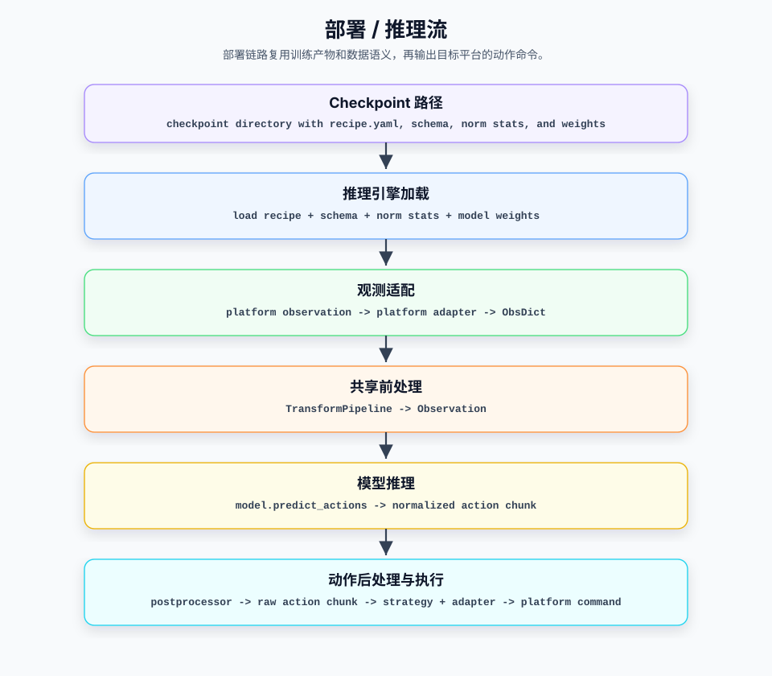

# 部署模块设计

## 0. 总览

部署模块是 VLA Factory 的输出端。它负责把训练产物（checkpoint +
`inference_metadata/`）转成平台可调用的实时策略服务：从 checkpoint 重建与
训练一致的推理链路，把各仿真器 / 真机平台的原生 observation 翻译成统一输入，
运行模型前向，再把模型输出的归一化 action chunk 还原成平台可执行的动作命令。

部署模块不重新扫描训练数据集，也不重新合并当前代码里的 model profile。它以
训练开始时写出的 `inference_metadata/{assembly.json, recipe.yaml}` 为唯一事实
来源；`assembly.json` 已包含 schema、norm stats、IO spec 和 transform plans。
因此部署模块的核心职责不是“把
observation 喂给模型”这么窄，而是**在不重跑数据管线的前提下，复现训练时的数据
标准，并把它安全地对接到具体运行平台**。

### 层级职责边界

在整体架构层面，部署模块对应主架构文档里的“部署层”，内部又可拆成三条职责：

| 子层 | 职责 | 边界 |
|---|---|---|
| **推理核心层** | 从 checkpoint 加载模型和 metadata，重建 preprocessor / postprocessor，运行前向，始终产出严格的 `ActionChunk[H,D]`。 | 复用训练侧 transform 语义；不拥有 action chunk 执行策略；不感知平台协议和 transport。 |
| **平台适配层** | 把某个平台的原生 observation 翻译成统一 `ObsDict`，把 action 向量翻译成平台动作命令。 | 理解某个平台/具身的字段命名与线协议；不做模型预处理、不解归一化；不理解 transport 框架。 |
| **传输与远程服务层** | 拥有连接生命周期、消息分帧、序列化，把远程请求分发到策略 handler。 | 只搬运字节和 `{cmd, obs}` / `{res}`；不理解 observation 语义、相机、关节或动作。 |

这三条职责在整体架构中共同实现主架构文档 §5.4 描述的“部署模块”。它消费
checkpoint 中的训练产物 metadata，向仿真器与真机平台提供统一的实时策略服务。

本文覆盖：

- 第 1 章讲部署模块的推理数据流全景，以及进程内 / 远程两种服务形态。
- 第 2 章讲部署模块涉及的核心对象。
- 第 3 章讲推理核心层如何从 checkpoint 重建并运行推理链路。
- 第 4 章讲平台适配层如何在具身/线协议边界上做双向翻译。
- 第 5 章讲传输与远程服务层如何在不理解模型语义的前提下承载 RPC。
- 第 6 章讲如何扩展部署模块。
- 第 7 章讲设计约束和使用注意事项。
- 第 8 章讲后续可以继续演进的方向。

本文不覆盖：

- 训练数据流、Reader、样本构造和 transform pipeline 的内部实现（见
  [数据模块设计](data-module.cn.md)）。
- 模型 adapter 的内部实现和 `predict_actions` 的模型侧逻辑。
- 训练 loop、优化器、checkpoint 保存策略。

### 目录

- [0. 总览](#0-总览)
- [1. 部署推理流全景](#1-部署推理流全景)
  - [1.1 部署推理流](#11-部署推理流)
  - [1.2 进程内与远程两种服务形态](#12-进程内与远程两种服务形态)
  - [1.3 metadata 与部署链路的关系](#13-metadata-与部署链路的关系)
- [2. 核心对象速览](#2-核心对象速览)
  - [2.1 推理核心对象](#21-推理核心对象)
  - [2.2 平台适配对象](#22-平台适配对象)
  - [2.3 传输与远程服务对象](#23-传输与远程服务对象)
  - [2.4 连接器对象](#24-连接器对象)
- [3. 推理核心层设计](#3-推理核心层设计)
  - [3.1 层职责与边界](#31-层职责与边界)
  - [3.2 初始化：从 checkpoint 重建部署标准](#32-初始化从-checkpoint-重建部署标准)
  - [3.3 ObsDict → Observation 前处理](#33-obsdict--observation-前处理)
  - [3.4 模型推理与后处理反变换](#34-模型推理与后处理反变换)
  - [3.5 Action chunk 执行策略](#35-action-chunk-执行策略)
- [4. 平台适配层设计](#4-平台适配层设计)
  - [4.1 层职责与边界](#41-层职责与边界)
  - [4.2 adapter 协议与各平台实现](#42-adapter-协议与各平台实现)
  - [4.3 ObsDict：适配层的输出标准](#43-obsdict适配层的输出标准)
- [5. 传输与远程服务层设计](#5-传输与远程服务层设计)
  - [5.1 层职责与边界](#51-层职责与边界)
  - [5.2 ZMQ transport 与 runner（仿真器 / lerobot host）](#52-zmq-transport-与-runner仿真器--lerobot-host)
  - [5.3 length-prefixed JSON RPC（RoboTwin）](#53-length-prefixed-json-rpcrobotwin)
  - [5.4 进程内形态](#54-进程内形态)
- [6. 扩展指南](#6-扩展指南)
  - [6.1 新增平台 adapter](#61-新增平台-adapter)
  - [6.2 新增 transport](#62-新增-transport)
  - [6.3 新增外置 connector](#63-新增外置-connector)
- [7. 设计约束与注意事项](#7-设计约束与注意事项)
  - [7.1 部署以 checkpoint metadata 为事实来源](#71-部署以-checkpoint-metadata-为事实来源)
  - [7.2 Adapter 不做模型预处理](#72-adapter-不做模型预处理)
  - [7.3 Transport 不理解模型语义](#73-transport-不理解模型语义)
  - [7.4 key 顺序不在部署时临时生成](#74-key-顺序不在部署时临时生成)
  - [7.5 缺字段或维度不符必须直接失败](#75-缺字段或维度不符必须直接失败)
- [8. 未来演进思路](#8-未来演进思路)

## 1. 部署推理流全景

部署模块的核心链路是一条**从平台 observation 到平台动作命令**的实时推理流。
它与训练数据流共享 schema、norm stats、transform 语义和 resolved recipe，但不
共享训练 Dataset——部署侧的 observation 来自传感器 / 仿真器，不经过 `VLADataset`
管线（见[数据模块 §4.6](data-module.cn.md#46-canonical-ir-的非目标)）。

### 1.1 部署推理流



| 阶段 | 输入 | 处理 | 输出 |
|---|---|---|---|
| 产物加载 | checkpoint path | `InferenceEngine` 读取 assembly / recipe，重建模型并加载权重 | 就绪的 `InferenceEngine` |
| 观测适配 | platform observation | platform adapter 转换线协议 / 具身字段 | `ObsDict` |
| 前处理 | `ObsDict` | 复用训练侧 preprocessor（normalize / resize / layout / tokenize） | `Observation` |
| 模型推理 | `Observation` | `model.predict_actions(obs, num_steps=...)` | normalized action chunk |
| 后处理 | action chunk | postprocessor 反归一化、裁剪、校验 shape / finite 值 | `ActionChunk[H,D]` |
| 执行策略 | `ActionChunk` | synchronous / temporal_ensembling / receding_horizon | `ActionCommand[N,D]` |
| 动作执行 | action | action adapter（如有）转成平台动作命令 | platform action command |

整条链路的类型必须逐段收紧：推理核心层只消费 `ObsDict`、只产出
`ActionChunk[H,D]`；执行策略只产出 `ActionCommand[N,D]`。平台差异（相机命名、
图像编码、电机 key 顺序）必须全部消化在平台适配层，禁止泄漏进核心链路。

### 1.2 进程内与远程两种服务形态

部署链路根据模型依赖能否与平台运行时共存，落成两种服务形态：

- **进程内 / 客户端形态**：`InferenceEngine` 与平台运行时在同一进程或由 VLA
  Factory 主动连接平台。仿真器（ZMQ）和 lerobot 真机（ZMQ host）走这条路：
  VLA Factory 作为 client 连接平台的 observation / command 端口，收到 observation
  就 `predict` 并把动作推回去。
- **远程模型服务形态**：模型依赖（如 openpi、torch、CUDA）与平台仿真依赖（如
  RoboTwin/SAPIEN）必须分处两个环境时，VLA Factory 作为**模型服务端**监听 TCP，
  平台作为 client 通过一个零依赖 connector 连过来。RoboTwin 平台走这条路。

两种形态必须共享同一个 `InferenceEngine`、同一套执行策略与平台 adapter；允许
不同的只有 transport 和连接发起方。任何“为某形态单独实现一份推理 / 适配逻辑”
的做法都是分层被破坏的信号。

### 1.3 metadata 与部署链路的关系

部署链路的事实来源全部来自 checkpoint 目录下的 `inference_metadata/`：

| 元数据文件 | 来源 | 部署用途 |
|---|---|---|
| `assembly.json` | 训练时的 `ResolvedAssembly` | schema、norm stats、ModelIOSpec 与三条 pipeline plan 的执行契约 |
| `recipe.yaml` | 训练时的 resolved recipe | 模型名、模型配置和运行参数 |

核心原则与数据模块一致：部署必须使用训练时保存的**快照**；禁止重新解析训练
数据集，禁止重新合并当前代码里的 model profile（详见
[数据模块 §4.5](data-module.cn.md#45-部署侧复用标准)、
[§6.6](data-module.cn.md#66-训练产物-metadata-是部署侧事实来源)）。

## 2. 核心对象速览

### 2.1 推理核心对象

| 对象 | 作用 | 关键字段 / 接口 |
|---|---|---|
| `InferenceEngine` | 部署推理核心。加载模型 + metadata，重建 transform；`predict` 的返回类型和 rank 不随执行策略变化。 | `predict(obs) -> ActionChunk`, `reset()`, `camera_keys`, `state_keys`, `action_keys`, `schema`, `recipe` |
| `ObsDict` | 统一 observation 输入格式（frozen dataclass，嵌套 dict 结构）。 | `video: dict[str, ndarray]`, `state`, `language` |
| `Observation` | 模型协议中的统一 observation 容器（来自模型层，非部署层定义）。 | `images`, `image_masks`, `state`, `tokenized_prompt(_mask)` |
| `ActionChunk` | 模型预测标准。强制为 finite float32 二维数组。 | `values: ndarray[H,D]` |
| `ActionCommand` | 一次平台交互要执行的动作，单步也保留二维 rank。 | `values: ndarray[N,D]`, `single()` |
| `ExecutionPolicy` | 消费 chunk 并选择本次命令；独占 temporal / playback 缓冲和 `n_action_steps`。 | `needs_chunk`, `consume(chunk)`, `reset()` |
| `PolicyExecutor` | 直接组合 `InferenceEngine` 与一个 `ExecutionPolicy`，只在策略需要新 chunk 时调用 engine。 | `predict(obs) -> ActionCommand`, `reset()` |
| `ReplayPolicy` | 可执行策略的替身，按序回放录制动作，不跑模型推理。 | `predict(obs) -> ActionCommand`, `reset()` |

### 2.2 平台适配对象

| 对象 | 作用 | 边界 |
|---|---|---|
| `PlatformObservationAdapter` | observation adapter 协议：`(observation, task) -> ObsDict`。 | 只做线协议 / 具身翻译，不做模型预处理。 |
| `SimulatorAdapter` | 解析 `observation.images.X` / `observation.state` 扁平 ZMQ 格式。 | 仿真器线协议。 |
| `RoboTwinAdapter` | 解析 connector 包裹的 RoboTwin 原生 observation → `ObsDict`。 | RoboTwin 具身字段（相机 rgb、joint_action）。 |
| `LerobotHostObsAdapter` | 逐电机 state 标量 + base64 JPEG 相机 → `ObsDict`。 | lerobot host 线协议。 |
| `LerobotHostActionAdapter` | action 向量 → 逐电机命令 dict（按 `action_keys`）。 | lerobot host 动作命令。 |
| `LeRobotAdapter` | 把 engine 暴露成 lerobot 的 `predict_action(tensor_dict)` 接口。 | lerobot policy 接口封装。 |
| `GROOTAdapter` | 把 engine 暴露成 GR00T 的 `get_action(obs_dict)` 接口。 | 仅适配方法签名；`tag` 只保存备用，embodiment 路由 / schema 映射尚未实现。 |

### 2.3 传输与远程服务对象

| 对象 | 作用 | 边界 |
|---|---|---|
| `ZmqPolicyClient` / `ZmqPolicyClientConfig` | LeKiwi 风格 ZMQ PUSH/PULL 纯 transport 与其配置（`transports/zmq.py`）。 | 只搬运 observation / action JSON；不选 adapter、不驱动推理。 |
| `PolicyRunner` | 客户端形态的部署循环（`deploy.py`）：驱动注入的 client transport，组合 obs/action adapter + `PolicyExecutor`，处理 reset 控制消息与限频。 | 编排层，不做序列化与分帧；transport 按 `transports/base.py` 的 `PolicyClientTransport` 协议注入。 |
| `LengthPrefixedJsonRpcServer` | 4 字节长度前缀 + numpy-aware JSON 的 RPC 服务端。 | 只解 `{cmd, obs}`、分发方法、编码 `{res}` 或错误。 |
| `RemotePolicyModel` | RPC handler：把 engine 暴露成 `reset_model` / `update_obs` / `get_action`。 | 编排 reset/缓存/预测，不做序列化。 |

### 2.4 连接器对象

| 对象 | 作用 | 边界 |
|---|---|---|
| `connectors/robotwin.py` | RoboTwin 导入的零依赖 policy 回调模块。 | 刻意无 import，可在未装 VLA Factory 依赖的 SAPIEN 环境运行。 |
| `connectors/robotwin.yml` | RoboTwin `eval_policy_client.py` 需要的最小 bootstrap 配置。 | 只声明 `policy_name`，随 wheel 分发。 |

## 3. 推理核心层设计

### 3.1 层职责与边界

推理核心层由 `InferenceEngine` 承担，标准只有一句话：**给定 checkpoint 与一个
`ObsDict`，必须复现训练时的数据语义，产出一个可信的 `ActionChunk[H,D]`**。
如何消费 chunk 不属于本层。

推理核心层可以：

- 以 checkpoint 的 `inference_metadata/` 为唯一配置来源，构建模型并加载权重。
- 解析并对外暴露 camera / state / action key 标准。
- 复用训练侧 transform，重建观测前处理与输出反变换。
- 调用模型协议方法 `predict_actions`，把输出校验、封装成 `ActionChunk`。

推理核心层禁止：

- 感知平台线协议、相机命名、电机 key（平台适配层职责）。
- 感知 transport / socket / 序列化（传输层职责）。
- 重新拟合归一化统计量、重新合并 model profile、读取训练数据集。
- 把 `Observation` 编排成上游模型库的原生 batch（model adapter 职责）。
- 持有任何 chunk 执行策略状态（temporal / playback 缓冲属于执行策略）。

### 3.2 初始化：从 checkpoint 重建部署标准

构造 `InferenceEngine` 就是重建部署标准。一个构造成功的 engine 必须满足以下
不变量；任何一条无法满足，构造必须立即失败，禁止产出“半可用”的 engine。

**事实来源**

- 配置必须且只能来自 checkpoint 的 `inference_metadata/`（resolved assembly
  与 recipe）。缺 assembly 或 recipe 必须失败。
- 必须能在训练数据集与原始预训练权重都不可达的机器上完成构造：checkpoint 已含
  完整模型状态与数据语义快照，可移植性是硬约束。

**标准解析**

- state/action 的维度→key 映射必须来自 schema 快照；禁止在部署时以排序或任何
  猜测方式生成。非零维向量缺 keys、或 key 数量与维度不符，必须失败——旧
  checkpoint 应重新生成完整 metadata，不提供 live dataset 回退。
- 相机顺序：来自具身组合的 `model_io_spec.cameras`，**没有部署期改名入口**——改名
  会让 CameraMapping 指向 observation 里不存在的键（pi0 会静默发占位图继续推理）。
  平台自己的相机命名由 PlatformAdapter 负责映射。解析结果必须以只读标准字段
  （`camera_keys` / `state_keys` / `action_keys` / `execution_action_dim` /
  `model_output_dim` / `schema` / `recipe`）对外暴露，供上层 adapter 构造使用。
- 动作宽度有两个，不能混用：`model_output_dim` 是模型自身输出的宽度（pi0 = 32），
  `execution_action_dim` 是 `model_to_robot` 恢复后的 DataSchema action 宽度（pi0 = 8）。平台动作
  适配器按后者对齐 motor key。

**模型与 transform**

- 模型必须经 registry 工厂按 recipe + assembly 构建；权重加载必须 strict——参数
  多出、缺失或形状不符都是错误，禁止部分加载。
- preprocessor / postprocessor 必须且只能从 assembly 中已解析的
  `robot_to_model` / `model_to_robot` plan 构造；前者与训练使用的 `data_to_model`
  值相等。缺失 plan 必须失败；部署侧不接受 transform step list 或改写。
- flow-matching / diffusion 头的推理步数来自保存的 resolved recipe 中的模型
  配置；禁止在部署侧硬编码另一份默认值。

构造成功后，engine 对外只有 `predict(obs) -> ActionChunk` 与 `reset()` 两个
行为入口。

### 3.3 ObsDict → Observation 前处理

前处理标准的核心：**部署侧必须复用训练的同一条 transform pipeline**。禁止在
engine 内出现任何 inline 归一化 / 缩放数学——否则训练与部署的数据语义会悄悄
分叉，而这种分叉不会以报错的形式暴露。

- engine 交给 pipeline 的样本必须保持 raw：HWC uint8 图像、float32 state；
  float / CHW / resize / normalize 一律由 pipeline 完成。
- 相机集合与顺序必须严格等于 `camera_keys`；缺相机必须失败，禁止静默跳过。
- 语言条件标准：`ObsDict.language` 存在时必须进入 tokenize 步骤；缺失时
  pipeline 必须仍产出 prompt tensor（回退 `default_task` 或空 prompt，可以
  告警）。语言条件模型（pi0）永远不会收到缺失的 prompt 输入，但缺 language
  时条件化效果会退化。
- 前处理样本禁止携带 `"actions"`（action 是模型输出，不是输入）；这保证
  action 相关的前处理步骤在推理路径上天然 no-op，无需按用途分支。

### 3.4 模型推理与后处理反变换

推理路径固定为：

```text
ObsDict
  -> 训练同款 preprocessor
  -> Observation
  -> model.predict_actions(·, num_steps 来自 ModelMetadata)
  -> 训练 transform 的反变换（反归一化 / 反 pad）
  -> ActionChunk[H, D]
```

必须保证：

- PlatformAdapter 输出必须满足 checkpoint DataSchema；缺少必需相机/state
  或 state 宽度不符时，必须在 preprocessor 之前失败。
- 输出反变换必须来自 checkpoint 里规划好的 `model_to_robot` pipeline——它由
  解析器按各 step 自己的 `inverse_call()` 生成（见
  [数据模块 §4.3](data-module.cn.md#43-模型变换流水线设计)）；禁止在部署侧
  手写第二套反归一化逻辑——正向与反向必须来自同一处声明，才能保证互逆。
- raw state 必须对反变换可用，为 delta→absolute 类反变换预留
  （absolute = delta + state_raw）。
- 模型输出必须封装为 `ActionChunk` 并通过三重校验：严格二维、shape 与
  checkpoint metadata 的 `(action_horizon, action_dim)` 一致、全部值 finite。
  任何一条不满足必须失败——禁止把异形或含 NaN 的动作交给下游平台。

### 3.5 Action chunk 执行策略

执行策略回答的问题是“一段 chunk 如何随时间被执行”，它与“如何算出 chunk”被强制
分离。标准如下：

- engine 的 `predict` 必须始终返回 `ActionChunk[H,D]`；返回类型与 rank 禁止随
  策略变化，策略状态（temporal / playback 缓冲）禁止进入 engine。
- 策略的消费方（runner、RPC handler、平台 facade）必须只接收
  `ActionCommand[N,D]`；单步命令禁止降为 `[D]`——需要一维向量的消费方必须显式
  调用 `single()`，多步命令在该处清晰失败，而不是被静默拍平或截断。
- `n_action_steps` 的唯一所有者是 execution policy，构建时必须满足
  `1 <= n_action_steps <= action_horizon`；temporal ensembling 固定单步，只
  接受省略该参数或显式设为 1。
- 模型推理只可以在策略声明需要新 chunk 时发生；receding playback 期间禁止
  运行模型（开环播放语义）。
- episode reset 必须同时到达 engine 与 execution policy；禁止出现"重置了模型
  却残留播放缓冲"的中间状态。

| 策略 | `ActionCommand` 形状 | 何时请求新 chunk | 语义 |
|---|---|---|---|
| `synchronous` | `[N,D]` | 每次调用 | 返回 chunk 的前 `N` 步；`N` 默认等于 horizon。 |
| `temporal_ensembling` | `[1,D]` | 每次调用 | 缓冲重叠 chunk，对当前时刻的多条预测做加权平均（越新的 chunk 权重越大）。 |
| `receding_horizon` | `[1,D]` | playback buffer 为空时 | 取 chunk 前 `N` 步逐步播放，播完才对最新 observation 重新推理。 |

策略选择指引：`receding_horizon` 是 ACT 这类 chunked policy 的合理默认——关键
动作可能藏在 chunk 深处，不能每次只取第一步（镜像 lerobot
`ACTPolicy.select_action` 的队列语义）；`synchronous` 适合每次交互消费一段
chunk 的平台（RoboTwin 的默认）。平台分支只提供默认策略；用户显式指定的
`--strategy` 必须被尊重，禁止静默覆盖。

## 4. 平台适配层设计

### 4.1 层职责与边界

平台适配层是**具身 / 线协议边界**：把某个平台的原生 observation 翻译成统一
`ObsDict`，并（在需要逐电机命令的平台上）把 `ActionCommand` 翻译成平台动作
命令。它必须保持为一个薄翻译层，不是 model adapter。

平台适配层可以：

- 理解某平台 observation 的字段命名、嵌套结构、图像编码（raw ndarray / base64
  JPEG）。
- 按 `camera_keys` 选取相机、按 `state_keys` / `action_keys` 重组或还原向量。
- 校验相机齐全、维度匹配；不符必须清晰报错。

平台适配层禁止：

- 做 resize / float / CHW / normalize——模型预处理属于 transform pipeline，
  adapter 只允许交出 raw HWC uint8 图像与 float32 state。
- 理解 transport / socket；adapter 只接收已反序列化的 observation。
- 臆造 key 顺序——顺序必须来自训练解析出的 schema / recipe 标准。

### 4.2 adapter 协议与各平台实现

所有 observation 适配必须实现同一个协议：

```python
@runtime_checkable
class PlatformObservationAdapter(Protocol):
    def __call__(self, observation: Any, task: str = "") -> ObsDict:
        ...
```

observation adapter 是可替换的策略对象；`RemotePolicyModel` 与 `PolicyRunner`
必须只依赖这个协议，禁止依赖具体平台类型。动作方向的适配
（`LerobotHostActionAdapter`）不纳入此协议，因为只有逐电机命令的平台需要它。

当前各平台实现的翻译规则：

| adapter | 输入格式 | 关键处理 |
|---|---|---|
| `SimulatorAdapter` | `observation.images.{cam}` / `observation.state` 扁平 dict | 按 `camera_keys` 取图，缺 key 报错；state 转 float32；`language` 取自 obs 或 task。 |
| `RoboTwinAdapter` | connector 包裹的 `{robotwin_observation, instruction, step}` | 从 `observation.observation.{cam}.rgb` 取 HWC 图，从 `joint_action.vector` 或四段命名分量（`left_arm/left_gripper/right_arm/right_gripper`）拼 qpos；相机缺失或 state 维度不符直接 `KeyError`/`ValueError`。 |
| `LerobotHostObsAdapter` | lerobot host 线协议 | 相机为 base64 JPEG（解码为 RGB）或 ndarray；按 `state_keys` 逐电机标量拼 state；构造时校验 key 数与 `state_dim` 一致，不符抛 `ValueError`。 |
| `LerobotHostActionAdapter` | — | 单步 action 向量 → `{motor_key: value}` dict，按 `action_keys` 顺序；构造时校验 key 数与 `action_dim` 一致；输入必须是 `(action_dim,)` 单步向量，多步输入必须失败。 |
| `LeRobotAdapter` | lerobot policy `tensor_dict` | 从嵌套/扁平 key 里挑 `image(s)`、`observation.state`、`language_instruction`，转 `ObsDict`；经 executable policy 取 `single()`，返回单步 `torch.Tensor`。 |
| `GROOTAdapter` | GR00T `{video, state, language}` dict | 转 `ObsDict` 后经 executable policy 产出 `ActionCommand`；仅适配 `get_action` 签名，embodiment `tag` 尚未使用。 |

`RoboTwinAdapter` 的 `instruction`（来自 connector 转发的
`TASK_ENV.get_instruction()`）优先于构造时的 `task`，保证每个 RoboTwin 任务用自己的
语言指令，而不是被一个默认 task 静默覆盖。

### 4.3 ObsDict：适配层的输出标准

`ObsDict` 是平台适配层的输出标准，也是推理核心层唯一接受的 observation 形态
——N 个平台的原生格式必须在此收敛为一种。它是 frozen dataclass：装配完成后
不可变，adapter 之后的任何环节禁止修改 observation。一个 adapter 是否合格，
验收标准就是它产出的 `ObsDict` 是否满足下表：

| 字段 | 类型 | 标准 |
|---|---|---|
| `video` | `dict[str, ndarray]` | key 必须恰好覆盖 checkpoint 的 `camera_keys`，每路映射到训练时的同名相机；值必须是 raw HWC uint8 图像，禁止 resize / float / normalize。缺相机必须失败，禁止静默降级。 |
| `state` | `ndarray \| None` | float32 一维向量；维度必须等于 `schema.state_dim`，分量顺序必须按 `state_keys`（逐电机平台由 adapter 依此重组）。无 state 的模型可以为 `None`。 |
| `language` | `str \| None` | 任务指令文本。平台自带指令（如 RoboTwin 的 `instruction`）必须优先于 CLI 的默认 `task`；允许为 `None`，缺失时由 transform 按 §3.3 的语言标准回退。 |

设计取舍：

- **嵌套 dict 而非扁平 key**（参考 GR00T）：相机名是数据而不是字段名——新增
  相机不需要改类型定义。
- **字段刻意最少**：`ObsDict` 只承载 raw 语义（图像、状态、指令）。tokenize
  结果、归一化产物禁止进入 `ObsDict`——它们属于 transform pipeline 的输出
  （`Observation`）；放进来等于让平台适配层重新背上模型预处理职责。
- **所有字段的标准必须可追溯到 checkpoint metadata**：相机集合、state 维度与
  key 顺序都由 `InferenceEngine` 解析后交给 adapter；adapter 禁止自带或猜测
  这些值。

**动作方向的镜像标准**：逐电机平台必须把 `ActionCommand.single()` 按
`action_keys` 还原成 `{motor_key: value}` 命令；顺序禁止在部署时临时排序生成
——错序意味着 action 维度驱动错误的电机。

## 5. 传输与远程服务层设计

### 5.1 层职责与边界

传输层拥有连接生命周期、消息分帧、序列化，把远程请求分发到策略 handler。它是纯
搬运层，**不理解模型语义**：既不知道 observation 里有相机还是关节，也不知道返回的
是 action chunk 还是单步。

传输层可以：

- 建立 / 维护 socket，接受连接，分帧收发字节。
- 序列化 / 反序列化（含 numpy-aware JSON 编解码）。
- 把 `{cmd, obs}` 分发到 handler 上的同名方法，编码 `{res}` 或结构化错误。

传输层禁止：

- 解释 observation 字段、选相机、重组向量、跑归一化。
- 硬编码任何模型方法名——`{cmd}` 决定调哪个 handler 方法。
- 做编排。adapter 选择、推理驱动、episode reset、限频都不属于传输层：服务端
  形态必须放在 `RemotePolicyModel`（handler），客户端形态必须放在
  `PolicyRunner`。两者同住 `inference/deploy.py`，与具体 transport 解耦。

### 5.2 ZMQ transport 与 runner（仿真器 / lerobot host）

客户端形态是一个**实时控制回路**：仿真器 / lerobot 真机 host 作为 ZMQ 服务端，
持续对外推送 observation 并等待收回动作命令；VLA Factory 作为客户端连接它，
循环执行"收观测 → 翻译 → 推理 → 翻译 → 发动作"：

```text
robot host (ZMQ 服务端)              VLA Factory (客户端)
  持续推送 observation ──────▶  ZmqPolicyClient（只保留最新一帧）
                                     │
                                     ▼  PolicyRunner 循环
                                observation adapter → ObsDict
                                executable policy   → ActionCommand
                                action adapter（如有）→ 平台命令
                                     │
  执行动作             ◀──────  ZmqPolicyClient
```

回路拆给两个对象，各管一半：`ZmqPolicyClient`（transport）只管收发消息，不懂
内容；`PolicyRunner` 只管循环本身——何时收、交给谁、发什么、节奏多快、何时
reset。两者的标准：

**client transport 必须：**

- 只交付最新一帧 observation。这是实时控制回路，不是消息队列：host 的推送
  频率通常高于推理频率，排队消费意味着基于几秒前的旧画面发动作。过期观测
  必须被丢弃，禁止排队执行。
- 支持连接等待；配置了超时则必须以 `TimeoutError` 显式失败，禁止无限静默阻塞。
- 同时承载数组（action 命令矩阵，simulator 用）与 dict（逐电机命令，lerobot
  用）两类 action payload。
- 对 observation 内容保持无知，禁止解释任何字段。

**runner 必须：**

- 通过 `PolicyClientTransport` 协议（`wait_for_connection` /
  `recv_observation` / `send_action` / `close`）接收注入的 client；禁止自行
  构造任何具体 transport——换线协议（如 ZMQ → WebSocket）不改 runner。
- 只消费 executable policy 产出的 `ActionCommand`：无 action adapter 时发送
  统一的二维 `[N,D]`；逐电机 action adapter 只接受 `single()`，多步命令必须
  失败而非被拍平 / 截断。
- 处理 `__control__ == "reset"` 控制消息（host 宣告新 episode 开始），并把
  reset 转发给 policy，清掉上一个 episode 的策略缓冲。
- 拥有限频（`max_loop_freq_hz`）——节拍是编排职责，禁止落在 transport 配置上。
- 退出时释放 transport（含异常路径）。

平台差异必须只体现在注入的 adapter：simulator 注入 `SimulatorAdapter`（action
直发数组），lerobot 注入 `LerobotHostObsAdapter` + `LerobotHostActionAdapter`
（逐电机命令 dict）。CLI 的平台分支只做装配，禁止各自持有循环逻辑。

### 5.3 length-prefixed JSON RPC（RoboTwin）

这一形态解决的问题与 §5.2 相反：RoboTwin 的仿真运行时（SAPIEN）与模型运行时
（torch / CUDA / openpi）依赖互相冲突，装不进同一个 Python 环境。于是连接方向
对调——VLA Factory 作为**模型服务端**监听 TCP；RoboTwin 留在自己的评测循环里，
作为客户端远程调用“给我动作”，本地不安装任何模型依赖：

```text
RoboTwin (SAPIEN 进程，零模型依赖)          VLA Factory (模型进程)
  TASK_ENV.get_obs()
  connectors/robotwin.encode_obs()
  ModelClient.call("get_action", obs)  ──TCP──▶  LengthPrefixedJsonRpcServer
                                                   RemotePolicyModel.get_action
                                                     RoboTwinAdapter → ObsDict
                                                     PolicyExecutor.predict
                                                       InferenceEngine → ActionChunk
                                                       ExecutionPolicy → ActionCommand
  for action in chunk:                 ◀──TCP──   {res: [n, action_dim]}
    TASK_ENV.take_action(action, "qpos")
```

链路拆给三个对象，各管一段：`LengthPrefixedJsonRpcServer`（transport）只管
分帧、编解码与方法分发；`RemotePolicyModel`（handler）只管把一次请求翻译成
一次推理并把结果送回；`connectors/robotwin.py` 是插在 RoboTwin 侧的零依赖
“插头”。三者的标准（总标准：SAPIEN 与模型依赖必须分处两个环境、互不安装
对方的依赖）：

**server transport 必须：**

- wire 格式与 RoboTwin `ModelClient` 逐字节兼容（4 字节大端长度前缀 +
  numpy-aware JSON）——对端是不可修改的既有客户端，兼容责任全在服务端。
- 对 RoboTwin 的相机 / 关节 / 动作保持无知：只解 `{cmd, obs}`、分发到 handler
  的同名方法、回 `{res}`。
- 错误必须以结构化 `{error, traceback}` 返回对端；malformed 请求（缺 `cmd`、
  `cmd` 非字符串、方法不存在）必须得到明确的 "No model method named ..." 类
  错误，禁止把内部异常原样泄漏成难以定位的消息。

**handler（`RemotePolicyModel`）必须：**

- 只暴露 `reset_model` / `update_obs` / `get_action` 三个方法——这是 RoboTwin
  客户端的调用约定，不是本框架的发明。
- `get_action` 原样返回执行策略产出的 `ActionCommand.values[N,D]`；禁止持有或
  截断 `n_action_steps`——chunk 消费语义只属于执行策略。

**connector 必须：**

- 保持零 import，可在未装 VLA Factory 依赖的 SAPIEN 环境里运行。
- 只做“包裹原生 observation + 逐步执行返回的动作”（`take_action(·, "qpos")`）；
  字段映射、相机选取、校验、模型预处理必须全部留在服务端。
- 配套的 `connectors/robotwin.yml` 提供 RoboTwin `eval_policy_client.py` 需要
  的最小 bootstrap（`policy_name`），必须随 wheel 分发（`pyproject.toml`
  `package-data`）。

### 5.4 进程内形态

`infer` / `evaluate` 子命令只评估模型原始 chunk，因此在进程内直接调用
`engine.predict().values`。需要执行语义的平台 facade 则持有 `PolicyExecutor`，
获得固定二维的 `ActionCommand`。两者都不经过 transport。

## 6. 扩展指南

### 6.1 新增平台 adapter

接入一个新仿真器 / 真机线协议时，必须新增 observation adapter；禁止为此改动
`InferenceEngine`、执行策略或数据管线。

1. 在 `vla_factory/inference/platforms/` 下新增 adapter 文件。
2. 实现 `__call__(observation, task="") -> ObsDict`，满足
   `PlatformObservationAdapter` 协议。
3. 相机必须按 `camera_keys` 选取、state 必须按 `state_dim` 校验；缺字段 / 维度
   不符必须清晰报错。
4. 只允许交出 raw HWC uint8 图像和 float32 state；归一化 / resize 交给
   transform。
5. 若平台需要逐电机命令，再实现一个 action adapter（参照
   `LerobotHostActionAdapter`：按 `action_keys` 还原，只接受单步向量）。
6. 在 `deploy.py` 中装配，在 `cli.py` 的 `--platform` choices 中声明；不要从
   `platforms/__init__.py` eager import 可选平台依赖。
7. 增加 adapter 单元测试（参照 `test/test_robotwin_server.py`）。

### 6.2 新增 transport

接入一种新的线传输 / 分帧协议时，必须新增 transport；禁止把协议细节混进
adapter、runner 或 engine。

1. 在 `vla_factory/inference/transports/` 下新增文件：客户端形态参照
   `ZmqPolicyClient`（连接 + 收发原语），服务端形态参照
   `LengthPrefixedJsonRpcServer`（RPC 服务端）。
2. transport 只搬字节 / 消息，不解释 observation 语义；编排（adapter 装配、
   推理驱动、reset、限频）放进 `PolicyRunner` 或 RPC handler。
3. 客户端 transport 实现 `transports/base.py` 的协议，并在 `deploy.py` 中装配；
   不要从 `transports/__init__.py` eager import 可选传输依赖。

### 6.3 新增外置 connector

当模型依赖与平台运行时必须分处两个环境时，为该平台提供一个零依赖 connector：

1. 在 `vla_factory/inference/connectors/` 下新增模块，**禁止引入任何 VLA Factory
   import**，以便在缺依赖的平台环境里加载（通过 `PYTHONPATH` 或平台的 policy
   插件机制）。
2. connector 只允许“包裹原生 observation + 驱动返回的 action”；字段映射、相机
   选取、校验、模型预处理必须全部留在 VLA Factory 服务端。
3. 如平台需要 bootstrap 配置，必须提供一个最小 `*.yml` 并在 `pyproject.toml`
   `package-data` 声明，使其随 wheel 分发。

## 7. 设计约束与注意事项

### 7.1 部署以 checkpoint metadata 为事实来源

`InferenceEngine` 必须只读 checkpoint 中的 `recipe.yaml` 与 `assembly.json`；
禁止重新解析训练数据集、禁止重新合并当前代码的 model
profile。相机集合、state/action 维度、key 顺序、归一化统计量都必须来自这份
assembly 快照。

### 7.2 Adapter 不做模型预处理

平台 adapter 必须只做线协议 / 具身字段翻译，交出 raw HWC uint8 图像与 float32
state。resize / float / CHW / normalize / tokenize 必须全部由 transform
pipeline 承担——这是部署与训练使用完全相同预处理逻辑的唯一保证。

### 7.3 Transport 不理解模型语义

transport 必须只负责连接、分帧、序列化和方法分发；禁止知道 observation 里有
什么、返回的是几步命令。更换 transport 禁止引起 adapter、执行策略或 engine 的
改动。

### 7.4 key 顺序不在部署时临时生成

state/action 的维度→key 映射是数据与机器人之间的强标准，必须来自训练解析出的
schema / recipe；禁止在部署时靠排序臆造。对需要逐电机发命令的平台
（lerobot host），缺 key 必须在 adapter 构造时明确失败，禁止静默错配电机。

### 7.5 缺字段或维度不符必须直接失败

相机缺失、state 维度与模型不符、action 含 NaN、请求缺 `cmd`、图像非 HWC、
多步命令被要求降为单步——这类异常必须抛出可定位的错误，禁止静默降级。这与
主架构文档 §7.3 的部署可靠性一致：宁可在发送动作前清晰失败，也不要把错配的
命令发给真机 / 仿真器。

## 8. 未来演进思路

- **协议版本协商与能力发现**：远程模型服务当前无版本 / 能力握手（RoboTwin 集成
  文档的阶段 3）。后续可在连接建立时协商 wire 版本与模型能力，避免 client/server
  单边漂移。
- **动作范围检查与裁剪**：`action_spec` 或平台 adapter 若声明动作上下界，可在发送前
  检查、裁剪或拒绝越界输出（主架构文档 §7.3）。
- **更多平台 / 真机**：通过新增 adapter + 可选 connector 接入更多仿真器与真机，
  保持 engine 与 transport 不变。
- **回放与录制工具化**：`ReplayPolicy` 可扩展成完整的部署链路验证工具，脱离真实
  模型也能端到端跑通 adapter / transport。
