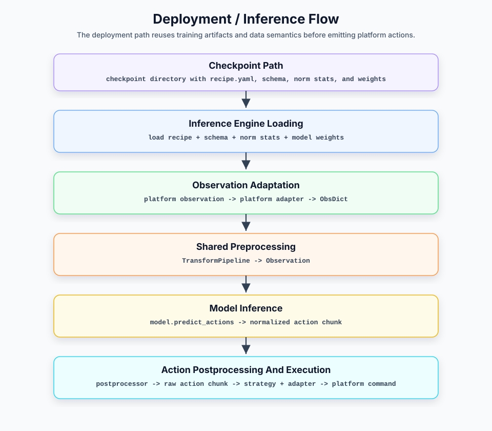

# Deployment Module Design

## 0. Overview

The deployment module is VLA Factory's output end. It turns a training
artifact (a checkpoint plus its `inference_metadata/`) into a real-time policy
service callable by a platform: it rebuilds the training-consistent inference
pipeline from the checkpoint, translates each simulator / real-robot
platform's native observation into a unified input, runs the model forward,
and turns the model's normalized action chunk back into platform-executable
action commands.

The deployment module does not rescan the training dataset, nor does it
re-merge the current code's model profile. It treats the
`inference_metadata/{assembly.json, recipe.yaml}` written at the start of
training as the single source of truth. `assembly.json` already contains the
schema, normalization statistics, IO spec, and transform plans. So the
deployment module's core responsibility is not the
narrow "feed an observation to the model", but rather **reproducing the
training-time data contract without re-running the data pipeline, and wiring
it safely onto a concrete runtime platform**.

### Layer responsibilities and boundaries

At the architecture level the deployment module corresponds to the
"deployment layer" in the main architecture doc, and internally splits into
three responsibilities:

| Sub-layer | Responsibility | Boundary |
|---|---|---|
| **Inference core** | Load the model and metadata from a checkpoint, rebuild the preprocessor / postprocessor, run the forward pass, and always produce a strict `ActionChunk[H,D]`. | Reuses training-side transform semantics; owns no action-chunk execution policy; unaware of platform protocols and transports. |
| **Platform adaptation** | Translate a platform's native observation into a unified `ObsDict`, and an action vector into platform action commands. | Understands one platform/embodiment's field naming and wire protocol; does no model preprocessing, no unnormalization; unaware of the transport framework. |
| **Transport & remote serving** | Own the connection lifecycle, message framing, and serialization; dispatch remote requests to a policy handler. | Only moves bytes and `{cmd, obs}` / `{res}`; unaware of observation semantics, cameras, joints, or actions. |

Together these three responsibilities implement the "deployment module"
described in §5.4 of the main architecture doc. They consume the
training-artifact metadata in the checkpoint and provide a unified real-time
policy service to simulators and real robots.

This document covers:

- Section 1: the deployment inference flow, and the in-process vs. remote
  serving forms.
- Section 2: the core objects involved in deployment.
- Section 3: how the inference core rebuilds and runs the inference pipeline
  from a checkpoint.
- Section 4: how the platform adaptation layer performs two-way translation
  at the embodiment / wire-protocol boundary.
- Section 5: how the transport & remote-serving layer carries RPC without
  understanding model semantics.
- Section 6: how to extend the deployment module.
- Section 7: design constraints and usage notes.
- Section 8: directions for future evolution.

This document does not cover:

- The internals of the training data flow, Reader, sample construction, and
  transform pipeline (see [Data Module Design](data-module.md)).
- The internals of the model adapter and the model-side logic of
  `predict_actions`.
- The training loop, optimizer, and checkpoint saving strategy.

### Table of contents

- [0. Overview](#0-overview)
- [1. Deployment inference flow](#1-deployment-inference-flow)
  - [1.1 Deployment inference flow](#11-deployment-inference-flow)
  - [1.2 In-process vs. remote serving forms](#12-in-process-vs-remote-serving-forms)
  - [1.3 Metadata and the deployment pipeline](#13-metadata-and-the-deployment-pipeline)
- [2. Core objects at a glance](#2-core-objects-at-a-glance)
  - [2.1 Inference core objects](#21-inference-core-objects)
  - [2.2 Platform adaptation objects](#22-platform-adaptation-objects)
  - [2.3 Transport & remote-serving objects](#23-transport--remote-serving-objects)
  - [2.4 Connector objects](#24-connector-objects)
- [3. Inference core layer design](#3-inference-core-layer-design)
  - [3.1 Layer responsibilities and boundaries](#31-layer-responsibilities-and-boundaries)
  - [3.2 Initialization: rebuilding the deployment contract from a checkpoint](#32-initialization-rebuilding-the-deployment-contract-from-a-checkpoint)
  - [3.3 ObsDict → Observation preprocessing](#33-obsdict--observation-preprocessing)
  - [3.4 Model inference and postprocessing inverse transforms](#34-model-inference-and-postprocessing-inverse-transforms)
  - [3.5 Action chunk execution policies](#35-action-chunk-execution-policies)
- [4. Platform adaptation layer design](#4-platform-adaptation-layer-design)
  - [4.1 Layer responsibilities and boundaries](#41-layer-responsibilities-and-boundaries)
  - [4.2 The adapter protocol and per-platform implementations](#42-the-adapter-protocol-and-per-platform-implementations)
  - [4.3 ObsDict: the adaptation layer's output contract](#43-obsdict-the-adaptation-layers-output-contract)
- [5. Transport & remote-serving layer design](#5-transport--remote-serving-layer-design)
  - [5.1 Layer responsibilities and boundaries](#51-layer-responsibilities-and-boundaries)
  - [5.2 ZMQ transport and runner (simulator / lerobot host)](#52-zmq-transport-and-runner-simulator--lerobot-host)
  - [5.3 Length-prefixed JSON RPC (RoboTwin)](#53-length-prefixed-json-rpc-robotwin)
  - [5.4 In-process form](#54-in-process-form)
- [6. Extension guide](#6-extension-guide)
  - [6.1 Adding a platform adapter](#61-adding-a-platform-adapter)
  - [6.2 Adding a transport](#62-adding-a-transport)
  - [6.3 Adding an external connector](#63-adding-an-external-connector)
- [7. Design constraints and notes](#7-design-constraints-and-notes)
  - [7.1 Deployment treats checkpoint metadata as the source of truth](#71-deployment-treats-checkpoint-metadata-as-the-source-of-truth)
  - [7.2 Adapters do no model preprocessing](#72-adapters-do-no-model-preprocessing)
  - [7.3 Transports do not understand model semantics](#73-transports-do-not-understand-model-semantics)
  - [7.4 Key ordering is never generated ad hoc at deploy time](#74-key-ordering-is-never-generated-ad-hoc-at-deploy-time)
  - [7.5 Missing fields or dimension mismatches must fail loudly](#75-missing-fields-or-dimension-mismatches-must-fail-loudly)
- [8. Future evolution](#8-future-evolution)

## 1. Deployment inference flow

The deployment module's core pipeline is a real-time inference flow **from a
platform observation to a platform action command**. It shares schema, norm
stats, transform semantics, and the resolved recipe with the training data
flow, but does not share the training Dataset — deployment-side observations
come from sensors / simulators and never pass through the `VLADataset`
pipeline (see [Data Module §4.6](data-module.md#46-non-goals-of-canonical-ir)).

### 1.1 Deployment inference flow



| Stage | Input | Processing | Output |
|---|---|---|---|
| Artifact loading | checkpoint path | `InferenceEngine` reads the assembly / recipe, rebuilds the model and loads weights | a ready `InferenceEngine` |
| Observation adaptation | platform observation | platform adapter converts the wire protocol / embodiment fields | `ObsDict` |
| Preprocessing | `ObsDict` | reuse the training-side preprocessor (normalize / resize / layout / tokenize) | `Observation` |
| Model inference | `Observation` | `model.predict_actions(obs, num_steps=...)` | normalized action chunk |
| Postprocessing | action chunk | postprocessor unnormalizes, unpads, validates shape / finite values | `ActionChunk[H,D]` |
| Execution policy | `ActionChunk` | synchronous / temporal_ensembling / receding_horizon | `ActionCommand[N,D]` |
| Action execution | action | action adapter (if any) converts to a platform action command | platform action command |

The types along the pipeline must tighten stage by stage: the inference core
consumes only `ObsDict` and produces only `ActionChunk[H,D]`; the execution
policy produces only `ActionCommand[N,D]`. Platform differences (camera
naming, image encoding, motor key ordering) must all be absorbed in the
platform adaptation layer and must not leak into the core pipeline.

### 1.2 In-process vs. remote serving forms

The deployment pipeline lands in two serving forms depending on whether the
model dependencies can coexist with the platform runtime:

- **In-process / client form**: `InferenceEngine` runs in the same process
  as the platform runtime, or VLA Factory actively connects to the platform.
  The simulator (ZMQ) and lerobot real robot (ZMQ host) take this path: VLA
  Factory acts as a client, connects to the platform's observation / command
  ports, and predicts and pushes actions back whenever an observation
  arrives.
- **Remote model-serving form**: when the model dependencies (openpi, torch,
  CUDA) and the platform simulation dependencies (RoboTwin/SAPIEN) must live
  in two separate environments, VLA Factory acts as the **model server**
  listening on TCP, and the platform connects as a client through a
  dependency-free connector. The RoboTwin platform takes this path.

The two forms must share the same `InferenceEngine`, the same execution
policies, and the same platform adapters; the only things allowed to differ
are the transport and who initiates the connection. Any "implement a
separate copy of inference / adaptation for one form" is a signal that the
layering has been broken.

### 1.3 Metadata and the deployment pipeline

The deployment pipeline's source of truth comes entirely from
`inference_metadata/` under the checkpoint directory:

| Metadata file | Source | Deployment use |
|---|---|---|
| `assembly.json` | training-time `ResolvedAssembly` | execution contract containing schema, norm stats, ModelIOSpec, and all three pipeline plans |
| `recipe.yaml` | resolved recipe from training | model name, model config, and runtime settings |

The core principle is the same as the data module's: deployment must use the
**snapshot** saved at training time; re-parsing the training dataset and
re-merging the current code's model profile are both forbidden (see
[Data Module §4.5](data-module.md#45-deployment-side-reuse-contract) and
[§6.6](data-module.md#66-training-artifact-metadata-is-the-deployment-side-source-of-truth)).

## 2. Core objects at a glance

### 2.1 Inference core objects

| Object | Role | Key fields / interface |
|---|---|---|
| `InferenceEngine` | Deployment inference core. Loads model + metadata, rebuilds transforms; the return type and rank of `predict` never vary with the execution policy. | `predict(obs) -> ActionChunk`, `reset()`, `camera_keys`, `state_keys`, `action_keys`, `schema`, `recipe` |
| `ObsDict` | Unified observation input format (frozen dataclass, nested dict structure). | `video: dict[str, ndarray]`, `state`, `language` |
| `Observation` | Unified observation container from the model protocol (defined in the model layer, not deploy). | `images`, `image_masks`, `state`, `tokenized_prompt(_mask)` |
| `ActionChunk` | The model prediction contract. Enforced as a finite float32 2-D array. | `values: ndarray[H,D]` |
| `ActionCommand` | The actions to execute in one platform interaction; single-step commands keep the 2-D rank. | `values: ndarray[N,D]`, `single()` |
| `ExecutionPolicy` | Consumes chunks and selects the current command; sole owner of the temporal / playback buffers and `n_action_steps`. | `needs_chunk`, `consume(chunk)`, `reset()` |
| `PolicyExecutor` | Composes an `InferenceEngine` with one `ExecutionPolicy`; calls the engine only when the policy needs a new chunk. | `predict(obs) -> ActionCommand`, `reset()` |
| `ReplayPolicy` | Executable-policy stand-in: replays recorded actions in order, no model inference. | `predict(obs) -> ActionCommand`, `reset()` |

### 2.2 Platform adaptation objects

| Object | Role | Boundary |
|---|---|---|
| `PlatformObservationAdapter` | Observation adapter protocol: `(observation, task) -> ObsDict`. | Wire / embodiment translation only, no model preprocessing. |
| `SimulatorAdapter` | Parse the flat `observation.images.X` / `observation.state` ZMQ format. | Simulator wire protocol. |
| `RoboTwinAdapter` | Parse a connector-wrapped native RoboTwin observation → `ObsDict`. | RoboTwin embodiment fields (camera rgb, joint_action). |
| `LerobotHostObsAdapter` | Per-motor state scalars + base64 JPEG cameras → `ObsDict`. | lerobot host wire protocol. |
| `LerobotHostActionAdapter` | Action vector → per-motor command dict (by `action_keys`). | lerobot host action commands. |
| `LeRobotAdapter` | Expose the engine through lerobot's `predict_action(tensor_dict)` interface. | lerobot policy-interface wrapper. |
| `GROOTAdapter` | Expose the engine through GR00T's `get_action(obs_dict)` interface. | Adapts the method signature only; `tag` is stored unused — embodiment routing / schema mapping not implemented yet. |

### 2.3 Transport & remote-serving objects

| Object | Role | Boundary |
|---|---|---|
| `ZmqPolicyClient` / `ZmqPolicyClientConfig` | LeKiwi-style ZMQ PUSH/PULL pure transport and its config (`transports/zmq.py`). | Only moves observation / action JSON; picks no adapter, drives no inference. |
| `PolicyRunner` | Client-shaped deployment loop (`deploy.py`): drives an injected client transport, composes obs/action adapters + `PolicyExecutor`, handles reset control messages and loop pacing. | Orchestration layer; does no serialization or framing; the transport follows `PolicyClientTransport` from `transports/base.py`. |
| `LengthPrefixedJsonRpcServer` | RPC server using a 4-byte length prefix + numpy-aware JSON. | Only decodes `{cmd, obs}`, dispatches the method, encodes `{res}` or an error. |
| `RemotePolicyModel` | RPC handler: exposes the engine as `reset_model` / `update_obs` / `get_action`. | Orchestrates reset/cache/predict; does no serialization. |

### 2.4 Connector objects

| Object | Role | Boundary |
|---|---|---|
| `connectors/robotwin.py` | Dependency-free policy callback module imported by RoboTwin. | Deliberately import-free; runs in a SAPIEN env without VLA Factory's deps. |
| `connectors/robotwin.yml` | Minimal bootstrap config required by RoboTwin's `eval_policy_client.py`. | Declares `policy_name` only; ships with the wheel. |

## 3. Inference core layer design

### 3.1 Layer responsibilities and boundaries

The inference core is `InferenceEngine`, and its contract is one sentence:
**given a checkpoint and an `ObsDict`, it must reproduce the training-time
data semantics and produce a trustworthy `ActionChunk[H,D]`**. How the chunk
is consumed does not belong to this layer.

The inference core may:

- Build the model and load weights with the checkpoint's
  `inference_metadata/` as the sole configuration source.
- Resolve and expose the camera / state / action key contract.
- Reuse the training-side transforms to rebuild observation preprocessing
  and output inverse transforms.
- Call the model protocol method `predict_actions`, validating and wrapping
  the output into an `ActionChunk`.

The inference core must not:

- Be aware of platform wire protocols, camera naming, or motor keys (the
  platform adaptation layer's job).
- Be aware of transports / sockets / serialization (the transport layer's
  job).
- Re-fit normalization stats, re-merge the model profile, or read the
  training dataset.
- Assemble `Observation` into an upstream model library's native batch (the
  model adapter's job).
- Hold any chunk-execution-policy state (temporal / playback buffers belong
  to the execution policy).

### 3.2 Initialization: rebuilding the deployment contract from a checkpoint

Constructing an `InferenceEngine` is rebuilding the deployment contract. A
successfully constructed engine must satisfy the following invariants; if
any one cannot be satisfied, construction must fail immediately — producing
a "half-usable" engine is forbidden.

**Source of truth**

- Configuration must come from — and only from — the checkpoint's
  `inference_metadata/` (resolved assembly and recipe). A missing assembly or
  recipe must fail.
- Construction must succeed on a machine where neither the training dataset
  nor the original pretrained weights are reachable: the checkpoint already
  contains the full model state and the data-semantics snapshot; portability
  is a hard constraint.

**Contract resolution**

- The state/action dimension→key mapping must come from the schema snapshot;
  generating it at deploy time by sorting or any guessing is forbidden. A
  non-zero-dimensional vector with missing keys, or a key count that
  disagrees with the dimension, must fail — old checkpoints should
  regenerate complete metadata; no live-dataset fallback is provided.
- Camera ordering comes from the assembly's `model_io_spec.cameras`, and there
  is **no deploy-time rename**: renaming would point the CameraMapping at keys
  the observation no longer has (pi0 would silently feed placeholders and keep
  predicting). A platform's own camera names are mapped by its PlatformAdapter.
  The resolved results must be exposed as read-only contract fields
  (`camera_keys` / `state_keys` / `action_keys` / `execution_action_dim` /
  `model_output_dim` / `schema` / `recipe`) for upper-layer adapters.
- There are two action widths and they must not be conflated:
  `model_output_dim` is what the network emits (pi0: 32), while
  `execution_action_dim` is the DataSchema action width restored by
  `model_to_robot` (pi0: 8). Platform action adapters
  align motor keys with the latter.

**Model and transforms**

- The model must be built through the registry factory from recipe + assembly;
  weight loading must be strict — extra, missing, or shape-mismatched
  parameters are all errors, and partial loading is forbidden.
- The preprocessor / postprocessor must be built from — and only from — the
  assembly's resolved `robot_to_model` / `model_to_robot` plans. The former is
  value-equal to the training-side `data_to_model` plan. A missing plan means
  the metadata is incomplete and must fail; deployment accepts no transform
  step list or override.
- The inference step count for flow-matching / diffusion heads comes from the
  saved resolved recipe's model config; deployment must not invent a second
  default.

Once constructed, the engine exposes exactly two behavioral entry points:
`predict(obs) -> ActionChunk` and `reset()`.

### 3.3 ObsDict → Observation preprocessing

The core of the preprocessing contract: **deployment must reuse the exact
same transform pipeline as training**. Any inline normalization / scaling
math inside the engine is forbidden — otherwise the training and deployment
data semantics silently diverge, and that divergence never surfaces as an
error.

- The sample the engine hands to the pipeline must stay raw: HWC uint8
  images, float32 state; float / CHW / resize / normalize are all done by
  the pipeline.
- The camera set and ordering must strictly equal `camera_keys`; a missing
  camera must fail — silently skipping it is forbidden.
- Language conditioning contract: when `ObsDict.language` is present it must
  enter the tokenize step; when absent, the pipeline must still produce a
  prompt tensor (falling back to `default_task` or an empty prompt, warning
  allowed). Language-conditioned models (pi0) never receive a missing prompt
  input, but conditioning quality degrades without a language.
- The preprocessing sample must not carry `"actions"` (actions are the
  model's output, not its input); this guarantees action-affecting
  preprocessing steps are naturally no-ops on the inference path, with no
  purpose-based branching.

### 3.4 Model inference and postprocessing inverse transforms

The inference path is fixed:

```text
ObsDict
  -> the training preprocessor
  -> Observation
  -> model.predict_actions(·, num_steps from ModelMetadata)
  -> inverse transforms of the training transforms (unnormalize / unpad)
  -> ActionChunk[H, D]
```

It must be guaranteed that:

- PlatformAdapter output must satisfy the checkpoint DataSchema. Missing
  required cameras/state or a wrong state width must fail before preprocessing.
- The output inverse transforms must come from the checkpoint's planned
  `model_to_robot` pipeline, which the resolver builds from each step's own
  `inverse_call()` (see
  [Data Module §4.3](data-module.md#43-model-transform-pipeline-design));
  hand-writing a second unnormalization on the deployment side is forbidden
  — forward and inverse must come from the same declaration to guarantee
  they invert each other.
- Raw state must be available to the inverse transforms, reserved for
  delta→absolute style inverses (absolute = delta + state_raw).
- The model output must be wrapped into an `ActionChunk` and pass a triple
  validation: strictly 2-D, shape equal to the checkpoint metadata's
  `(action_horizon, action_dim)`, all values finite. Failing any one must
  raise — handing a malformed or NaN-carrying action to a downstream
  platform is forbidden.

### 3.5 Action chunk execution policies

The execution policy answers "how a chunk is executed over time", forcibly
separated from "how a chunk is computed". The contract:

- The engine's `predict` must always return `ActionChunk[H,D]`; the return
  type and rank must never vary with the policy, and policy state (temporal
  / playback buffers) must never enter the engine.
- Consumers of the policy (runner, RPC handler, platform facades) must
  receive only `ActionCommand[N,D]`; degrading a single-step command to
  `[D]` is forbidden — consumers that need a 1-D vector must call
  `single()` explicitly, where a multi-step command fails loudly instead of
  being silently flattened or truncated.
- The sole owner of `n_action_steps` is the execution policy, and it must
  satisfy `1 <= n_action_steps <= action_horizon` at build time; temporal
  ensembling is fixed to a single step and accepts only omission or an
  explicit 1.
- Model inference may only happen when the policy declares it needs a new
  chunk; running the model during receding playback is forbidden (open-loop
  playback semantics).
- An episode reset must reach both the engine and the execution policy;
  the intermediate state "model reset but playback buffer left over" is
  forbidden.

| Policy | `ActionCommand` shape | When a new chunk is requested | Semantics |
|---|---|---|---|
| `synchronous` | `[N,D]` | every call | Return the first `N` steps of the chunk; `N` defaults to the horizon. |
| `temporal_ensembling` | `[1,D]` | every call | Buffer overlapping chunks; weighted-average the predictions for the current step (newer chunks weigh more). |
| `receding_horizon` | `[1,D]` | when the playback buffer is empty | Take the first `N` steps of the chunk, play them one per call, and only re-predict on the latest observation once drained. |

Policy selection guidance: `receding_horizon` is the sensible default for
chunked policies like ACT — key actions may live deeper in the chunk, and
taking only the first step each time is insufficient (mirroring lerobot's
`ACTPolicy.select_action` queue semantics); `synchronous` suits platforms
that consume a chunk per interaction (RoboTwin's default). Platform branches
only provide the default policy; an explicitly given `--strategy` must be
honored — silently overriding it is forbidden.

## 4. Platform adaptation layer design

### 4.1 Layer responsibilities and boundaries

The platform adaptation layer is the **embodiment / wire-protocol boundary**:
it translates a platform's native observation into a unified `ObsDict`, and
(on platforms that require per-motor commands) an `ActionCommand` into
platform action commands. It must stay a thin translation layer — it is not
a model adapter.

The platform adaptation layer may:

- Understand a platform observation's field naming, nested structure, and
  image encoding (raw ndarray / base64 JPEG).
- Select cameras by `camera_keys`, and reassemble / restore vectors by
  `state_keys` / `action_keys`.
- Validate that cameras are complete and dimensions match; mismatches must
  raise clearly.

The platform adaptation layer must not:

- Do resize / float / CHW / normalize — model preprocessing belongs to the
  transform pipeline; the adapter may only hand over raw HWC uint8 images
  and float32 state.
- Understand transports / sockets; the adapter only receives an
  already-deserialized observation.
- Invent key ordering — the ordering must come from the schema / recipe
  contract resolved during training.

### 4.2 The adapter protocol and per-platform implementations

Every observation adaptation must implement the same protocol:

```python
@runtime_checkable
class PlatformObservationAdapter(Protocol):
    def __call__(self, observation: Any, task: str = "") -> ObsDict:
        ...
```

The observation adapter is a swappable strategy object; `RemotePolicyModel`
and `PolicyRunner` must depend only on this protocol — depending on a
concrete platform type is forbidden. The action-direction adaptation
(`LerobotHostActionAdapter`) is not part of this protocol, since only
platforms with per-motor commands need it.

The translation rules of the current per-platform implementations:

| Adapter | Input format | Key processing |
|---|---|---|
| `SimulatorAdapter` | Flat `observation.images.{cam}` / `observation.state` dict | Take images by `camera_keys`, error on missing key; state → float32; `language` from obs or task. |
| `RoboTwinAdapter` | Connector-wrapped `{robotwin_observation, instruction, step}` | Take HWC images from `observation.observation.{cam}.rgb`; build qpos from `joint_action.vector` or the four named parts (`left_arm/left_gripper/right_arm/right_gripper`); a missing camera or state-dim mismatch raises `KeyError`/`ValueError` directly. |
| `LerobotHostObsAdapter` | lerobot host wire protocol | Cameras are base64 JPEG (decoded to RGB) or ndarray; build state from per-motor scalars by `state_keys`; validates key count against `state_dim` at construction, raising `ValueError` on mismatch. |
| `LerobotHostActionAdapter` | — | Single-step action vector → `{motor_key: value}` dict in `action_keys` order; validates key count against `action_dim` at construction; the input must be a `(action_dim,)` single-step vector — multi-step input must fail. |
| `LeRobotAdapter` | lerobot policy `tensor_dict` | Pick `image(s)`, `observation.state`, `language_instruction` from nested/flat keys, convert to `ObsDict`; take `single()` from the executable policy and return a single-step `torch.Tensor`. |
| `GROOTAdapter` | GR00T `{video, state, language}` dict | Convert to `ObsDict`, then produce an `ActionCommand` through the executable policy; adapts the `get_action` signature only, the embodiment `tag` is not used yet. |

`RoboTwinAdapter`'s `instruction` (forwarded by the connector from
`TASK_ENV.get_instruction()`) takes precedence over the construction-time
`task`, so each RoboTwin task uses its own language instruction rather than
being silently overridden by one default task.

### 4.3 ObsDict: the adaptation layer's output contract

`ObsDict` is the platform adaptation layer's output contract and the only
observation form the inference core accepts — the native formats of N
platforms must converge into this one. It is a frozen dataclass: immutable
once assembled; any stage after the adapter is forbidden from mutating the
observation. Whether an adapter is correct has one acceptance criterion:
whether the `ObsDict` it produces satisfies the table below:

| Field | Type | Contract |
|---|---|---|
| `video` | `dict[str, ndarray]` | Keys must exactly cover the checkpoint's `camera_keys`, each mapped to the same-named camera it was trained on; values must be raw HWC uint8 images — resize / float / normalize forbidden. A missing camera must fail; silent degradation is forbidden. |
| `state` | `ndarray \| None` | A float32 1-D vector; the dimension must equal `schema.state_dim`, and the component order must follow `state_keys` (per-motor platforms reassemble by it in the adapter). May be `None` for stateless models. |
| `language` | `str \| None` | Task instruction text. A platform-provided instruction (e.g. RoboTwin's `instruction`) must take precedence over the CLI's default `task`; `None` is allowed — when missing, the transform falls back per the language contract in §3.3. |

Design trade-offs:

- **Nested dict rather than flat keys** (reference: GR00T): camera names are
  data, not field names — adding a camera requires no type change.
- **Deliberately minimal fields**: `ObsDict` carries only raw semantics
  (images, state, instruction). Tokenize results and normalized products are
  forbidden from entering `ObsDict` — they belong to the transform
  pipeline's output (`Observation`); putting them here would load model
  preprocessing back onto the platform adaptation layer.
- **Every field's contract must be traceable to checkpoint metadata**: the
  camera set, state dimension, and key ordering are all resolved by
  `InferenceEngine` and handed to the adapter; the adapter is forbidden from
  bringing its own or guessing these values.

**The mirror contract in the action direction**: per-motor platforms must
restore `ActionCommand.single()` into a `{motor_key: value}` command by
`action_keys`; generating the ordering ad hoc at deploy time is forbidden —
a wrong order means an action dimension drives the wrong motor.

## 5. Transport & remote-serving layer design

### 5.1 Layer responsibilities and boundaries

The transport layer owns the connection lifecycle, message framing, and
serialization, and dispatches remote requests to a policy handler. It is a
pure carrier and **does not understand model semantics**: it knows neither
whether the observation contains cameras or joints, nor how many steps the
returned command has.

The transport layer may:

- Establish / maintain sockets, accept connections, frame and move bytes.
- Serialize / deserialize (including numpy-aware JSON encoding/decoding).
- Dispatch `{cmd, obs}` to a same-named method on the handler, and encode
  `{res}` or a structured error.

The transport layer must not:

- Interpret observation fields, select cameras, reassemble vectors, or run
  normalization.
- Hardcode any model method name — `{cmd}` decides which handler method is
  called.
- Orchestrate. Adapter selection, inference driving, episode reset, and loop
  pacing do not belong to the transport: the server-shaped form must live in
  `RemotePolicyModel` (the handler), the client-shaped form in
  `PolicyRunner`. Both live in `inference/deploy.py`, decoupled from
  any concrete transport.

### 5.2 ZMQ transport and runner (simulator / lerobot host)

The client-shaped form is a **real-time control loop**: the simulator /
lerobot real-robot host acts as a ZMQ server, continuously pushing
observations and waiting for action commands back; VLA Factory connects to
it as a client and loops "receive → translate → infer → translate → send":

```text
robot host (ZMQ server)              VLA Factory (client)
  pushes observations ──────▶  ZmqPolicyClient (keeps only the newest frame)
                                     │
                                     ▼  PolicyRunner loop
                                observation adapter → ObsDict
                                executable policy   → ActionCommand
                                action adapter (if any) → platform command
                                     │
  executes actions      ◀──────  ZmqPolicyClient
```

The loop is split between two objects, each owning half: `ZmqPolicyClient`
(transport) only moves messages and does not understand their content;
`PolicyRunner` only owns the loop itself — when to receive, whom to hand
off to, what to send, at what pace, and when to reset. Their contracts:

**The client transport must:**

- Deliver only the newest observation frame. This is a real-time control
  loop, not a message queue: the host usually pushes faster than inference
  runs, and queued consumption means acting on frames from seconds ago.
  Stale observations must be dropped; queued execution is forbidden.
- Support waiting for the connection; if a timeout is configured, it must
  fail explicitly with `TimeoutError` — silently blocking forever is
  forbidden.
- Carry both action payload kinds: arrays (action command matrices, used by
  the simulator) and dicts (per-motor commands, used by lerobot).
- Stay ignorant of the observation content; interpreting any field is
  forbidden.

**The runner must:**

- Receive the injected client through the `PolicyClientTransport` protocol
  (`wait_for_connection` / `recv_observation` / `send_action` / `close`);
  constructing any concrete transport itself is forbidden — swapping wire
  protocols (e.g. ZMQ → WebSocket) must not change the runner.
- Consume only the `ActionCommand` produced by the executable policy: with
  no action adapter it sends the uniform 2-D `[N,D]`; a per-motor action
  adapter accepts only `single()`, and a multi-step command must fail
  rather than being flattened / truncated.
- Handle the `__control__ == "reset"` control message (the host announcing
  a new episode) and forward the reset to the policy, clearing the previous
  episode's policy buffers.
- Own the loop pacing (`max_loop_freq_hz`) — pacing is an orchestration
  concern and is forbidden from living on the transport config.
- Release the transport on exit (including exceptional paths).

Platform differences must show up only in the injected adapters: the
simulator injects `SimulatorAdapter` (actions sent as raw arrays), lerobot
injects `LerobotHostObsAdapter` + `LerobotHostActionAdapter` (per-motor
command dicts). The CLI platform branches only assemble; owning loop logic
of their own is forbidden.

### 5.3 Length-prefixed JSON RPC (RoboTwin)

This form solves the opposite problem of §5.2: RoboTwin's simulation runtime
(SAPIEN) and the model runtime (torch / CUDA / openpi) have conflicting
dependencies and cannot share one Python environment. So the connection
direction flips — VLA Factory acts as the **model server** listening on
TCP; RoboTwin stays inside its own evaluation loop and, as a client,
remotely asks "give me actions", installing no model dependencies locally:

```text
RoboTwin (SAPIEN process, zero model deps)   VLA Factory (model process)
  TASK_ENV.get_obs()
  connectors/robotwin.encode_obs()
  ModelClient.call("get_action", obs)  ──TCP──▶  LengthPrefixedJsonRpcServer
                                                   RemotePolicyModel.get_action
                                                     RoboTwinAdapter → ObsDict
                                                     PolicyExecutor.predict
                                                       InferenceEngine → ActionChunk
                                                       ExecutionPolicy → ActionCommand
  for action in chunk:                 ◀──TCP──   {res: [n, action_dim]}
    TASK_ENV.take_action(action, "qpos")
```

The pipeline is split among three objects, each owning one segment:
`LengthPrefixedJsonRpcServer` (transport) only frames, encodes/decodes, and
dispatches methods; `RemotePolicyModel` (handler) only translates one
request into one inference and sends the result back;
`connectors/robotwin.py` is the dependency-free "plug" inserted on the
RoboTwin side. Their contracts (overall contract: SAPIEN and the model
dependencies must live in two environments, neither installing the other's
dependencies):

**The server transport must:**

- Be byte-for-byte wire-compatible with RoboTwin's `ModelClient` (4-byte
  big-endian length prefix + numpy-aware JSON) — the peer is an existing
  client that cannot be modified, so compatibility is entirely the server's
  responsibility.
- Stay ignorant of RoboTwin's cameras / joints / actions: only decode
  `{cmd, obs}`, dispatch to the same-named handler method, and return
  `{res}`.
- Return errors as structured `{error, traceback}` to the peer; malformed
  requests (missing `cmd`, non-string `cmd`, unknown method) must produce a
  clear "No model method named ..." class of error — leaking internal
  exceptions as hard-to-trace messages is forbidden.

**The handler (`RemotePolicyModel`) must:**

- Expose exactly `reset_model` / `update_obs` / `get_action` — this is the
  calling convention of RoboTwin's client, not an invention of this
  framework.
- Return the execution policy's `ActionCommand.values[N,D]` as-is from
  `get_action`; holding or truncating `n_action_steps` is forbidden — chunk
  consumption semantics belong solely to the execution policy.

**The connector must:**

- Stay import-free, runnable in a SAPIEN environment without VLA Factory's
  dependencies.
- Do only "wrap the native observation + execute the returned actions step
  by step" (`take_action(·, "qpos")`); field mapping, camera selection,
  validation, and model preprocessing must all stay on the server side.
- Ship the companion `connectors/robotwin.yml` — the minimal bootstrap
  (`policy_name`) required by RoboTwin's `eval_policy_client.py` — with the
  wheel (`pyproject.toml` `package-data`).

### 5.4 In-process form

The `infer` / `evaluate` subcommands evaluate raw model chunks only, so they
call `engine.predict().values` directly in-process. Platform facades that
need execution semantics hold a `PolicyExecutor` instead and obtain the
uniformly 2-D `ActionCommand`. Neither goes through a transport.

## 6. Extension guide

### 6.1 Adding a platform adapter

When integrating a new simulator / real-robot wire protocol, a new
observation adapter must be added; changing `InferenceEngine`, the execution
policies, or the data pipeline for this is forbidden.

1. Add an adapter file under `vla_factory/inference/platforms/`.
2. Implement `__call__(observation, task="") -> ObsDict`, satisfying the
   `PlatformObservationAdapter` protocol.
3. Cameras must be selected by `camera_keys` and state validated by
   `state_dim`; missing fields / dimension mismatches must raise clearly.
4. Only raw HWC uint8 images and float32 state may be handed over;
   normalization / resize goes to the transforms.
5. If the platform needs per-motor commands, also implement an action
   adapter (mirror `LerobotHostActionAdapter`: restore by `action_keys`,
   accept single-step vectors only).
6. Assemble it in `deploy.py` and declare it in the CLI's `--platform`
   choices; do not eagerly import optional platform dependencies from
   `platforms/__init__.py`.
7. Add adapter unit tests (mirror `test/test_robotwin_server.py`).

### 6.2 Adding a transport

When integrating a new wire transport / framing protocol, a new transport
must be added; mixing protocol details into an adapter, the runner, or the
engine is forbidden.

1. Add a file under `vla_factory/inference/transports/`: mirror
   `ZmqPolicyClient` (connection + send/recv primitives) for a client-shaped
   form, or `LengthPrefixedJsonRpcServer` (RPC server) for a server-shaped
   form.
2. The transport only moves bytes / messages and does not interpret
   observation semantics; orchestration (adapter assembly, inference
   driving, reset, pacing) goes into `PolicyRunner` or an RPC handler.
3. Client transports implement the protocol in `transports/base.py` and are
   assembled in `deploy.py`; do not eagerly import optional transports from
   `transports/__init__.py`.

### 6.3 Adding an external connector

When the model dependencies and the platform runtime must live in two
separate environments, provide a dependency-free connector for that
platform:

1. Add a module under `vla_factory/inference/connectors/` with **no VLA Factory
   imports whatsoever**, so it can load in a dependency-scarce platform env
   (via `PYTHONPATH` or the platform's policy plugin mechanism).
2. The connector may only "wrap the native observation + drive the returned
   actions"; field mapping, camera selection, validation, and model
   preprocessing must all stay on the VLA Factory server side.
3. If the platform needs a bootstrap config, a minimal `*.yml` must be
   provided and declared in `pyproject.toml` `package-data` so it ships with
   the wheel.

## 7. Design constraints and notes

### 7.1 Deployment treats checkpoint metadata as the source of truth

`InferenceEngine` must read only `recipe.yaml` and `assembly.json` from the
checkpoint; re-parsing the training dataset and
re-merging the current code's model profile are forbidden. The camera set,
state/action dims, key ordering, and normalization stats must all come from
the assembly snapshot.

### 7.2 Adapters do no model preprocessing

Platform adapters must do only wire / embodiment field translation, handing
over raw HWC uint8 images and float32 state. Resize / float / CHW /
normalize / tokenize must all be carried by the transform pipeline — this is
the only guarantee that deployment uses exactly the same preprocessing logic
as training.

### 7.3 Transports do not understand model semantics

A transport must be responsible only for connection, framing, serialization,
and method dispatch; knowing what is inside the observation, or how many
steps the returned command has, is forbidden. Swapping the transport must
not cause changes to adapters, execution policies, or the engine.

### 7.4 Key ordering is never generated ad hoc at deploy time

The state/action dimension→key mapping is a strong contract between the data
and the robot; it must come from the schema / recipe resolved during
training, and inventing an ordering by sorting at deploy time is forbidden.
On platforms that send per-motor commands (lerobot host), missing keys must
fail clearly at adapter construction — silently mismatching motors is
forbidden.

### 7.5 Missing fields or dimension mismatches must fail loudly

A missing camera, a state dim that disagrees with the model, an action
containing NaN, a request missing `cmd`, a non-HWC image, a multi-step
command asked to degrade to a single step — such anomalies must raise a
locatable error; silent degradation is forbidden. This is consistent with
§7.3 (deployment reliability) in the main architecture doc: better to fail
clearly before sending an action than to send a mismatched command to a
real robot / simulator.

## 8. Future evolution

- **Protocol version negotiation and capability discovery**: the remote
  model service currently has no version / capability handshake. A future
  version could negotiate the wire
  version and model capabilities at connect time to avoid client/server
  one-sided drift.
- **Action range checking and clipping**: if the assembly snapshot or a platform
  adapter declares action bounds, they could be checked, clipped, or
  rejected before sending (main architecture doc §7.3).
- **More platforms / real robots**: integrate more simulators and real
  robots via new adapters + optional connectors, keeping the engine and
  transports unchanged.
- **Replay and recording tooling**: `ReplayPolicy` could grow into a full
  deployment-pipeline validation tool, exercising the adapters / transports
  end to end without a real model.
